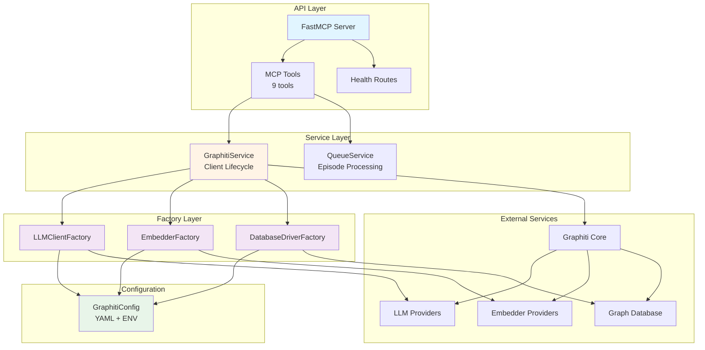

# Repository Architecture Documentation

> Generated: 2024-11-30 | Graphiti MCP Server Architecture Analysis

## Overview

This repository implements a **Graphiti MCP Server** - a Model Context Protocol (MCP) server that exposes the Graphiti knowledge graph library as a set of tools for AI agents and applications. The server enables episodic memory storage, entity extraction, relationship mapping, and semantic search over temporal knowledge graphs.

The architecture follows modern Python patterns: **factory-based dependency injection** for flexible provider configuration, **async queue-based processing** for write operations to prevent race conditions, and **layered service architecture** for clean separation of concerns. It supports multiple LLM providers (OpenAI, Azure, Anthropic, Gemini, Groq), embedder providers (OpenAI, Azure, Gemini, Voyage), and graph databases (Neo4j, FalkorDB).

The system is designed for dual deployment scenarios: **FastMCP Cloud** via the factory pattern in `server.py`, and **local development** with CLI configuration via `graphiti_mcp_server.py`. Both use the same service layer, ensuring consistency across deployment environments.

## Quick Start

### Using This Documentation

This documentation set provides comprehensive coverage of the codebase architecture, from high-level system design to detailed API specifications. The documents are organized to support different use cases:

| Document | Purpose | Best For |
|----------|---------|----------|
| [Component Inventory](docs/01_component_inventory.md) | Complete listing of modules, classes, and functions with file locations | Finding specific components, understanding code organization, reference lookup |
| [Architecture Diagrams](diagrams/02_architecture_diagrams.md) | Visual system architecture with layered views and component relationships | Understanding system design, onboarding new developers, design reviews |
| [Data Flows](docs/03_data_flows.md) | Sequence diagrams showing request flows, async processing, and error handling | Understanding runtime behavior, debugging, performance optimization |
| [API Reference](docs/04_api_reference.md) | Complete API documentation with examples, parameters, and return types | Using the MCP tools, integrating with the server, client development |

**Recommended Reading Order**:
1. **New to the project**: Start with this README, then Architecture Diagrams, then Data Flows
2. **Implementing features**: Component Inventory to locate code, then Data Flows for behavior
3. **Using the API**: API Reference for complete tool documentation and examples
4. **Debugging issues**: Data Flows for request/error flows, then Component Inventory for code locations

### Key Entry Points

**For Developers**:
- **Factory Server**: `src/server.py` - Modern entry point using factory pattern (Lines 173-219: `create_server()`)
- **Legacy Server**: `src/graphiti_mcp_server.py` - Backward-compatible entry point with CLI args
- **Main Entry**: `main.py` - Wrapper for backward compatibility

**For Configuration**:
- **YAML Config**: `config/config.yaml` - Main configuration file
- **Config Schema**: `src/config/schema.py` - Pydantic configuration models

**For Integration**:
- **MCP Client Example**: `examples/01_connect_and_discover.py` - Connection and tool discovery
- **Tool Usage Example**: `examples/02_call_tools.py` - Calling MCP tools
- **Memory Example**: `examples/03_graphiti_memory.py` - Episode operations

## Architecture Summary

### System Design

The system follows a **layered architecture** with clear separation between the MCP protocol layer, service layer, factory layer, and external integrations. This design enables provider flexibility, testability, and deployment portability.



**Layer Descriptions**:

- **API Layer**: FastMCP server exposing 9 MCP tools for knowledge graph operations (add_memory, search_nodes, search_memory_facts, etc.)
- **Service Layer**: Business logic with GraphitiService (client management) and QueueService (async processing)
- **Factory Layer**: Provider abstraction creating LLM, embedder, and database clients from configuration
- **Configuration**: Hierarchical config (CLI > ENV > YAML > Defaults) with environment variable expansion
- **External Services**: Graphiti Core library integrating with LLM/embedder/database providers

### Design Patterns

The architecture employs several key design patterns:

1. **Factory Pattern**: Used for creating provider-specific clients (LLM, Embedder, Database) based on configuration. Enables runtime provider selection and clean dependency injection.
   - `LLMClientFactory.create()` - Creates OpenAI, Azure, Anthropic, Gemini, or Groq clients
   - `EmbedderFactory.create()` - Creates OpenAI, Azure, Gemini, or Voyage embedders
   - `DatabaseDriverFactory.create_config()` - Creates Neo4j or FalkorDB configurations

2. **Service Pattern**: Encapsulates business logic in service classes with dependency injection
   - `GraphitiService` - Manages Graphiti client lifecycle and initialization
   - `QueueService` - Manages async episode processing with per-group_id queues

3. **Closure-Based Dependency Injection**: Tool handlers capture service instances via closures, enabling factory pattern without global state
   - Critical for FastMCP Cloud deployment which requires factory-based server creation
   - Tools defined in `_register_tools()` capture `graphiti_svc`, `queue_svc`, `cfg`

4. **Queue Pattern**: Async processing with sequential guarantees per group_id
   - Prevents race conditions in knowledge graph updates
   - Different groups process in parallel
   - Background workers with proper error isolation

5. **Configuration Hierarchy**: Pydantic Settings with multiple sources
   - Priority: CLI args > Environment variables > YAML config > Defaults
   - Environment variable expansion in YAML: `${VAR}` and `${VAR:default}`

### Technology Stack

**Core Framework**:
- **FastMCP** - MCP server framework with JSON-RPC 2.0 over HTTP/stdio
- **Graphiti Core** - Knowledge graph library with temporal fact support
- **Pydantic v2** - Data validation, settings management, and schema generation

**Async Processing**:
- **AsyncIO** - Async/await for concurrent operations
- **asyncio.Queue** - Per-group_id queues for sequential processing

**LLM Providers** (configurable):
- OpenAI (gpt-4.1, gpt-4.1-mini, gpt-5, o1, o3)
- Azure OpenAI (all models, with Azure AD support)
- Anthropic (Claude 3 models)
- Google Gemini (gemini-pro, gemini-ultra)
- Groq (llama, mixtral models)

**Embedder Providers** (configurable):
- OpenAI (text-embedding-3-small/large)
- Azure OpenAI (text-embedding-3-small/large)
- Google Gemini (text-embedding-004)
- Voyage AI (voyage-3, voyage-3-lite)

**Graph Databases** (configurable):
- Neo4j - Property graph database (bolt protocol)
- FalkorDB - Redis-based graph database

**Development**:
- Python 3.10+
- pytest for testing
- ruff for linting

## Component Overview

### Public API (MCP Tools)

The server exposes 9 tools through the Model Context Protocol:

| Tool | Purpose | Async |
|------|---------|-------|
| add_memory | Add episodes (text, JSON, messages) to knowledge graph | Yes (queued) |
| search_nodes | Search for entities using natural language | No (sync) |
| search_memory_facts | Search for relationship facts between entities | No (sync) |
| get_episodes | Retrieve episodes from knowledge graph | No (sync) |
| get_entity_edge | Retrieve specific relationship edge by UUID | No (sync) |
| delete_entity_edge | Delete relationship edge by UUID | No (sync) |
| delete_episode | Delete episode by UUID | No (sync) |
| clear_graph | Clear all data for specified group IDs | No (sync) |
| get_status | Health check for server and database | No (sync) |

**Key Characteristics**:
- All tools registered via `@server.tool()` decorator
- Type hints auto-generate JSON Schema for MCP protocol
- Tools return TypedDict responses (ErrorResponse, SuccessResponse, etc.)
- Write operations queue work, read operations execute synchronously

**Source**: `src/server.py` (Lines 230-455)

### Core Services

**GraphitiService** (`src/server.py:88-168`):
- Manages Graphiti client lifecycle and initialization
- Uses factories to create LLM, embedder, and database clients
- Builds custom entity types from configuration
- Provides `get_client()` for tool handlers
- Initializes database indices and constraints

**QueueService** (`src/services/queue_service.py:12-153`):
- Manages sequential episode processing per group_id
- Maintains separate asyncio.Queue for each group
- One background worker per group ensures sequential processing
- Prevents race conditions in knowledge graph updates
- Error isolation - worker errors don't crash other workers

### Factory System

**LLMClientFactory** (`src/services/factories.py:100-251`):
- Creates LLM clients based on configuration provider
- Supports: openai, azure_openai, anthropic, gemini, groq
- Handles API key validation
- Special logic for reasoning models (gpt-5, o1, o3)
- Azure AD authentication support

**EmbedderFactory** (`src/services/factories.py:253-361`):
- Creates embedder clients for vector generation
- Supports: openai, azure_openai, gemini, voyage
- Configurable embedding dimensions
- API key validation

**DatabaseDriverFactory** (`src/services/factories.py:363-440`):
- Creates database configuration dictionaries
- Supports: neo4j, falkordb
- Environment variable overrides for connection strings
- URI parsing for host/port extraction

### Configuration

**GraphitiConfig** (`src/config/schema.py:230-293`):
- Main configuration class using Pydantic BaseSettings
- Nested configs: ServerConfig, LLMConfig, EmbedderConfig, DatabaseConfig, GraphitiAppConfig
- Loads from YAML with environment variable expansion
- Priority: CLI > ENV > YAML > Defaults
- Custom YamlSettingsSource for `${VAR}` expansion

**Configuration Hierarchy**:
```
CLI Arguments → Environment Variables → YAML File → Default Values
```

## Data Flows

### Key Flow Patterns

The system implements distinct patterns for different operation types:

1. **Query Flow** (Synchronous):
   - Client → HTTP Transport → FastMCP → Tool Handler → GraphitiService → Graphiti Core → Database
   - Direct path with immediate response
   - Used for: search_nodes, search_memory_facts, get_episodes, get_status
   - Hybrid search: Vector similarity + keyword matching with RRF scoring

2. **Episode Addition Flow** (Asynchronous):
   - Client → HTTP Transport → FastMCP → add_memory Tool → QueueService → Queue
   - Immediate SuccessResponse to client (async processing)
   - Background Worker → process_episode → Graphiti Core → LLM (entity extraction) → Embedder → Database
   - Sequential processing per group_id prevents race conditions

3. **Client Session Flow** (Initialization):
   - Connection establishment via streamablehttp_client
   - MCP protocol handshake (initialize)
   - Tool discovery (list_tools)
   - Tool invocation (tools/call)
   - Proper cleanup with async context managers

**Detailed Diagrams**: See [Data Flows Documentation](docs/03_data_flows.md) for complete sequence diagrams

### Async Processing

The queue-based async processing architecture ensures data consistency:

**Architecture**:
- Separate `asyncio.Queue` for each group_id
- Long-lived background worker per queue
- Sequential processing within a group (prevents conflicts)
- Parallel processing across different groups (scalability)

**Processing Pipeline** (inside Graphiti Core):
1. LLM extracts entities and relationships from episode
2. Embedder generates vectors for entities and facts
3. Semantic deduplication merges similar entities
4. Database writes: EpisodicNode, EntityNodes, EntityEdges
5. RELATES_TO edges connect episode to extracted entities

**Error Handling**:
- Worker errors logged but don't crash other workers
- Failed episodes marked complete (no retry)
- Client already received success (monitoring required)

## Key Insights

### Architectural Strengths

1. **Provider Flexibility**: Factory pattern enables runtime provider selection without code changes. Swap OpenAI for Anthropic or Neo4j for FalkorDB via configuration.

2. **Deployment Portability**: Dual entry points (factory-based and legacy) support both FastMCP Cloud deployment and local development with same service layer.

3. **Data Consistency**: Queue-based processing with sequential guarantees per group_id prevents concurrent modification issues in the knowledge graph.

4. **Clean Separation**: Layered architecture with clear boundaries enables independent testing of API, service, and factory layers.

5. **Protocol Abstraction**: FastMCP handles all MCP protocol complexity (JSON-RPC, schema generation, serialization), allowing tool developers to focus on business logic.

### Integration Points

**LLM Providers**:
- OpenAI: Direct API or Azure deployment
- Anthropic: Claude models via direct API
- Google: Gemini models with optional project_id
- Groq: Fast inference for llama/mixtral
- All use conditional imports for optional dependencies

**Embedder Providers**:
- OpenAI: text-embedding-3-small (1536d) or large (3072d)
- Azure OpenAI: Same models via Azure deployment
- Google Gemini: text-embedding-004 (768d)
- Voyage AI: voyage-3 (1024d) or lite (512d)

**Graph Databases**:
- Neo4j: Bolt protocol, full Cypher support
- FalkorDB: Redis-based, subset of Cypher
- Both support temporal facts and hybrid search

**Configuration Sources**:
- Environment variables: Direct override (prefixed with section, e.g., `LLM__PROVIDER`)
- YAML files: Structured config with `${VAR}` expansion
- CLI arguments: Runtime overrides for local development
- Defaults: Sensible defaults in Pydantic models

### Extensibility

**Adding New LLM Providers**:
1. Add provider config class to `src/config/schema.py` (e.g., `OllamaConfig`)
2. Add to `LLMProvidersConfig` as nested field
3. Add case to `LLMClientFactory.create()` match statement
4. Import provider client from graphiti_core (conditional import)
5. Update YAML config and documentation

**Adding New Entity Types**:
1. Define Pydantic model in `src/models/entity_types.py`
2. Add to `ENTITY_TYPES` dictionary
3. Add to YAML config `graphiti.entity_types` with description
4. LLM will use description for entity extraction

**Adding New MCP Tools**:
1. Define tool function in `_register_tools()` with `@server.tool()` decorator
2. Use type hints for auto-generated JSON Schema
3. Return TypedDict response (SuccessResponse, ErrorResponse, or custom)
4. Capture service instances via closure
5. Add to API documentation

**Custom Health Checks**:
1. Add route to FastMCP via `@server.custom_route()`
2. Return JSON response for monitoring
3. Example: `/health` endpoint returns `{"status": "healthy"}`

## File Structure

```

├── src/
│   ├── server.py                    # Factory-based entry point (FastMCP Cloud)
│   ├── graphiti_mcp_server.py       # Legacy entry point (local dev)
│   ├── config/
│   │   └── schema.py                # Configuration models (GraphitiConfig)
│   ├── services/
│   │   ├── factories.py             # Provider factories (LLM, Embedder, Database)
│   │   └── queue_service.py         # Async episode processing
│   ├── models/
│   │   ├── response_types.py        # TypedDict responses for MCP tools
│   │   └── entity_types.py          # Custom Pydantic entity models
│   └── utils/
│       ├── formatting.py            # Node/edge formatting utilities
│       └── utils.py                 # Azure AD authentication
├── config/
│   └── config.yaml                  # Main configuration file
├── examples/
│   ├── 01_connect_and_discover.py   # MCP client connection
│   ├── 02_call_tools.py             # Tool invocation examples
│   ├── 03_graphiti_memory.py        # Memory operations
│   └── 04_mcp_concepts.py           # MCP concepts demo
├── scripts/
│   ├── check_falkordb_health.py     # Database health checks
│   ├── populate_meta_knowledge.py   # Seed knowledge graph
│   ├── export_graph.py              # Data export
│   └── import_graph.py              # Data import
├── tests/                           # Test suite (13 test files)
├── main.py                          # Backward-compatible wrapper
└── README.md                        # Main project README
```

**Key Directories**:
- `src/`: Source code with layered architecture
- `config/`: YAML configuration files
- `examples/`: Client integration examples
- `scripts/`: Utility scripts for ops
- `tests/`: Pytest test suite
- `ra_output/`: Architecture documentation (this folder)

## References

### Detailed Documentation

- **[Component Inventory](docs/01_component_inventory.md)** - Complete module, class, and function listing with file locations and line numbers. Use for code navigation and reference lookup.

- **[Architecture Diagrams](diagrams/02_architecture_diagrams.md)** - Visual system architecture including layered view, component relationships, class hierarchies, module dependencies, and deployment patterns.

- **[Data Flows](docs/03_data_flows.md)** - Sequence diagrams and detailed explanations of query flow, episode addition flow, client session flow, tool registration, MCP communication, message routing, and error handling.

- **[API Reference](docs/04_api_reference.md)** - Complete API documentation for all 9 MCP tools, service classes, factory classes, configuration, data models, entity types, and utility functions with examples.

### External Resources

**Core Dependencies**:
- [Graphiti Core](https://github.com/getzep/graphiti-core) - Knowledge graph library with temporal fact support
- [FastMCP](https://github.com/jlowin/fastmcp) - FastMCP server framework for Model Context Protocol
- [MCP Specification](https://modelcontextprotocol.io/) - Model Context Protocol specification and documentation
- [Pydantic](https://docs.pydantic.dev/) - Data validation and settings management

**LLM Provider SDKs**:
- [OpenAI Python SDK](https://github.com/openai/openai-python)
- [Anthropic Python SDK](https://github.com/anthropics/anthropic-sdk-python)
- [Google Generative AI SDK](https://github.com/google/generative-ai-python)

**Database Drivers**:
- [Neo4j Python Driver](https://neo4j.com/docs/python-manual/current/)
- [FalkorDB Python Client](https://github.com/FalkorDB/FalkorDB-Python)

**Development Tools**:
- [pytest](https://docs.pytest.org/) - Testing framework
- [ruff](https://github.com/astral-sh/ruff) - Linting and formatting

## Contributing

### Documentation Maintenance

This architecture documentation was **auto-generated** by analyzing the codebase structure, imports, and implementation patterns. The documentation is organized into:

- **Component Inventory**: Extracted from module structure and docstrings
- **Architecture Diagrams**: Generated from import dependencies and class relationships
- **Data Flows**: Derived from async patterns and request handling code
- **API Reference**: Built from function signatures, type hints, and docstrings

**To Update Documentation**:
1. Modify source code with clear docstrings and type hints
2. Re-run the architecture analysis tool
3. Review generated documentation for accuracy
4. Commit both code and documentation changes

**Documentation Standards**:
- All public APIs should have docstrings with parameter descriptions
- Type hints should be complete for auto-schema generation
- Example usage in docstrings improves API documentation quality
- Architectural decisions should be documented in code comments

### Development Workflow

**Setup**:
```bash
# Clone repository
git clone <repository-url>
cd graphiti-fastmcp

# Create virtual environment
python -m venv .venv
source .venv/bin/activate  # or .venv\Scripts\activate on Windows

# Install dependencies
pip install -e .

# Copy and configure
cp config/config.yaml.example config/config.yaml
# Edit config.yaml with your API keys and database settings
```

**Testing**:
```bash
# Run test suite
pytest tests/

# Run specific test file
pytest tests/test_server.py

# Run with coverage
pytest --cov=src tests/
```

**Local Development**:
```bash
# Run server with HTTP transport
python src/server.py

# Or use legacy entry point with CLI args
python src/graphiti_mcp_server.py --transport http --port 8000
```

**Code Quality**:
```bash
# Run linter
ruff check src/

# Auto-fix issues
ruff check --fix src/

# Format code
ruff format src/
```

---

*This documentation was generated by analyzing the Graphiti MCP Server codebase on 2024-11-30. For the most up-to-date information, refer to the source code and inline documentation.*
