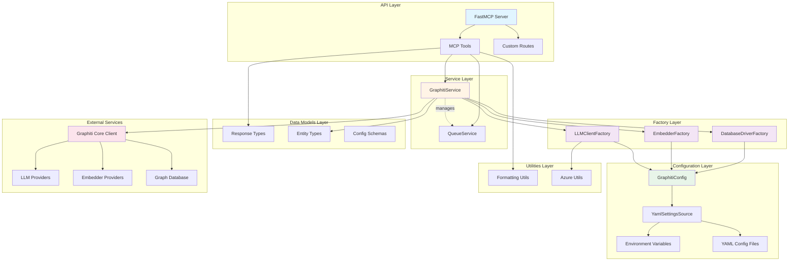
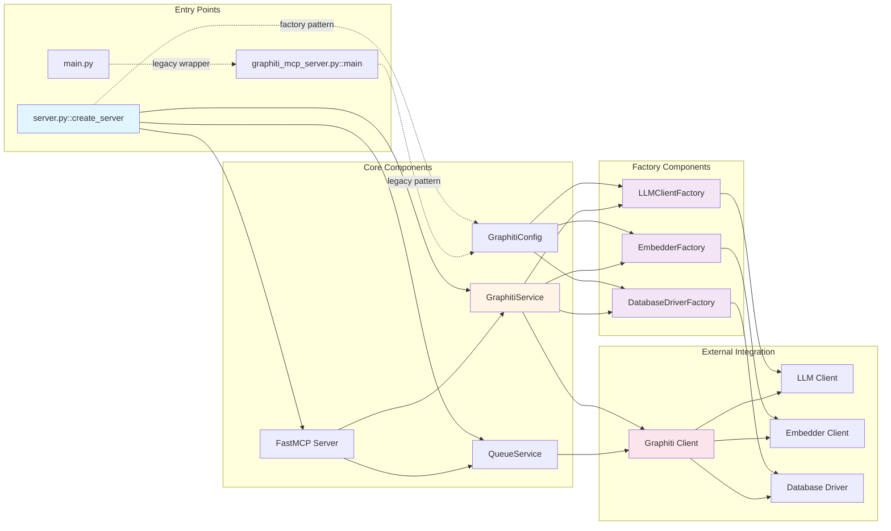
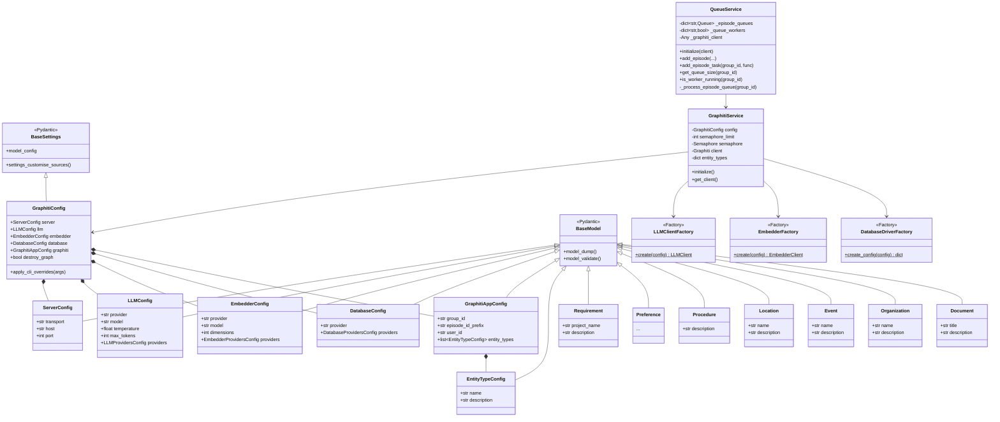
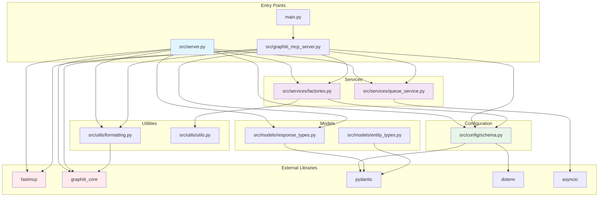
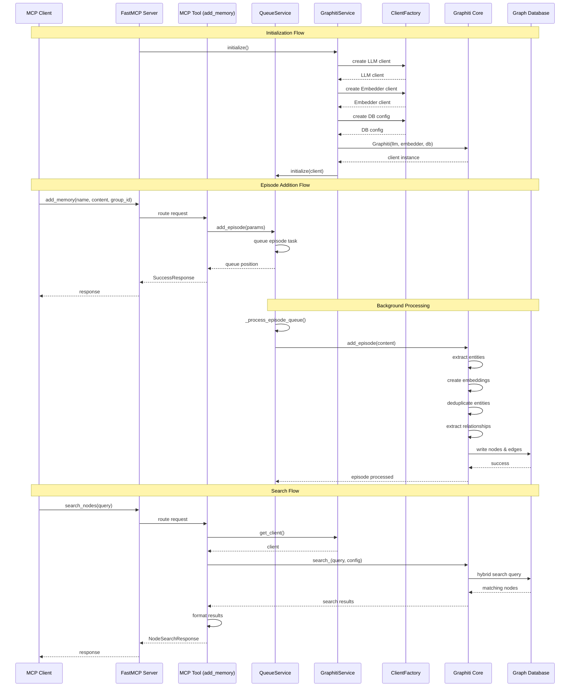
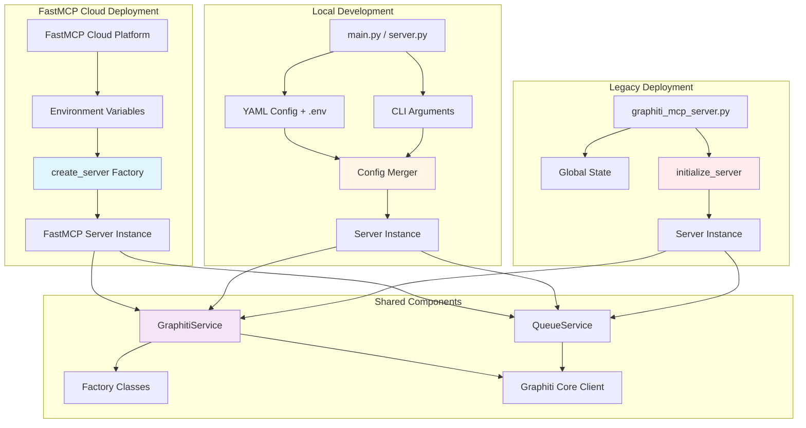

# Architecture Diagrams

## Overview

The Graphiti MCP Server is a FastMCP-based implementation that exposes the Graphiti knowledge graph library through the Model Context Protocol. The architecture follows a layered design with clear separation between API, service, configuration, and data model layers. It employs the Factory Pattern for dependency injection and supports multiple LLM/embedder/database providers.

**Key Architectural Characteristics:**
- **Layered Architecture**: API Layer (MCP Tools) -> Service Layer -> Integration Layer -> External Services
- **Factory Pattern**: Configurable client creation for LLM, Embedder, and Database providers
- **Queue-Based Processing**: Sequential episode processing per group_id to prevent race conditions
- **Configuration-Driven**: YAML + Environment Variables with hierarchical overrides
- **Dual Entry Points**: Factory-based (cloud) and legacy (local development)

---

## System Architecture (Layered View)

### Diagram



### Explanation

**API Layer** (`src/server.py`, `src/graphiti_mcp_server.py`)
- Exposes MCP tools for knowledge graph operations
- Handles HTTP/stdio transport and custom routes
- Implements tool registration via closure pattern
- File: `src/server.py` (Lines 230-455)

**Service Layer** (`src/server.py:88-168`, `src/services/queue_service.py`)
- **GraphitiService**: Manages Graphiti client lifecycle, initialization, and provider setup
- **QueueService**: Handles sequential episode processing with per-group_id queues
- Provides business logic abstraction from API layer
- Files:
  - `src/server.py` (Lines 88-168)
  - `src/services/queue_service.py`

**Factory Layer** (`src/services/factories.py`)
- **LLMClientFactory**: Creates LLM clients (OpenAI, Azure, Anthropic, Gemini, Groq)
- **EmbedderFactory**: Creates embedder clients (OpenAI, Azure, Gemini, Voyage)
- **DatabaseDriverFactory**: Creates database configs (Neo4j, FalkorDB)
- Enables provider abstraction and dependency injection
- File: `src/services/factories.py` (Lines 100-440)

**Configuration Layer** (`src/config/schema.py`)
- Hierarchical configuration: CLI > ENV > YAML > Defaults
- Environment variable expansion in YAML files
- Provider-specific configuration classes
- File: `src/config/schema.py` (Lines 1-293)

**Data Models Layer** (`src/models/`)
- Response types for MCP tool outputs (TypedDict)
- Entity types for knowledge extraction (Pydantic)
- Configuration schemas (Pydantic BaseSettings)
- Files:
  - `src/models/response_types.py`
  - `src/models/entity_types.py`

**Utilities Layer** (`src/utils/`)
- Formatting utilities for nodes and edges
- Azure AD credential providers
- Files:
  - `src/utils/formatting.py`
  - `src/utils/utils.py`

**External Services**
- **Graphiti Core**: Knowledge graph library
- **LLM Providers**: OpenAI, Azure OpenAI, Anthropic, Gemini, Groq
- **Embedder Providers**: OpenAI, Azure OpenAI, Gemini, Voyage
- **Graph Databases**: FalkorDB (Redis-based), Neo4j

---

## Component Relationships

### Diagram



### Explanation

**Entry Point Relationships:**
- `main.py` is a backward-compatible wrapper delegating to `graphiti_mcp_server.py`
- `server.py::create_server()` is the modern factory-based entry point for FastMCP Cloud
- `graphiti_mcp_server.py::main()` is the legacy entry point with global state

**Configuration Flow:**
- GraphitiConfig loads from YAML files and environment variables
- Configuration is passed to factory classes for client creation
- Factory classes create concrete provider implementations

**Service Dependencies:**
- GraphitiService uses factories to create LLM, embedder, and database clients
- GraphitiService initializes the Graphiti Core client
- QueueService depends on initialized Graphiti client for episode processing
- FastMCP Server uses closures to capture service instances in tool functions

**Client Creation Flow:**
```
GraphitiConfig -> Factory Classes -> Provider Clients -> Graphiti Client
```

**Request Processing Flow:**
```
MCP Client -> FastMCP Server -> MCP Tool -> GraphitiService/QueueService -> Graphiti Client -> Database
```

---

## Class Hierarchies

### Diagram



### Explanation

**Configuration Hierarchy:**
- `GraphitiConfig` extends Pydantic `BaseSettings` for environment variable support
- Nested configuration classes extend `BaseModel` for validation
- Composition pattern: GraphitiConfig contains ServerConfig, LLMConfig, EmbedderConfig, etc.
- File: `src/config/schema.py` (Lines 230-293)

**Service Classes:**
- `GraphitiService`: Manages Graphiti client lifecycle, uses factories for initialization
- `QueueService`: Independent service for queue management, depends on Graphiti client
- Both services use dependency injection pattern
- Files:
  - `src/server.py` (Lines 88-168)
  - `src/services/queue_service.py` (Lines 12-153)

**Factory Pattern:**
- Static factory methods for creating provider-specific clients
- Each factory handles multiple provider types via match/case
- File: `src/services/factories.py` (Lines 100-440)

**Entity Type Models:**
- All entity types inherit from Pydantic `BaseModel`
- Used for custom knowledge extraction in Graphiti
- Defines schema for structured entity extraction
- File: `src/models/entity_types.py` (Lines 6-225)

**Inheritance Patterns:**
- Configuration classes use composition over inheritance
- Entity types use inheritance for base Pydantic functionality
- Factory classes use static methods (no inheritance)

---

## Module Dependencies

### Diagram



### Explanation

**Entry Point Dependencies:**
- `main.py` only imports `graphiti_mcp_server` for backward compatibility
- `src/server.py` imports config, models, services, and utilities (modern approach)
- `src/graphiti_mcp_server.py` has similar imports (legacy approach)

**Core Module Import Structure:**

**Configuration Module** (`src/config/schema.py`):
- Depends on: `pydantic`, `pydantic_settings`, `yaml`, `pathlib`, `os`
- Provides: Configuration schemas used throughout the application
- No internal dependencies (leaf module in dependency tree)

**Factory Module** (`src/services/factories.py`):
- Imports: `config.schema` (GraphitiConfig and provider configs)
- Imports: `utils.utils` (Azure credential helpers)
- Conditional imports: Graphiti Core provider clients
- Provides: Factory classes for LLM, Embedder, Database client creation

**Queue Service Module** (`src/services/queue_service.py`):
- Imports: `asyncio`, `logging`, `datetime`
- No internal module dependencies
- Provides: Queue management for episode processing

**Models Modules** (`src/models/`):
- `response_types.py`: Depends on `typing_extensions` for TypedDict
- `entity_types.py`: Depends on `pydantic` for BaseModel
- Both are leaf modules with no internal dependencies

**Utilities Modules** (`src/utils/`):
- `formatting.py`: Imports `graphiti_core.edges`, `graphiti_core.nodes`
- `utils.py`: Imports `azure.identity` conditionally
- Minimal internal dependencies

**External Library Dependencies:**
- **FastMCP**: Server framework for MCP protocol
- **Graphiti Core**: Knowledge graph library (main integration)
- **Pydantic**: Data validation and settings management
- **AsyncIO**: Asynchronous operation support
- **dotenv**: Environment variable loading

**Dependency Injection Pattern:**
```
server.py → services (factories, queue) → config → external providers
```

**Import Hierarchy (least to most dependent):**
1. Models (no internal imports)
2. Config (imports only external libraries)
3. Utilities (minimal imports)
4. Services (import config, utils)
5. Server modules (import everything)

---

## Data Flow

### Diagram



### Explanation

**Initialization Flow** (`src/server.py:173-219`):
1. `create_server()` factory loads GraphitiConfig from environment/YAML
2. GraphitiService uses factories to create LLM, Embedder, and Database clients
3. Factories handle provider-specific initialization (OpenAI, Azure, Anthropic, etc.)
4. GraphitiService creates Graphiti Core client with all providers
5. QueueService is initialized with Graphiti client
6. FastMCP server is created and tools are registered
7. File: `src/server.py` (Lines 173-219)

**Episode Addition Flow** (`src/server.py:231-266`):
1. MCP client calls `add_memory` tool with episode data
2. Tool validates source type and sets effective group_id
3. Episode is queued via QueueService.add_episode()
4. QueueService creates background task if needed
5. Immediate response returned to client (async processing)
6. Background worker processes episode sequentially per group_id
7. File: `src/server.py` (Lines 231-266)

**Background Episode Processing** (`src/services/queue_service.py:128-152`):
1. Background worker retrieves queued task
2. Calls Graphiti Core add_episode() method
3. Graphiti extracts entities using LLM
4. Entities are embedded using embedder client
5. Deduplication and relationship extraction occur
6. Nodes and edges written to graph database
7. Worker marks task complete and processes next
8. File: `src/services/queue_service.py` (Lines 128-152)

**Search Flow** (`src/server.py:268-312`):
1. MCP client calls `search_nodes` with natural language query
2. Tool retrieves initialized Graphiti client
3. Search filters created for entity types
4. Hybrid search (vector + keyword) executed
5. Database returns matching nodes with relevance scores
6. Results formatted and returned to client
7. File: `src/server.py` (Lines 268-312)

**Configuration Flow** (`src/config/schema.py:249-262`):
```
YAML File -> YamlSettingsSource -> Environment Variable Expansion
    -> Pydantic Validation -> GraphitiConfig Instance
    -> Provider-Specific Configs -> Factory Classes
```

**Error Handling:**
- Factory methods validate API keys and provider availability
- Service methods catch exceptions and return ErrorResponse
- Queue processing logs errors but continues with next task
- Background workers have CancelledError handling

**Data Transformation:**
- Input: Raw text/JSON/messages from MCP client
- Processing: Entity extraction, embedding generation
- Storage: Graph nodes (entities) and edges (relationships)
- Output: Formatted search results with metadata

---

## Deployment Patterns

### Diagram



### Explanation

**FastMCP Cloud Deployment** (Recommended):
- Entry: `src/server.py::create_server()` async factory function
- Configuration: Environment variables only (no CLI args)
- Pattern: Factory pattern with dependency injection
- Initialization: All services initialized before server creation
- File: `src/server.py` (Lines 173-219)

**Local Development Deployment**:
- Entry: `main.py` or `python src/server.py`
- Configuration: YAML files + .env + optional CLI overrides
- Pattern: Same factory pattern as cloud
- Flexibility: Supports transport selection (http/stdio)
- File: `src/server.py` (Lines 461-495)

**Legacy Deployment** (Backward Compatibility):
- Entry: `src/graphiti_mcp_server.py::main()`
- Configuration: Full CLI argument parsing + YAML + .env
- Pattern: Global state variables
- Purpose: Maintains compatibility with existing scripts
- File: `src/graphiti_mcp_server.py`

**Configuration Priority** (All Patterns):
```
CLI Arguments > Environment Variables > YAML Config > Defaults
```

**Shared Service Layer**:
- All deployment patterns use the same GraphitiService and QueueService
- Factory classes ensure consistent client creation
- Services are provider-agnostic

**Key Differences**:
- **Cloud**: No file system access, env vars only, factory pattern
- **Local**: File access, multiple config sources, same factory pattern
- **Legacy**: File access, global state, comprehensive CLI args

