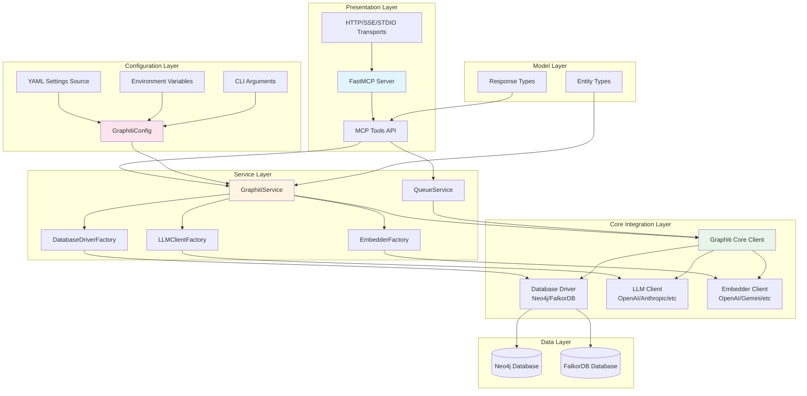
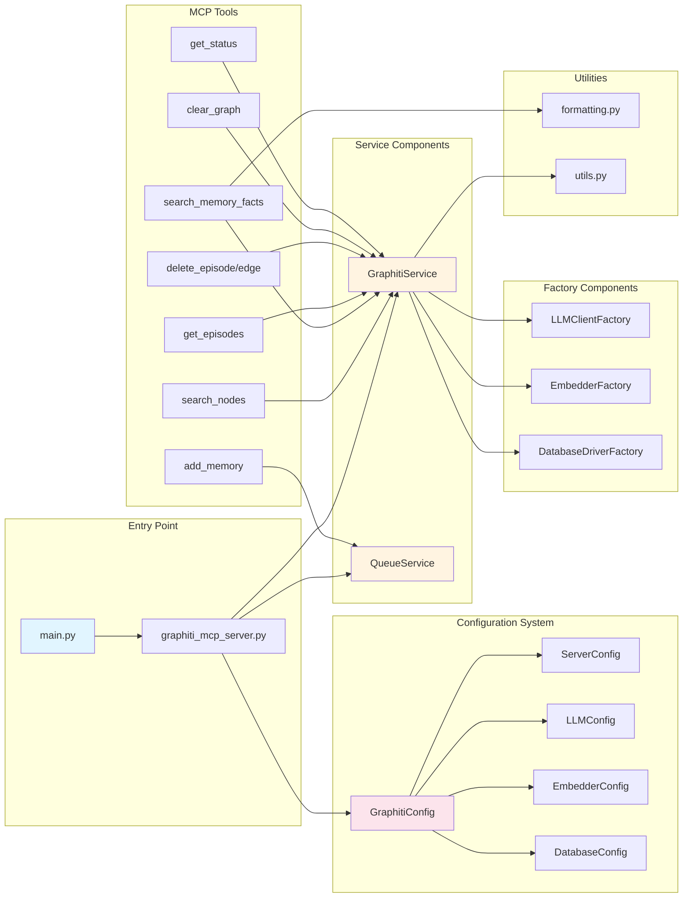
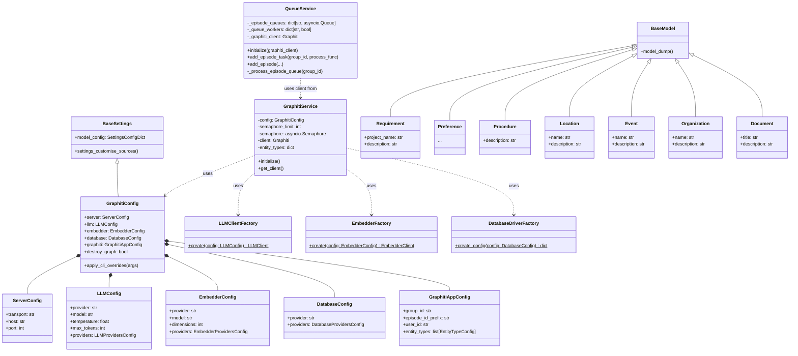
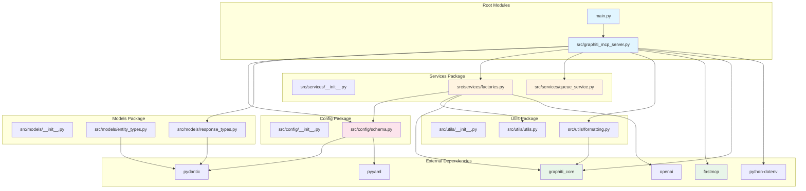
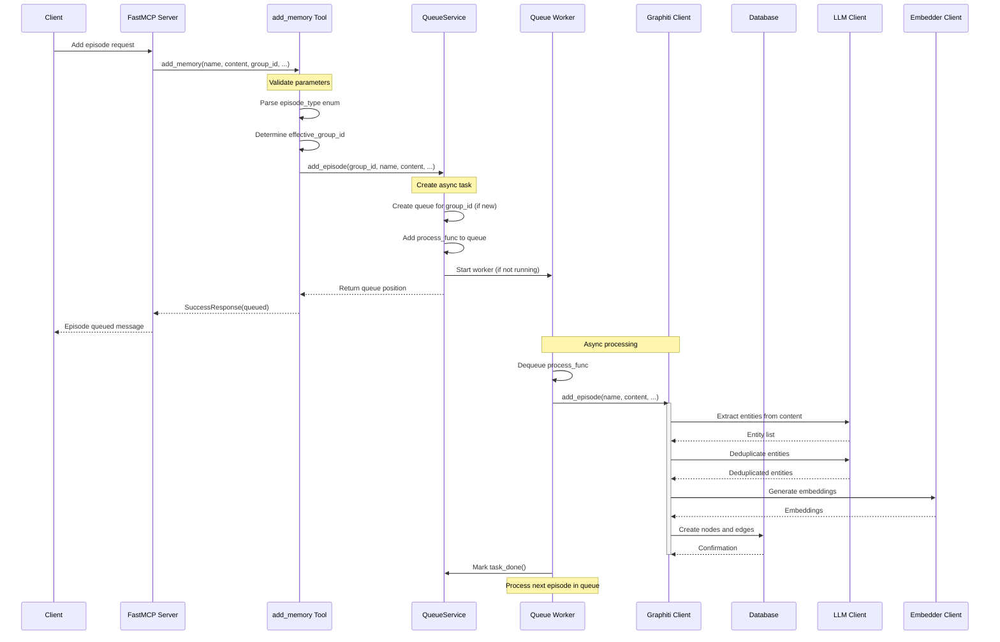
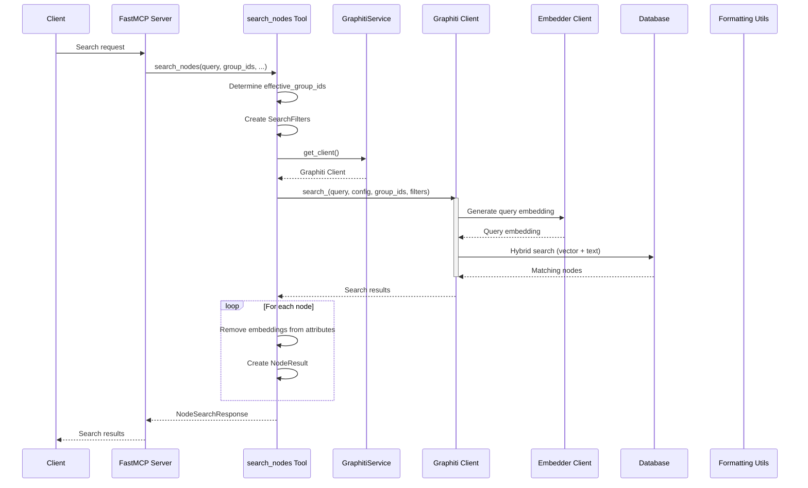
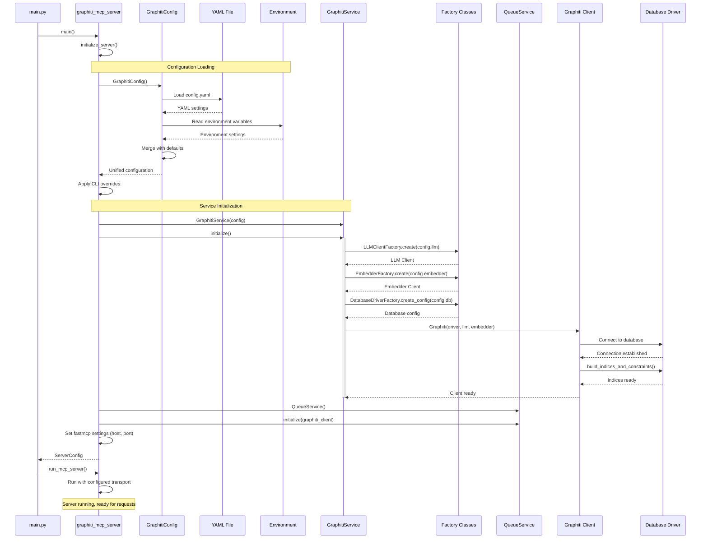
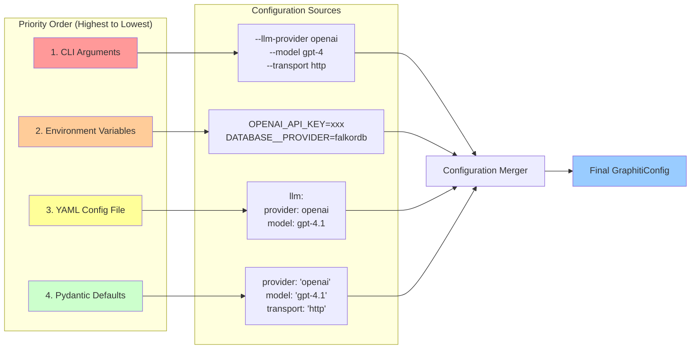

# Architecture Diagrams

## System Architecture

### Overview
The Graphiti MCP Server is built on a layered architecture that separates concerns between presentation (MCP server interface), business logic (services and factories), data access (Graphiti Core integration), and configuration management. The system uses the Model Context Protocol (MCP) to expose knowledge graph functionality through a FastMCP server, which can operate via HTTP, SSE, or STDIO transports.

The architecture follows these key principles:
- **Separation of Concerns**: Clear boundaries between configuration, services, models, and utilities
- **Factory Pattern**: Abstraction of LLM, Embedder, and Database client creation
- **Queue-based Processing**: Asynchronous episode processing with per-group_id sequential guarantees
- **Configuration-driven**: YAML-based configuration with environment variable support and CLI overrides

### Layered Architecture Diagram

**Layer Responsibilities:**

1. **Presentation Layer**: Handles all MCP protocol communication and exposes tools as API endpoints
   - FastMCP Server: Main entry point for MCP communication
   - MCP Tools API: Tool definitions (add_memory, search_nodes, search_memory_facts, etc.)
   - Transport Handlers: HTTP, SSE (deprecated), and STDIO transport implementations

2. **Service Layer**: Business logic and orchestration
   - GraphitiService: Main service coordinating Graphiti Core operations
   - QueueService: Manages sequential episode processing per group_id
   - Factories: Create and configure LLM, Embedder, and Database clients

3. **Core Integration Layer**: Integration with Graphiti Core library
   - Graphiti Core Client: Primary interface to the Graphiti knowledge graph library
   - Database Drivers: Neo4j or FalkorDB graph database drivers
   - AI Clients: LLM and Embedder clients for entity extraction and search

4. **Configuration Layer**: Centralized configuration management
   - Multi-source configuration: YAML files, environment variables, CLI arguments
   - Validation and type safety via Pydantic
   - Provider-specific configurations

5. **Model Layer**: Data models and type definitions
   - Entity Types: Custom entity type definitions (Requirement, Preference, Procedure, etc.)
   - Response Types: Structured response formats for MCP tools

6. **Data Layer**: Persistent storage
   - Graph databases for knowledge graph storage (Neo4j or FalkorDB)

## Component Relationships

### Overview
The system uses a service-oriented architecture where the GraphitiService acts as the central coordinator. It uses factory classes to create provider-specific clients (LLM, Embedder, Database), and delegates episode processing to the QueueService for concurrent handling with sequential guarantees per group_id.

### Component Diagram

**Key Relationships:**

1. **Initialization Flow**: main.py → graphiti_mcp_server.py → initialize_server() → GraphitiService + QueueService
2. **Configuration Cascade**: GraphitiConfig contains nested configs (ServerConfig, LLMConfig, EmbedderConfig, DatabaseConfig)
3. **Factory Pattern**: GraphitiService uses factories to create provider-specific clients
4. **Tool Routing**: MCP tools route to either GraphitiService (for queries) or QueueService (for writes)
5. **Utility Support**: Formatting utilities for response serialization, utils for Azure AD authentication

## Class Hierarchies

### Overview
The codebase uses Pydantic models extensively for configuration and data validation. Entity types are dynamically created Pydantic models, while response types use TypedDict for MCP tool returns. The service classes follow a simple initialization pattern without deep inheritance.

### Class Diagram

**Class Design Patterns:**

1. **Configuration Composition**: GraphitiConfig aggregates multiple configuration classes
2. **Static Factories**: Factory classes use static methods to create instances
3. **Service Pattern**: GraphitiService and QueueService are stateful services initialized at startup
4. **Pydantic Models**: Entity types and configurations use Pydantic for validation
5. **TypedDict Responses**: Response types use TypedDict for lightweight structured returns

## Module Dependencies

### Overview
The module structure is organized into clear packages: config (configuration management), services (business logic), models (data definitions), and utils (helper functions). The main server module orchestrates all components and exposes MCP tools.

### Dependency Diagram

**Dependency Layers:**

1. **Entry Layer** (main.py, graphiti_mcp_server.py)
   - Imports from all internal packages
   - Directly depends on external frameworks (fastmcp, graphiti_core)

2. **Configuration Layer** (config/)
   - schema.py: Depends on pydantic, pyyaml
   - No dependencies on other internal packages

3. **Models Layer** (models/)
   - entity_types.py: Depends only on pydantic
   - response_types.py: Depends only on typing_extensions
   - No dependencies on other internal packages

4. **Services Layer** (services/)
   - factories.py: Depends on config, utils, graphiti_core, openai
   - queue_service.py: Minimal dependencies (asyncio, logging)

5. **Utils Layer** (utils/)
   - formatting.py: Depends on graphiti_core
   - utils.py: Depends on azure.identity (optional)

**Import Guidelines:**

- **Top-down dependencies**: Server → Services → Config/Models/Utils
- **No circular dependencies**: Clean separation between layers
- **Optional imports**: Provider-specific clients are imported conditionally
- **External isolation**: External dependencies concentrated in factories and server

## Data Flow

### Overview
The system processes data through several key flows: episode addition (async write path), search operations (sync read path), and initialization (setup). The episode addition flow uses a queue-based system to ensure sequential processing per group_id while allowing concurrent processing across different groups.

### Episode Addition Flow

### Search Flow

### Initialization Flow

### Configuration Resolution Flow

**Data Flow Characteristics:**

1. **Async Write Path**: Episode additions are queued and processed asynchronously, returning immediately to the client
2. **Sequential Guarantees**: Episodes for the same group_id are processed sequentially to maintain consistency
3. **Concurrent Processing**: Different group_ids can be processed in parallel (limited by semaphore)
4. **Sync Read Path**: Search operations are synchronous and return results immediately
5. **Configuration Cascade**: Configuration is resolved through multiple layers with clear priority order
6. **Error Handling**: Each layer handles errors appropriately and returns structured error responses

## Key Architectural Patterns

### 1. Factory Pattern
Used extensively for creating provider-specific clients (LLM, Embedder, Database) with configuration-driven selection.

**Location**: `src/services/factories.py`

**Benefits**:
- Encapsulates complex client creation logic
- Supports multiple providers without changing client code
- Centralizes provider-specific configuration

### 2. Service Pattern
GraphitiService and QueueService act as stateful facades to Graphiti Core functionality.

**Locations**:
- `src/graphiti_mcp_server.py` (lines 162-321)
- `src/services/queue_service.py`

**Benefits**:
- Encapsulates initialization complexity
- Manages lifecycle of Graphiti client
- Provides clean interface for MCP tools

### 3. Queue-based Async Processing
Episodes are processed asynchronously through per-group queues to ensure sequential consistency while allowing concurrency.

**Location**: `src/services/queue_service.py` (lines 49-80)

**Benefits**:
- Non-blocking API for episode addition
- Sequential processing per group_id prevents race conditions
- Concurrent processing across different groups

### 4. Configuration Composition
Multi-layered configuration system with YAML, environment variables, and CLI overrides.

**Location**: `src/config/schema.py`

**Benefits**:
- Flexible deployment options (dev, staging, prod)
- Type-safe configuration with Pydantic validation
- Clear priority order for configuration sources

### 5. Decorator-based Tool Registration
MCP tools are registered using FastMCP decorators for clean, declarative API definition.

**Location**: `src/graphiti_mcp_server.py` (lines 323-755)

**Benefits**:
- Clear tool definitions with type hints
- Automatic request/response handling
- Self-documenting API

### 6. Response Type Standardization
Consistent response types (SuccessResponse, ErrorResponse, etc.) across all tools.

**Location**: `src/models/response_types.py`

**Benefits**:
- Predictable error handling
- Consistent client experience
- Easy to test and validate

## Technology Stack

### Core Technologies
- **Python 3.10+**: Primary programming language
- **FastMCP**: MCP protocol server implementation
- **Graphiti Core**: Knowledge graph library
- **Pydantic**: Data validation and configuration management
- **asyncio**: Asynchronous programming support

### AI/ML Integrations
- **LLM Providers**: OpenAI, Azure OpenAI, Anthropic, Gemini, Groq
- **Embedder Providers**: OpenAI, Azure OpenAI, Gemini, Voyage AI

### Database Support
- **Neo4j**: Graph database (bolt protocol)
- **FalkorDB**: Redis-based graph database

### Configuration & Deployment
- **PyYAML**: Configuration file parsing
- **python-dotenv**: Environment variable management
- **Docker**: Containerization support
- **uvicorn**: ASGI server for HTTP transport

## File Reference

### Main Server Files
- `main.py` - Entry point wrapper
- `src/graphiti_mcp_server.py` - Main server implementation with MCP tools

### Configuration
- `src/config/schema.py` - Pydantic configuration schemas

### Services
- `src/services/factories.py` - Client factories for LLM, Embedder, Database
- `src/services/queue_service.py` - Queue-based episode processing

### Models
- `src/models/entity_types.py` - Custom entity type definitions
- `src/models/response_types.py` - MCP tool response types

### Utilities
- `src/utils/formatting.py` - Response formatting utilities
- `src/utils/utils.py` - Azure AD authentication utilities

### Tests
- `tests/` - Comprehensive test suite including integration, stress, and transport tests
