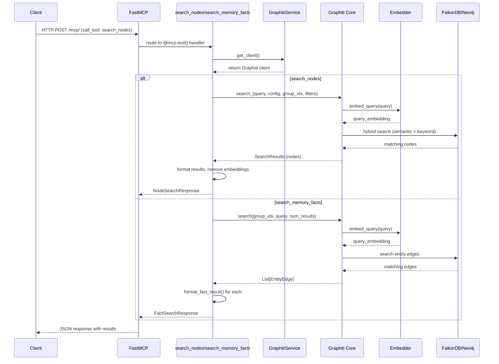
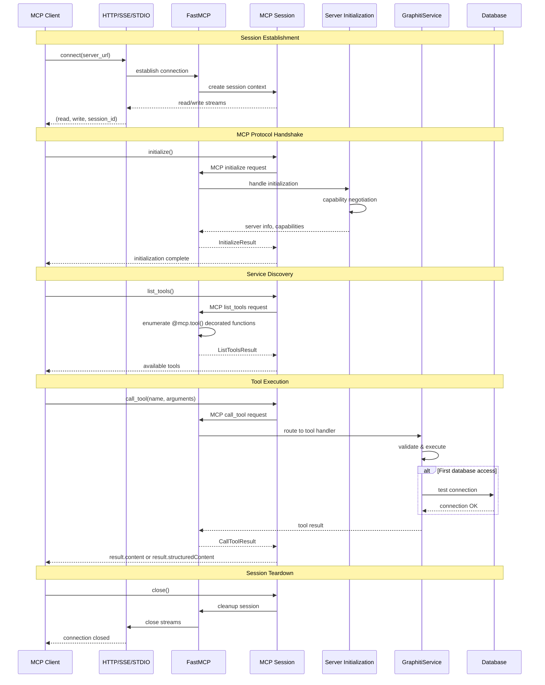
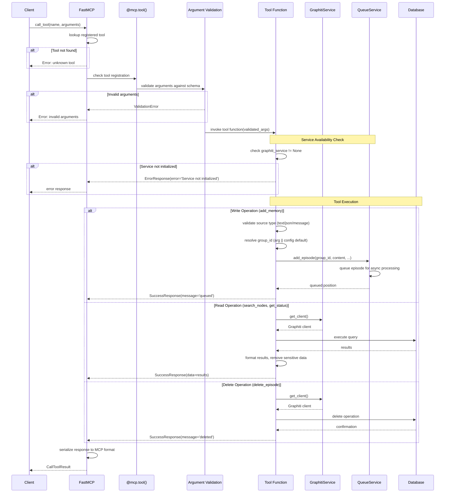
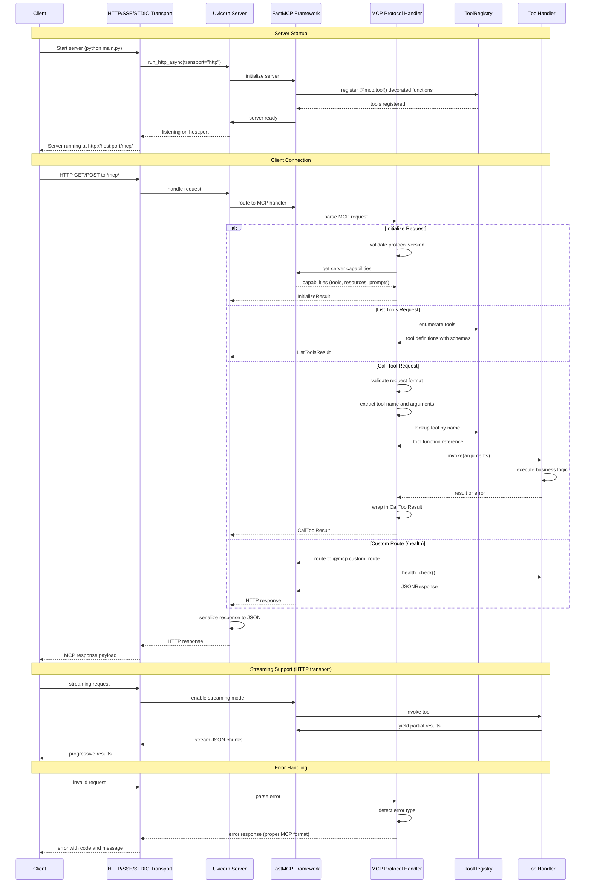
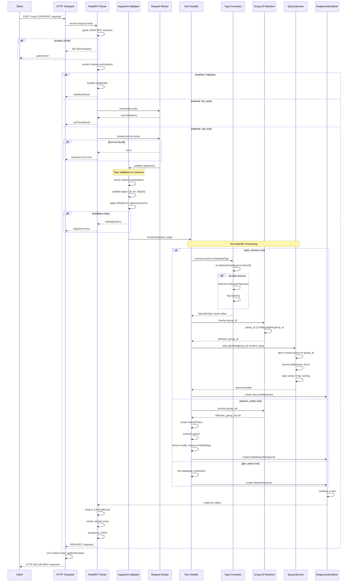

# Data Flow Analysis

## Overview

The Graphiti MCP Server implements several key data flows that enable AI agents to interact with a knowledge graph through the Model Context Protocol (MCP). The system handles:

1. **Query Flow**: Simple read operations for searching nodes and facts in the knowledge graph
2. **Interactive Session Flow**: Client connection, initialization, and sustained communication via MCP protocol
3. **Tool Permission/Callback Flow**: Authorization and execution of tool calls from MCP clients
4. **MCP Server Communication Flow**: Protocol-level message handling and transport management
5. **Message Parsing and Routing**: Request parsing and routing to appropriate tool handlers

The architecture uses FastMCP as the MCP server framework, which provides decorators for defining tools and handles the low-level protocol details. The system supports multiple transports (HTTP, SSE, STDIO) and manages asynchronous episode processing through a queue-based system.

## 1. Query Flow (Search Operations)

### Description

The query flow handles read operations where clients search for nodes (entities) or facts (relationships) in the knowledge graph. This is a synchronous operation that doesn't modify the graph state. The flow uses the Graphiti Core library's search capabilities with hybrid search combining semantic embeddings and keyword matching.

### Sequence Diagram

### Key Steps

1. **Request Reception** (`src/graphiti_mcp_server.py:410-486`)
   - FastMCP receives HTTP POST to `/mcp/` endpoint with tool call
   - Routes to appropriate tool handler based on tool name
   - For `search_nodes`: handler at line 410
   - For `search_memory_facts`: handler at line 490

2. **Client Initialization** (`src/graphiti_mcp_server.py:314-320`)
   - Tool retrieves Graphiti client via `get_client()`
   - If client is None, initializes it with database drivers, LLM, and embedder
   - Returns initialized client instance

3. **Group ID Resolution** (`src/graphiti_mcp_server.py:432-439`)
   - Uses provided `group_ids` parameter if given
   - Falls back to default `config.graphiti.group_id` from configuration
   - Group IDs partition the knowledge graph into logical namespaces

4. **Search Execution - Nodes** (`src/graphiti_mcp_server.py:441-457`)
   - Creates `SearchFilters` with entity type filters if provided
   - Uses `NODE_HYBRID_SEARCH_RRF` recipe for hybrid search
   - Calls `client.search_()` with query, config, group_ids, and filters
   - Embedder converts query to vector, database performs hybrid search

5. **Search Execution - Facts** (`src/graphiti_mcp_server.py:525-530`)
   - Validates `max_facts` parameter (must be positive)
   - Calls `client.search()` with group_ids, query, num_results, and optional center_node_uuid
   - Returns list of `EntityEdge` objects representing relationships

6. **Result Formatting** (`src/graphiti_mcp_server.py:463-481`)
   - Extracts nodes/edges from search results
   - Removes embedding vectors to reduce payload size
   - Formats timestamps as ISO strings
   - Creates typed response objects (NodeSearchResponse or FactSearchResponse)

7. **Response Return** (`src/graphiti_mcp_server.py:482-486`)
   - Returns structured response with message and results array
   - FastMCP serializes to JSON and sends HTTP response
   - Client receives parsed results

### Code References

- **Search Tools**: `src/graphiti_mcp_server.py:410-540`
  - `search_nodes()`: Lines 410-486
  - `search_memory_facts()`: Lines 490-540
- **Graphiti Service**: `src/graphiti_mcp_server.py:162-321`
  - `GraphitiService.get_client()`: Lines 314-320
  - `GraphitiService.initialize()`: Lines 172-312
- **Formatting Utilities**: `src/utils/formatting.py:9-51`
  - `format_node_result()`: Lines 9-29
  - `format_fact_result()`: Lines 32-51
- **Response Types**: `src/models/response_types.py:16-33`

## 2. Interactive Session Flow

### Description

The interactive session flow manages the lifecycle of an MCP client connection. This includes establishing the HTTP connection, performing the MCP handshake, maintaining the session, and gracefully closing resources. The flow supports both long-lived connections (for interactive clients) and short-lived request-response patterns.

### Sequence Diagram

### Key Steps

1. **Connection Establishment** (`examples/01_connect_and_discover.py:40`)
   - Client creates connection using `streamablehttp_client(SERVER_URL)`
   - Returns tuple: (read_stream, write_stream, session_id)
   - Uses async context manager for automatic cleanup

2. **Session Creation** (`examples/01_connect_and_discover.py:43`)
   - Client creates `ClientSession(read, write)` with the streams
   - Session manages MCP protocol state machine
   - Context manager ensures proper cleanup on exit

3. **MCP Handshake** (`examples/01_connect_and_discover.py:47`)
   - Client calls `session.initialize()` - REQUIRED before any operations
   - Server performs capability negotiation
   - Establishes protocol version and supported features
   - FastMCP framework handles this automatically

4. **Service Discovery** (`examples/01_connect_and_discover.py:52`)
   - Client calls `session.list_tools()` to discover available operations
   - FastMCP scans for functions decorated with `@mcp.tool()`
   - Returns `ListToolsResult` with tool metadata (name, description, parameters)
   - Tools defined at: `src/graphiti_mcp_server.py:323-756`

5. **Server Initialization** (`src/graphiti_mcp_server.py:764-907`)
   - Server parses CLI arguments and loads YAML configuration
   - Creates `GraphitiService` instance with configuration
   - Initializes database drivers (FalkorDB or Neo4j)
   - Creates LLM and Embedder clients via factories
   - Builds database indices and constraints
   - Initializes `QueueService` for async episode processing

6. **Tool Invocation** (`examples/02_call_tools.py:65-85`)
   - Client calls `session.call_tool(name, arguments)`
   - FastMCP deserializes arguments and routes to handler
   - Handler executes business logic
   - Returns `CallToolResult` with content array

7. **Result Parsing** (`examples/02_call_tools.py:31-44`)
   - Client extracts data from `result.content` (list of TextContent)
   - Or uses `result.structuredContent` for direct dict access
   - Helper function parses JSON from TextContent items

8. **Session Cleanup**
   - Context managers automatically close sessions and connections
   - FastMCP handles stream cleanup
   - No explicit close required with async context managers

### Code References

- **Client Examples**: `examples/01_connect_and_discover.py`
  - Connection pattern: Lines 40-48
  - Service discovery: Lines 52-61
- **Tool Invocation**: `examples/02_call_tools.py`
  - Calling tools: Lines 65-97
  - Result parsing: Lines 31-44
- **Server Initialization**: `src/graphiti_mcp_server.py:764-907`
  - `initialize_server()`: Lines 764-907
- **MCP Server Definition**: `src/graphiti_mcp_server.py:148-151`
  - FastMCP instance creation: Lines 148-151

## 3. Tool Permission/Callback Flow

### Description

The tool permission flow in this MCP server uses FastMCP's decorator-based approach. Tools are registered via `@mcp.tool()` decorators, and FastMCP handles authorization and execution. The system doesn't implement explicit permission callbacks but relies on FastMCP's built-in tool registration and validation. The flow includes argument validation, service availability checks, and error handling.

### Sequence Diagram

### Key Steps

1. **Tool Registration** (`src/graphiti_mcp_server.py:323-756`)
   - Functions decorated with `@mcp.tool()` are automatically registered
   - FastMCP extracts function signatures for argument validation
   - Tool metadata (name, description, parameters) generated from docstrings
   - Example: `add_memory` at line 323, `search_nodes` at line 410

2. **Request Reception and Routing** (FastMCP internal)
   - FastMCP receives `call_tool` request from client
   - Looks up tool in registry by name
   - Returns error if tool not found

3. **Argument Validation** (FastMCP internal with Pydantic)
   - FastMCP validates arguments against function signature
   - Uses type hints for validation (e.g., `str`, `list[str]`, `int`)
   - Returns validation error if types don't match or required args missing

4. **Service Availability Check** (`src/graphiti_mcp_server.py:372-373`)
   - All tools check if `graphiti_service` is initialized
   - Returns `ErrorResponse` if service is None
   - Example: `add_memory` checks at lines 372-373

5. **Write Operation Flow - add_memory** (`src/graphiti_mcp_server.py:376-406`)
   - Resolves effective group_id (parameter or config default) at line 377
   - Validates and converts source to `EpisodeType` enum at lines 379-387
   - Queues episode for async processing at lines 390-398
   - Returns success response immediately (non-blocking) at lines 400-401

6. **Read Operation Flow - search_nodes** (`src/graphiti_mcp_server.py:430-482`)
   - Gets Graphiti client via `get_client()` at line 430
   - Resolves group_ids with fallback to config at lines 432-439
   - Creates search filters at lines 442-444
   - Executes hybrid search at lines 449-454
   - Formats results and removes embeddings at lines 463-480

7. **Delete Operation Flow** (`src/graphiti_mcp_server.py:544-592`)
   - Gets Graphiti client
   - Retrieves entity/episode by UUID
   - Calls delete method on the object
   - Returns success confirmation

8. **Error Handling** (Pattern used throughout)
   - All tools wrapped in try/except blocks
   - Exceptions logged with `logger.error()`
   - Returns `ErrorResponse` with error message
   - Example pattern at lines 403-406, 483-486, 537-540

9. **Response Serialization** (FastMCP internal)
   - FastMCP serializes response objects to MCP format
   - TypedDict responses converted to JSON
   - Wrapped in `CallToolResult` structure

### Code References

- **Tool Decorators**: `src/graphiti_mcp_server.py:323-756`
  - `@mcp.tool()` decorator usage throughout
  - add_memory: Lines 323-406
  - search_nodes: Lines 410-486
  - search_memory_facts: Lines 490-540
  - delete operations: Lines 544-592
  - get_status: Lines 726-755
- **Response Types**: `src/models/response_types.py`
  - ErrorResponse: Lines 8-9
  - SuccessResponse: Lines 12-13
  - NodeSearchResponse: Lines 26-28
  - FactSearchResponse: Lines 31-33
- **FastMCP Setup**: `src/graphiti_mcp_server.py:148-151`
  - Server initialization with instructions

## 4. MCP Server Communication Flow

### Description

The MCP server communication flow handles the low-level protocol details for client-server interaction. FastMCP supports three transport modes: HTTP (streamable, recommended), SSE (deprecated), and STDIO. The HTTP transport uses streaming JSON-RPC over HTTP, enabling both request-response and streaming patterns. The flow manages connection lifecycle, message framing, protocol version negotiation, and transport-specific handling.

### Sequence Diagram

### Key Steps

1. **Server Initialization** (`src/graphiti_mcp_server.py:910-951`)
   - Parse CLI arguments at line 768-840
   - Load YAML configuration at line 847
   - Apply CLI overrides at line 850
   - Initialize GraphitiService at line 889-891
   - Initialize QueueService at line 898
   - Configure FastMCP settings (host, port) at lines 901-904

2. **Transport Selection** (`src/graphiti_mcp_server.py:916-951`)
   - Based on `config.server.transport` value
   - HTTP (recommended): `mcp.run_http_async(transport="http")` at line 947
   - STDIO: `mcp.run_stdio_async()` at line 918
   - SSE (deprecated): `mcp.run_sse_async()` at line 924

3. **HTTP Transport Details** (`src/graphiti_mcp_server.py:926-947`)
   - Binds to configured host:port (default: 0.0.0.0:8000)
   - MCP endpoint at `/mcp/` path
   - Supports streaming JSON-RPC
   - Uses Uvicorn as ASGI server
   - Logging configured at lines 99-108

4. **Connection Handling** (FastMCP internal)
   - Client connects to `/mcp/` endpoint
   - FastMCP creates session context
   - Returns read/write streams for bidirectional communication
   - Session ID generated for tracking

5. **Protocol Version Negotiation** (FastMCP internal)
   - Client sends `initialize` request with supported versions
   - Server responds with capabilities and selected version
   - If version mismatch, returns protocol error

6. **Message Framing** (FastMCP internal)
   - HTTP: JSON-RPC over HTTP with Content-Type: application/json
   - SSE: Server-Sent Events with event stream format
   - STDIO: Line-delimited JSON on stdin/stdout

7. **Tool Registry** (`src/graphiti_mcp_server.py:148-151`)
   - FastMCP scans for `@mcp.tool()` decorated functions
   - Extracts function signatures and docstrings
   - Generates JSON schema for parameters
   - Registers in internal tool registry

8. **Request Routing** (FastMCP internal)
   - Parses incoming JSON-RPC request
   - Identifies method (initialize, list_tools, call_tool, etc.)
   - Routes to appropriate handler
   - Validates request structure

9. **Custom Routes** (`src/graphiti_mcp_server.py:758-761`)
   - `@mcp.custom_route()` decorator for non-MCP endpoints
   - Health check endpoint at `/health` (line 758)
   - Returns standard HTTP responses (not MCP protocol)
   - Useful for load balancers and monitoring

10. **Logging Configuration** (`src/graphiti_mcp_server.py:80-108`)
    - Structured logging with timestamps
    - Log format: `%(asctime)s - %(name)s - %(levelname)s - %(message)s`
    - Uvicorn logging configured to match format at lines 99-108
    - Reduces noise from MCP framework logs

11. **Error Response Format** (FastMCP internal)
    - MCP protocol errors wrapped in standard format
    - Includes error code and message
    - Tool errors returned as ErrorResponse objects
    - HTTP errors (404, 500) handled by Uvicorn

### Code References

- **Server Startup**: `src/graphiti_mcp_server.py:910-967`
  - `run_mcp_server()`: Lines 910-951
  - `main()`: Lines 954-963
- **Initialization**: `src/graphiti_mcp_server.py:764-907`
  - `initialize_server()`: Lines 764-907
- **Transport Configuration**: `src/graphiti_mcp_server.py:916-951`
  - STDIO mode: Lines 917-918
  - SSE mode: Lines 919-924
  - HTTP mode: Lines 925-947
- **FastMCP Setup**: `src/graphiti_mcp_server.py:148-151`
  - Server instance with instructions
- **Logging Setup**: `src/graphiti_mcp_server.py:80-108`
  - Basic config: Lines 83-88
  - Uvicorn integration: Lines 99-108
- **Health Endpoint**: `src/graphiti_mcp_server.py:758-761`
  - Custom route for monitoring

## 5. Message Parsing and Routing

### Description

Message parsing and routing in the Graphiti MCP server is primarily handled by the FastMCP framework. The system receives JSON-RPC formatted MCP messages, parses them into structured request objects, validates arguments against function signatures, routes to appropriate handlers, and serializes responses back to MCP format. The flow includes argument type coercion, group_id resolution, episode type validation, and async queue management for write operations.

### Sequence Diagram

### Key Steps

1. **JSON-RPC Parsing** (FastMCP internal)
   - Receives HTTP POST body as bytes
   - Parses as JSON-RPC 2.0 format
   - Extracts: jsonrpc version, method, params, id
   - Validates JSON structure

2. **Method Identification** (FastMCP internal)
   - Reads `method` field from request
   - Common methods: `initialize`, `list_tools`, `call_tool`, `list_resources`, `list_prompts`
   - Routes to appropriate internal handler

3. **Tool Name Resolution** (FastMCP internal for call_tool)
   - Extracts tool name from params
   - Looks up in tool registry (populated from `@mcp.tool()` decorators)
   - Returns error if tool not found

4. **Argument Extraction and Validation** (FastMCP internal with Pydantic)
   - Extracts `arguments` object from params
   - Matches against function signature
   - Validates types using Pydantic or type hints
   - Returns validation error for type mismatches

5. **Type Conversion - EpisodeType** (`src/graphiti_mcp_server.py:379-387`)
   - For `add_memory` tool, converts `source` string to enum
   - Tries `EpisodeType[source.lower()]` lookup
   - Falls back to `EpisodeType.text` if invalid
   - Logs warning for unknown types

6. **Group ID Resolution** (`src/graphiti_mcp_server.py:377-439`)
   - Pattern: `effective_group_id = group_id or config.graphiti.group_id`
   - For lists: `effective_group_ids = group_ids if group_ids is not None else [config.graphiti.group_id]`
   - Ensures every operation has a group context
   - Used in all search and modify operations

7. **Queue-Based Routing for Write Operations** (`src/graphiti_mcp_server.py:390-398`)
   - `add_memory` submits to QueueService instead of executing directly
   - Creates async processing function closure
   - Queues by group_id to ensure sequential processing
   - Returns immediately with success message (non-blocking)

8. **Queue Service Processing** (`src/services/queue_service.py:24-152`)
   - `add_episode_task()` adds to group-specific queue (lines 24-47)
   - Worker task `_process_episode_queue()` processes sequentially (lines 49-80)
   - Actual Graphiti processing in closure at lines 128-149
   - Error handling logs failures but continues processing

9. **Response Formatting** (Pattern throughout tools)
   - Tools return TypedDict objects (SuccessResponse, ErrorResponse, etc.)
   - Dates converted to ISO strings
   - Embeddings removed from results
   - Structured data (nodes, facts) in typed arrays

10. **Response Serialization** (FastMCP internal)
    - Wraps result in `CallToolResult` object
    - Creates `content` array with `TextContent` items
    - May also populate `structuredContent` for direct dict access
    - Serializes to JSON-RPC response

11. **Error Response Handling** (Pattern throughout)
    - Exceptions caught in try/except blocks
    - Logged with `logger.error()`
    - Returns `ErrorResponse(error=error_message)`
    - FastMCP serializes to MCP error format

12. **Custom Route Handling** (`src/graphiti_mcp_server.py:758-761`)
    - `@mcp.custom_route()` bypasses MCP protocol
    - Returns standard HTTP responses (e.g., JSONResponse)
    - Used for health checks and monitoring endpoints

### Code References

- **Message Routing**: FastMCP framework (internal)
  - Tool registration via decorators
  - Automatic argument validation
  - Response serialization
- **Tool Handlers**: `src/graphiti_mcp_server.py:323-756`
  - add_memory: Lines 323-406 (with type conversion and queue routing)
  - search_nodes: Lines 410-486 (with group ID resolution)
  - search_memory_facts: Lines 490-540
  - get_status: Lines 726-755
- **Type Conversion**: `src/graphiti_mcp_server.py:379-387`
  - EpisodeType enum conversion
- **Group ID Resolution**: Multiple locations
  - add_memory: Line 377
  - search_nodes: Lines 432-439
  - search_memory_facts: Lines 517-523
  - get_episodes: Lines 642-648
- **Queue Service**: `src/services/queue_service.py`
  - add_episode_task: Lines 24-47
  - _process_episode_queue: Lines 49-80
  - add_episode: Lines 101-152
- **Response Types**: `src/models/response_types.py`
  - TypedDict definitions for all response types
- **Configuration Loading**: `src/config/schema.py`
  - YamlSettingsSource: Lines 16-74 (custom settings parser)
  - GraphitiConfig: Lines 230-293 (unified configuration)

## Data Flow Summary

### Request/Response Patterns

The Graphiti MCP Server implements three primary request/response patterns:

1. **Synchronous Read Pattern** (search_nodes, search_memory_facts, get_episodes, get_entity_edge)
   - Request → Parse → Validate → Execute → Format → Response
   - Blocking until database query completes
   - Typical response time: 100-500ms depending on query complexity
   - Example: `src/graphiti_mcp_server.py:410-486`

2. **Asynchronous Write Pattern** (add_memory)
   - Request → Parse → Validate → Queue → Immediate Response
   - Non-blocking, returns success before processing
   - Actual graph update happens in background worker
   - Sequential processing per group_id to avoid race conditions
   - Example: `src/graphiti_mcp_server.py:390-398`

3. **Synchronous Delete Pattern** (delete_episode, delete_entity_edge)
   - Request → Parse → Validate → Execute → Confirm → Response
   - Blocking until deletion completes
   - Returns confirmation of deletion
   - Example: `src/graphiti_mcp_server.py:544-592`

### Error Handling Flow

Error handling follows a consistent pattern throughout the system:

1. **Service Initialization Errors** (`src/graphiti_mcp_server.py:172-312`)
   - Database connection failures detected at startup
   - Friendly error messages with setup instructions
   - Raises RuntimeError with provider-specific guidance
   - Example: FalkorDB connection error at lines 249-258

2. **Tool Execution Errors** (Pattern throughout all tools)
   - Wrapped in try/except blocks
   - Logged with `logger.error()` for debugging
   - Returns `ErrorResponse(error=message)` to client
   - Example pattern at lines 403-406, 483-486

3. **Validation Errors** (FastMCP internal)
   - Type validation errors caught before tool execution
   - Returns MCP protocol error with details
   - Client receives clear error message

4. **Queue Processing Errors** (`src/services/queue_service.py:64-70`)
   - Errors in background processing logged but don't stop worker
   - Worker continues processing next items
   - No notification to client (already received success response)

5. **Database Errors** (Handled by Graphiti Core)
   - Connection timeouts and query errors
   - Propagated to tool handlers
   - Converted to ErrorResponse objects

### Async Processing Flow

The system uses multiple async patterns for optimal performance:

1. **Queue-Based Episode Processing** (`src/services/queue_service.py`)
   - Per-group_id queues ensure sequential processing
   - Avoids race conditions in graph updates
   - Background worker tasks process episodes continuously
   - Queue initialization at lines 36-39
   - Worker lifecycle at lines 49-80

2. **Semaphore-Limited Concurrency** (`src/graphiti_mcp_server.py:76`)
   - `SEMAPHORE_LIMIT` controls max concurrent Graphiti operations
   - Default: 10 (configurable via environment variable)
   - Prevents overwhelming LLM API rate limits
   - Tuning guidelines in comments at lines 49-76

3. **Async Database Operations** (Graphiti Core internal)
   - All database queries use async drivers
   - Non-blocking I/O for Neo4j and FalkorDB
   - Allows handling multiple client requests concurrently

4. **Async Tool Handlers** (All tools use `async def`)
   - Tools can await database operations
   - Non-blocking execution in FastMCP event loop
   - Supports concurrent client requests

5. **Event Loop Management** (`src/graphiti_mcp_server.py:954-963`)
   - Single event loop for entire server
   - `asyncio.run(run_mcp_server())` at line 958
   - Graceful shutdown on KeyboardInterrupt

### Data Transformation Points

Data undergoes several transformations as it flows through the system:

1. **Client Request → MCP Protocol** (Client-side)
   - Python dict → JSON-RPC formatted request
   - Example: `examples/02_call_tools.py:65-85`

2. **MCP Protocol → Python Types** (FastMCP internal)
   - JSON-RPC → parsed method and params
   - Arguments → type-validated Python objects

3. **String → Enum Conversion** (`src/graphiti_mcp_server.py:379-387`)
   - source string → EpisodeType enum
   - Handles invalid values gracefully

4. **Group ID Resolution** (Multiple locations)
   - Optional parameter → effective group_id string
   - None → config default value

5. **Database Results → Response Objects** (`src/utils/formatting.py`)
   - EntityNode objects → NodeResult dicts
   - EntityEdge objects → Fact dicts
   - Embedding vectors removed
   - Dates → ISO format strings

6. **Response Objects → MCP Protocol** (FastMCP internal)
   - TypedDict → JSON serializable dict
   - Wrapped in CallToolResult
   - Added to content array

7. **MCP Protocol → Client Objects** (Client-side)
   - JSON response → parsed Python objects
   - TextContent → extracted and parsed
   - Example: `examples/02_call_tools.py:31-44`

### Performance Considerations

Key performance characteristics of the data flows:

1. **Non-Blocking Writes**: add_memory returns immediately, processing happens asynchronously
2. **Read Query Optimization**: Hybrid search combines semantic and keyword matching efficiently
3. **Connection Pooling**: Database drivers manage connection pools internally
4. **Semaphore Control**: Rate limiting prevents LLM API overload
5. **Streaming Support**: HTTP transport supports streaming responses for large datasets
6. **Result Filtering**: Embeddings removed from responses to reduce payload size

### Security Considerations

Security aspects of the data flows:

1. **No Built-in Authentication**: MCP protocol doesn't include auth (use reverse proxy for production)
2. **Group ID Isolation**: Data partitioned by group_id for multi-tenancy
3. **API Key Protection**: LLM and embedder API keys loaded from environment variables
4. **Embedding Exclusion**: Internal embeddings not exposed to clients
5. **Input Validation**: FastMCP validates all tool arguments against schemas
6. **Error Message Sanitization**: Generic error messages prevent information leakage
