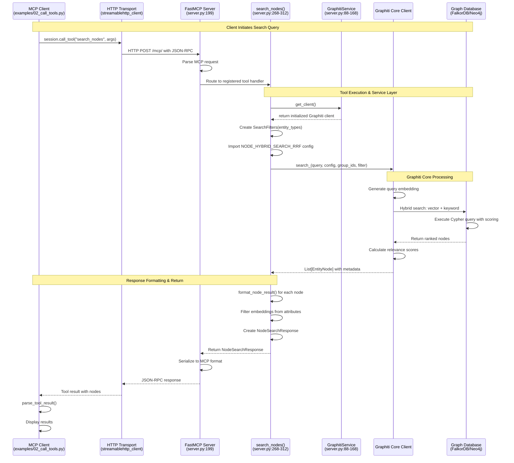
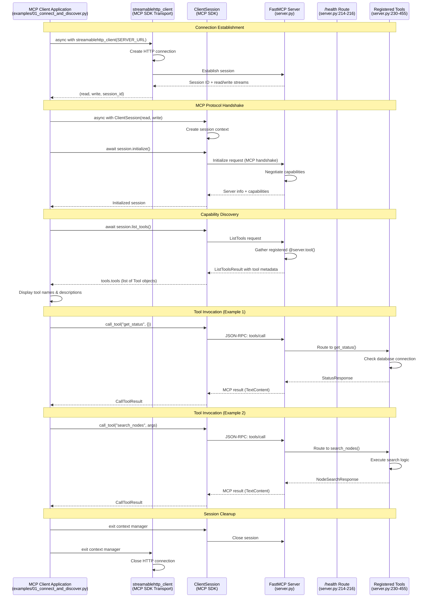
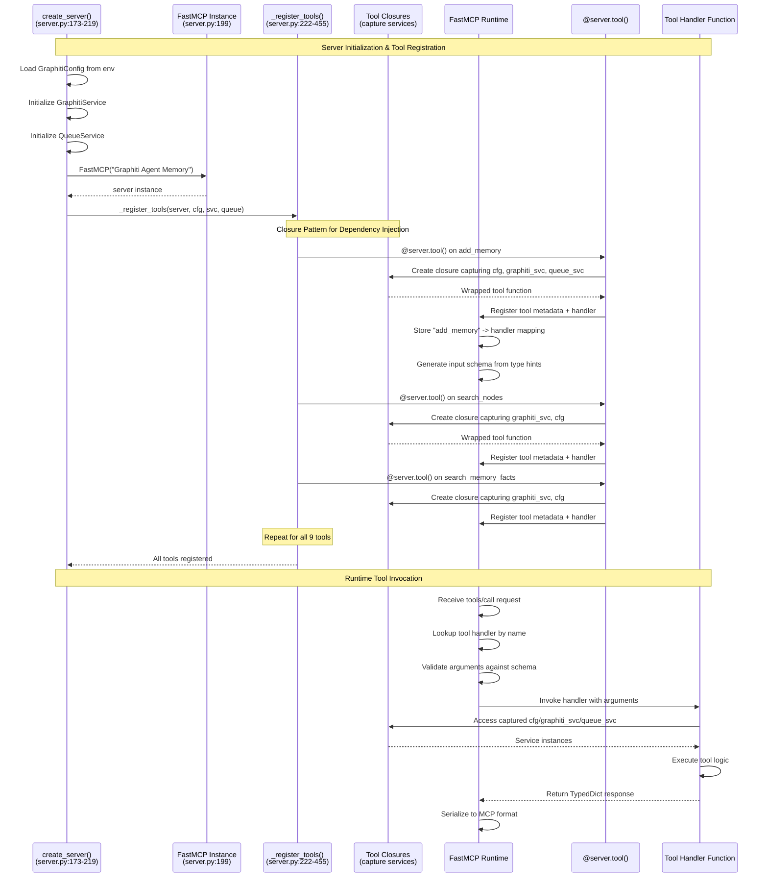
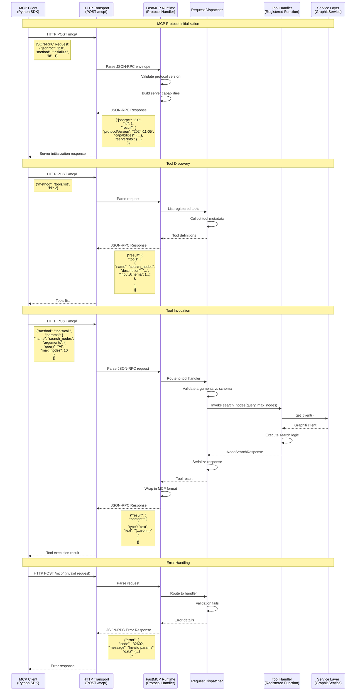
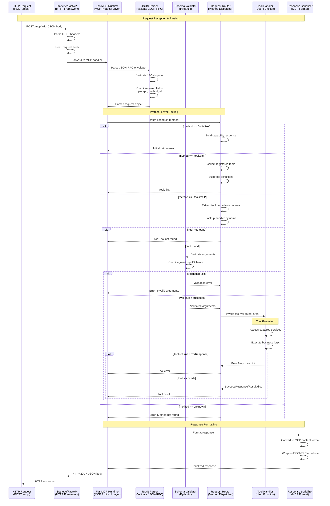
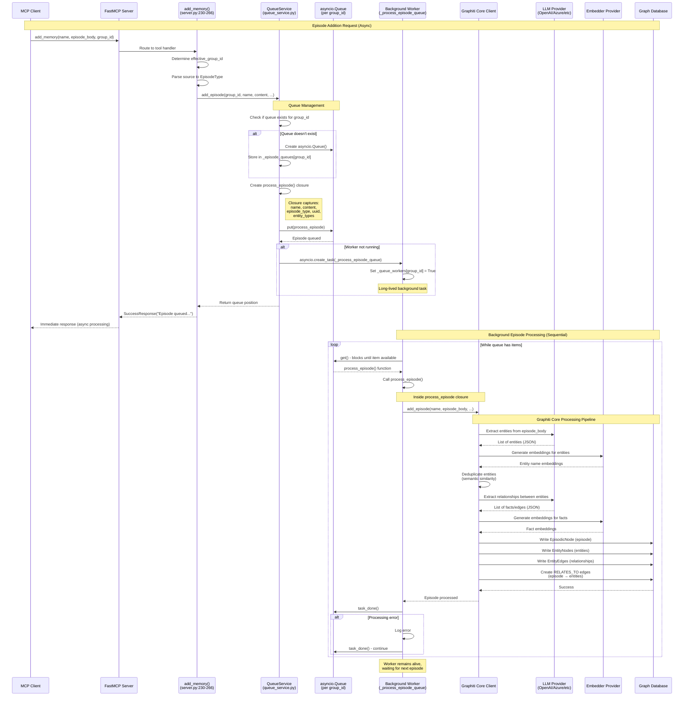

```mermaid
sequenceDiagram
    participant Client as MCP Client
    participant FastMCP as FastMCP Server
    participant Tool as Tool Handler
    participant Service as Service Layer
    participant Graphiti as Graphiti Core
    participant DB as Database

    Note over Client,DB: Scenario 1: Invalid Tool Arguments
    Client->>FastMCP: call_tool("search_nodes", invalid_args)
    FastMCP->>FastMCP: Validate args against schema
    FastMCP-->>Client: JSON-RPC error (-32602)<br/>"Invalid params"

    Note over Client,DB: Scenario 2: Tool Not Found
    Client->>FastMCP: call_tool("unknown_tool", args)
    FastMCP->>FastMCP: Lookup tool in registry
    FastMCP-->>Client: JSON-RPC error (-32601)<br/>"Method not found"

    Note over Client,DB: Scenario 3: Service Initialization Error
    Client->>FastMCP: call_tool("search_nodes", args)
    FastMCP->>Tool: Route to search_nodes()
    Tool->>Service: get_client()
    Service->>Service: Check if client is None

    alt Client not initialized
        Service->>Service: Call initialize()
        Service->>Service: Factory create fails
        Service-->>Tool: Raise RuntimeError
        Tool->>Tool: Catch exception
        Tool-->>FastMCP: ErrorResponse(error="Failed to initialize")
        FastMCP-->>Client: Tool result with error
    end

    Note over Client,DB: Scenario 4: Database Connection Error
    Client->>FastMCP: call_tool("get_status", {})
    FastMCP->>Tool: Route to get_status()
    Tool->>Service: get_client()
    Service-->>Tool: Graphiti client
    Tool->>Graphiti: Test database connection
    Graphiti->>DB: Execute test query
    DB-->>Graphiti: Connection refused
    Graphiti-->>Tool: Raise exception
    Tool->>Tool: Catch exception in try/except
    Tool-->>FastMCP: StatusResponse(status="error", message="...")
    FastMCP-->>Client: Tool result with error status

    Note over Client,DB: Scenario 5: Search Query Error
    Client->>FastMCP: call_tool("search_nodes", valid_args)
    FastMCP->>Tool: Route to search_nodes()
    Tool->>Service: get_client()
    Service-->>Tool: Graphiti client
    Tool->>Graphiti: search_(query, config, ...)
    Graphiti->>Graphiti: Generate embedding fails
    Graphiti-->>Tool: Raise exception
    Tool->>Tool: Catch in try/except (Line 310)
    Tool->>Tool: logger.error("Error searching nodes...")
    Tool-->>FastMCP: ErrorResponse(error="Error searching nodes: ...")
    FastMCP-->>Client: Tool result with error

    Note over Client,DB: Scenario 6: Episode Processing Error (Async)
    Client->>FastMCP: call_tool("add_memory", args)
    FastMCP->>Tool: Route to add_memory()
    Tool->>Service: queue_svc.add_episode()
    Service-->>Tool: Queue position
    Tool-->>FastMCP: SuccessResponse("Episode queued")
    FastMCP-->>Client: Success response (async)

    Note over Service,DB: Background Worker Error
    Service->>Service: Background worker processes
    Service->>Graphiti: add_episode()
    Graphiti->>DB: Write to database
    DB-->>Graphiti: Write error (constraint violation)
    Graphiti-->>Service: Raise exception
    Service->>Service: Catch in try/except (Line 147)
    Service->>Service: logger.error("Failed to process episode")
    Service->>Service: task_done() - continue
    Note right of Service: Client already received<br/>success, error logged only

    Note over Client,DB: Scenario 7: Invalid Episode UUID
    Client->>FastMCP: call_tool("delete_episode", {"uuid": "invalid"})
    FastMCP->>Tool: Route to delete_episode()
    Tool->>Graphiti: EpisodicNode.get_by_uuid(driver, uuid)
    Graphiti->>DB: Query by UUID
    DB-->>Graphiti: No matching node
    Graphiti-->>Tool: Raise exception (not found)
    Tool->>Tool: Catch exception (Line 365)
    Tool-->>FastMCP: ErrorResponse(error="Error deleting episode: ...")
    FastMCP-->>Client: Tool result with error

    Note over Client,DB: Scenario 8: Factory Provider Error
    Note over Service: During server initialization
    Service->>Service: LLMClientFactory.create(config)
    Service->>Service: Validate API key

    alt API key missing
        Service->>Service: Raise ValueError
        Service->>Service: Catch in initialize() (Line 106)
        Service->>Service: logger.warning("Failed to create LLM client")
        Service->>Service: Continue with llm_client=None
        Note right of Service: Degraded mode:<br/>Some operations may fail
    end
```

# Data Flow Analysis

## Overview

The Graphiti MCP Server implements a layered data flow architecture that processes knowledge graph operations through the Model Context Protocol (MCP). Data flows through distinct stages: client request initiation, MCP protocol handling, tool execution, service orchestration, and database operations. The system employs async queue-based processing for write operations (episodes) and synchronous hybrid search for read operations (nodes and facts).

**Key Data Flow Characteristics:**
- **Asynchronous Episode Processing**: Write operations are queued per group_id to prevent race conditions
- **Hybrid Search Pattern**: Read operations use vector + keyword search directly through Graphiti Core
- **Factory-Based Initialization**: Client instances are created via factory pattern during startup
- **Protocol Abstraction**: FastMCP handles MCP protocol details, exposing clean tool interfaces
- **Multi-Provider Support**: LLM/Embedder/Database clients are created dynamically based on configuration

**Primary Data Flow Types:**
1. **Query Flow**: Client → MCP Server → Tool → GraphitiService → Graphiti Core → Database
2. **Episode Addition Flow**: Client → MCP Server → Tool → QueueService (async) → Graphiti Core → Database
3. **Initialization Flow**: create_server() → GraphitiService → Factories → Provider Clients → Graphiti Core

---

## Query Flow (Search Operations)

### Sequence Diagram



### Explanation

The query flow handles synchronous read operations for searching nodes (entities) in the knowledge graph. The process follows a request-response pattern through multiple layers:

**Client Layer** (`examples/02_call_tools.py:79-96`):
- Client initiates search using `session.call_tool("search_nodes", arguments)` from `examples/02_call_tools.py` (Lines 79-96)
- Arguments include: query string, max_nodes, optional group_ids and entity_types
- Uses MCP Python SDK's streamablehttp_client for HTTP transport

**Transport Layer** (MCP Protocol):
- HTTP POST to `/mcp/` endpoint with JSON-RPC 2.0 formatted request
- FastMCP framework handles protocol parsing and validation
- Request routed to registered tool handler based on method name

**Tool Layer** (`src/server.py:268-312`):
- `@server.tool()` decorator registers handler with FastMCP
- Tool validates arguments and applies defaults (group_id from config)
- Creates `SearchFilters` for entity type filtering (Lines 280)
- Retrieves Graphiti client from GraphitiService (Line 277)
- Uses `NODE_HYBRID_SEARCH_RRF` search configuration (Line 281-288)

**Service Layer** (`src/server.py:162-167`):
- GraphitiService.get_client() returns initialized Graphiti Core instance
- Client was initialized during server startup via factory pattern
- Service maintains connection pool to graph database

**Graphiti Core Processing** (External Library):
- Generates embedding for query using configured embedder (OpenAI/Azure/Gemini/Voyage)
- Constructs hybrid search combining vector similarity and keyword matching
- Executes Cypher query on Neo4j/FalkorDB with RRF (Reciprocal Rank Fusion) scoring
- Returns ranked EntityNode objects with relevance scores

**Response Formatting** (`src/server.py:294-309`):
- Converts EntityNode objects to NodeResult TypedDict format
- Filters out embedding vectors from attributes (Line 297)
- Includes: uuid, name, labels, created_at, summary, group_id, attributes
- Returns NodeSearchResponse with message and nodes list

**Client Response Parsing** (`examples/02_call_tools.py:31-44`):
- MCP client receives TextContent with JSON string
- Helper function extracts and parses JSON
- Application displays results

### Key Code Paths

**Client Connection & Tool Invocation:**
- `examples/02_call_tools.py` (Lines 52-53): `streamablehttp_client()` context manager
- `examples/02_call_tools.py` (Lines 79-85): `session.call_tool()` invocation

**Server Tool Registration:**
- `src/server.py` (Lines 222-228): `_register_tools()` function with closure pattern
- `src/server.py` (Lines 268-312): `search_nodes()` tool implementation

**Service & Client Management:**
- `src/server.py` (Lines 88-168): GraphitiService class
- `src/server.py` (Lines 98-160): `initialize()` method with factory-created clients
- `src/server.py` (Lines 162-167): `get_client()` accessor

**Response Type Definitions:**
- `src/models/response_types.py` (Lines 16-28): NodeResult and NodeSearchResponse TypedDicts

**Similar Flow for Facts:**
- `src/server.py` (Lines 314-343): `search_memory_facts()` tool
- Uses `client.search()` instead of `client.search_()`
- Returns FactSearchResponse with formatted edges
- `src/utils/formatting.py` (Lines 32-50): `format_fact_result()`

---

## Interactive Client Session Flow

### Sequence Diagram



### Explanation

The interactive client session flow demonstrates the complete lifecycle of an MCP client connection, from initial handshake through capability discovery to tool invocation and cleanup.

**Connection Establishment** (`examples/01_connect_and_discover.py:40-43`):
- Client uses `streamablehttp_client(SERVER_URL)` as async context manager
- SERVER_URL defaults to `http://localhost:8000/mcp/`
- Transport creates HTTP connection and returns (read_stream, write_stream, session_id)
- FastMCP server accepts connection on `/mcp/` endpoint

**MCP Protocol Handshake** (`examples/01_connect_and_discover.py:43-47`):
- ClientSession created with read/write streams as context manager
- `session.initialize()` is REQUIRED before any operations (Line 47)
- Performs MCP protocol version negotiation
- Server responds with capabilities, protocol version, and server information
- FastMCP provides server name: "Graphiti Agent Memory" and instructions

**Capability Discovery** (`examples/01_connect_and_discover.py:52-61`):
- `session.list_tools()` requests available tools from server
- FastMCP gathers all tools registered via `@server.tool()` decorator
- Returns ListToolsResult containing tool metadata:
  - name: Tool identifier (e.g., "search_nodes")
  - description: Tool documentation from docstring
  - inputSchema: JSON schema for arguments (auto-generated from type hints)
- Client iterates and displays tool names and descriptions

**Tool Invocation Pattern** (`examples/02_call_tools.py:65-69`):
- `session.call_tool(name, arguments)` invokes tool with JSON arguments
- Arguments dictionary maps parameter names to values
- FastMCP routes request to registered tool handler
- Tool executes and returns TypedDict response
- FastMCP serializes response to MCP format (TextContent with JSON string)
- Client receives CallToolResult with .content list
- Client parses TextContent to extract data

**Session Lifecycle Management**:
- Python async context managers ensure proper cleanup
- Session context manager closes MCP session on exit
- Transport context manager closes HTTP connection
- Proper error handling with async exception propagation

**Custom Health Check** (`src/server.py:214-216`):
- FastMCP supports custom HTTP routes beyond MCP protocol
- `/health` endpoint returns JSON status for monitoring
- Used by deployment platforms (FastMCP Cloud, Kubernetes)

### Key Code Paths

**Client Connection & Session Management:**
- `examples/01_connect_and_discover.py` (Lines 40-48): Connection establishment and initialization
- `examples/01_connect_and_discover.py` (Lines 52-61): Tool discovery loop

**Server Creation & Tool Registration:**
- `src/server.py` (Lines 173-219): `create_server()` factory function
- `src/server.py` (Lines 199-202): FastMCP server instantiation
- `src/server.py` (Lines 205-211): Tool registration via `_register_tools()`
- `src/server.py` (Lines 214-216): Custom health check route

**Tool Invocation Examples:**
- `examples/02_call_tools.py` (Lines 65-70): get_status() with no arguments
- `examples/02_call_tools.py` (Lines 79-96): search_nodes() with arguments
- `examples/03_graphiti_memory.py` (Lines 80-109): add_memory() with different source types

**Response Parsing:**
- `examples/02_call_tools.py` (Lines 31-44): `parse_tool_result()` helper function
- `examples/03_graphiti_memory.py` (Lines 36-44): Similar parsing pattern

---

## Tool Permission/Callback Flow

### Sequence Diagram



### Explanation

The tool permission/callback flow uses Python closures to implement dependency injection, allowing tool handlers to access service instances without global state. This pattern is critical for the factory-based server creation required by FastMCP Cloud.

**Factory Initialization Phase** (`src/server.py:173-195`):
- `create_server()` loads configuration from environment variables and YAML files
- GraphitiService is initialized with LLM, embedder, and database clients via factories
- QueueService is initialized with the Graphiti client for episode processing
- Services are fully initialized before tool registration
- FastMCP server instance created with name and instructions (Lines 199-202)

**Tool Registration via Closure Pattern** (`src/server.py:222-228`):
- `_register_tools()` receives server instance and all service dependencies
- Function defines tool handlers as nested functions (closures)
- Each tool closure captures: `server`, `cfg`, `graphiti_svc`, `queue_svc` from outer scope
- Closures allow tools to access services without global variables
- Critical for supporting multiple server instances (testing, multi-tenant scenarios)

**Decorator-Based Registration** (`src/server.py:230-455`):
- `@server.tool()` decorator registers each handler with FastMCP
- FastMCP extracts tool metadata from function signature:
  - name: Function name (e.g., "add_memory")
  - description: Docstring first line
  - inputSchema: Auto-generated JSON schema from type hints
- Handler stored in internal routing table
- Type hints converted to JSON Schema for MCP protocol

**Runtime Tool Invocation**:
- MCP client sends JSON-RPC request: `{"method": "tools/call", "params": {"name": "search_nodes", "arguments": {...}}}`
- FastMCP runtime looks up handler by tool name
- Arguments validated against auto-generated schema
- Handler function invoked with validated arguments
- Closure provides access to captured service instances
- Return value serialized to MCP TextContent format

**No Permission System (Open Access)**:
- Current implementation does not include permission/authorization checks
- All tools are available to all connected clients
- Could be extended with custom middleware for authentication
- FastMCP supports custom authentication via HTTP headers

**Error Handling**:
- Tool handlers use try/except to catch errors (e.g., Lines 264-266)
- Return ErrorResponse TypedDict with error message
- FastMCP serializes errors as tool execution failures
- Client receives .isError flag in CallToolResult

### Key Code Paths

**Server Factory & Initialization:**
- `src/server.py` (Lines 173-219): `create_server()` async factory
- `src/server.py` (Lines 183): GraphitiConfig loading
- `src/server.py` (Lines 186-194): Service initialization
- `src/server.py` (Lines 199-202): FastMCP instantiation

**Tool Registration Function:**
- `src/server.py` (Lines 222-228): `_register_tools()` signature
- Purpose: Encapsulate tool definitions with closure-based DI

**Individual Tool Handlers (Examples):**
- `src/server.py` (Lines 230-266): `add_memory()` - captures cfg, graphiti_svc, queue_svc
- `src/server.py` (Lines 268-312): `search_nodes()` - captures cfg, graphiti_svc
- `src/server.py` (Lines 314-343): `search_memory_facts()` - captures cfg, graphiti_svc
- `src/server.py` (Lines 434-455): `get_status()` - captures cfg, graphiti_svc

**Service Classes Used by Closures:**
- `src/server.py` (Lines 88-168): GraphitiService class
- `src/services/queue_service.py` (Lines 12-153): QueueService class

**Type Definitions for Responses:**
- `src/models/response_types.py`: All response TypedDicts

---

## MCP Server Communication Flow

### Sequence Diagram



### Explanation

The MCP server communication flow implements the Model Context Protocol specification using JSON-RPC 2.0 over HTTP. FastMCP abstracts the protocol details, allowing tool developers to focus on business logic.

**MCP Protocol Foundation**:
- JSON-RPC 2.0 is the transport layer for all MCP messages
- Every request has: `jsonrpc`, `method`, `id`, optional `params`
- Every response has: `jsonrpc`, `id`, `result` or `error`
- Protocol version: "2024-11-05" (MCP specification version)

**Initialization Handshake**:
- Client sends `initialize` request with client capabilities
- FastMCP responds with server capabilities:
  - tools: Server provides tools (yes)
  - resources: Server provides resources (no - Graphiti uses tools only)
  - prompts: Server provides prompts (no)
- serverInfo includes name and version from FastMCP
- Instructions field provides AI assistant context (Lines 69-82)

**Tool Discovery (tools/list)**:
- Client requests list of available tools
- FastMCP iterates registered `@server.tool()` functions
- For each tool, extracts:
  - name: From function name (e.g., "search_nodes")
  - description: From function docstring
  - inputSchema: JSON Schema auto-generated from type hints
- Returns array of tool definitions for client to parse

**Tool Invocation (tools/call)**:
- Client specifies tool name and arguments in request params
- FastMCP dispatcher looks up handler in registry
- Arguments validated against auto-generated JSON schema
- Handler function invoked with keyword arguments
- Response serialized to MCP content format:
  - TextContent: JSON string with tool result
  - structuredContent: Direct JSON object (newer MCP spec)
- Tool can return ErrorResponse which FastMCP wraps appropriately

**HTTP Transport Layer** (`src/server.py:495`):
- FastMCP runs on configurable host/port (default: 0.0.0.0:8000)
- Endpoint: `http://localhost:8000/mcp/` for MCP protocol messages
- Additional endpoints: `/health` for health checks (Line 214-216)
- Uses Starlette/Uvicorn under the hood

**Stdio Transport (Alternative)**:
- FastMCP also supports stdio transport for local Claude Desktop integration
- Uses `server.run_stdio_async()` instead of HTTP (Line 484)
- Messages sent over stdin/stdout instead of HTTP
- Same JSON-RPC protocol, different transport

**Error Handling**:
- Protocol errors: Invalid JSON-RPC format
- Validation errors: Arguments don't match schema
- Tool errors: Handler returns ErrorResponse
- Each error type has appropriate JSON-RPC error code
- FastMCP handles serialization of all error types

**Content Types**:
- TextContent: {"type": "text", "text": "..."}
- structuredContent: Direct JSON object (newer spec)
- Graphiti tools return JSON serialized in TextContent
- Client helper functions parse TextContent back to objects

### Key Code Paths

**Server HTTP Runtime:**
- `src/server.py` (Lines 495): `server.run_http_async()` - HTTP server
- `src/server.py` (Lines 484): `server.run_stdio_async()` - Stdio alternative
- `src/server.py` (Lines 468-479): Host/port configuration

**Custom Health Route:**
- `src/server.py` (Lines 214-216): `@server.custom_route('/health', methods=['GET'])`
- Returns: `{"status": "healthy", "service": "graphiti-mcp"}`

**MCP Instructions:**
- `src/server.py` (Lines 69-82): GRAPHITI_MCP_INSTRUCTIONS constant
- Passed to FastMCP constructor (Line 201)
- Provides context for AI assistants using the server

**Client-Side Protocol Handling:**
- `examples/01_connect_and_discover.py` (Lines 40-48): Connection and initialization
- `examples/02_call_tools.py` (Lines 52-53): HTTP transport setup
- MCP Python SDK handles JSON-RPC serialization transparently

**Response Parsing:**
- `examples/02_call_tools.py` (Lines 31-44): Parse TextContent JSON
- `examples/02_call_tools.py` (Lines 115-123): Handle structuredContent

**FastMCP Framework:**
- External library handling all MCP protocol details
- Source: `from fastmcp import FastMCP`
- Decorators: `@server.tool()`, `@server.custom_route()`
- Runtime: Manages request routing, schema generation, serialization

---

## Message Parsing and Routing

### Sequence Diagram



### Explanation

Message parsing and routing is handled by FastMCP's internal machinery, which implements the MCP specification's JSON-RPC 2.0 protocol. The framework abstracts complexity from tool developers while ensuring protocol compliance.

**HTTP Layer Processing** (Starlette/FastAPI):
- FastMCP uses Starlette as HTTP framework (part of FastAPI ecosystem)
- All MCP messages arrive as HTTP POST to `/mcp/` endpoint
- HTTP headers parsed for content-type (application/json)
- Request body read and passed to FastMCP handler

**JSON-RPC Parsing**:
- FastMCP validates JSON-RPC 2.0 envelope structure
- Required fields: `jsonrpc` (must be "2.0"), `method`, `id`
- Optional field: `params` (object or array)
- Malformed JSON returns JSON-RPC parse error (-32700)
- Invalid envelope returns JSON-RPC invalid request error (-32600)

**Method-Based Routing**:
FastMCP routes based on `method` field:
- `initialize`: Server capability negotiation
- `tools/list`: Discover available tools
- `tools/call`: Execute a specific tool
- `resources/list`, `prompts/list`: Not implemented (Graphiti uses tools only)
- Unknown methods return "method not found" error (-32601)

**Tool Lookup & Validation** (tools/call flow):
- Extract `name` from `params.name`
- Lookup handler in registry (populated by `@server.tool()` decorators)
- Tool not found → error response
- Tool found → proceed to argument validation

**Schema Validation**:
- FastMCP auto-generates JSON Schema from Python type hints
- Example: `query: str` → `{"type": "string"}`
- Example: `max_nodes: int = 10` → `{"type": "integer", "default": 10}`
- Pydantic validates arguments against schema
- Type mismatches, missing required params → validation error (-32602)

**Handler Invocation**:
- Validated arguments passed as keyword arguments to handler
- Handler has access to captured services via closure
- Handler executes synchronously (even if async internally)
- Return value can be TypedDict, dict, or primitive

**Error Handling Flow**:
Tools return ErrorResponse TypedDict:
```python
return ErrorResponse(error="Database connection failed")
```
- FastMCP detects error field in response
- Wraps in appropriate JSON-RPC error structure
- Client receives tool execution error (not protocol error)

**Success Response Flow**:
Tools return structured data:
```python
return NodeSearchResponse(message="Success", nodes=[...])
```
- FastMCP serializes to JSON string
- Wraps in TextContent: `{"type": "text", "text": "{\"message\":...}"}`
- Returns in JSON-RPC result: `{"result": {"content": [...]}, "id": ...}`

**Response Serialization**:
- All Python objects serialized to JSON
- Dates converted to ISO format
- Embeddings filtered out (too large for transport)
- Response wrapped in JSON-RPC envelope with matching `id`
- HTTP 200 status with JSON content-type

**Stdio Transport Alternative**:
- Same parsing/routing logic
- Input from stdin instead of HTTP POST
- Output to stdout instead of HTTP response
- Line-delimited JSON messages
- Used for Claude Desktop integration

### Key Code Paths

**Server Entry Point:**
- `src/server.py` (Lines 173-219): `create_server()` - Sets up FastMCP instance
- `src/server.py` (Lines 199-202): FastMCP("Graphiti Agent Memory") instantiation

**Tool Registration (Populates Router):**
- `src/server.py` (Lines 222-455): `_register_tools()` function
- Each `@server.tool()` decorator adds handler to internal registry

**Response Type Definitions:**
- `src/models/response_types.py`: TypedDict schemas
  - ErrorResponse (Lines 8-9)
  - SuccessResponse (Lines 12-13)
  - NodeSearchResponse (Lines 26-28)
  - FactSearchResponse (Lines 31-33)
  - StatusResponse (Lines 41-43)

**Type Hint to Schema Conversion (Automatic):**
- Tool signatures define schemas, e.g.:
  - `src/server.py` (Lines 231-237): `add_memory()` parameters
  - `src/server.py` (Lines 269-273): `search_nodes()` parameters
- FastMCP uses introspection to generate inputSchema JSON

**Error Response Examples:**
- `src/server.py` (Line 266): add_memory error handling
- `src/server.py` (Line 312): search_nodes error handling
- `src/server.py` (Line 343): search_memory_facts error handling

**FastMCP Framework (External):**
- Handles all protocol parsing, routing, and serialization
- Provides decorators: `@server.tool()`, `@server.custom_route()`
- Manages JSON-RPC compliance
- Source: `from fastmcp import FastMCP`

---

## Episode Addition Flow (Async Queue)

### Sequence Diagram



### Explanation

The episode addition flow uses asynchronous queue-based processing to prevent race conditions when multiple episodes are added concurrently for the same group_id. This ensures sequential processing per namespace while allowing parallel processing across different groups.

**Synchronous Request Phase** (`src/server.py:230-266`):
- Client calls `add_memory()` tool with episode data
- Handler determines effective group_id (from parameter or config default, Line 241)
- Converts source string to EpisodeType enum (Lines 243-249)
  - "text" → EpisodeType.text
  - "json" → EpisodeType.json
  - "message" → EpisodeType.message
- Calls QueueService.add_episode() to enqueue work (Lines 251-259)
- Returns SuccessResponse immediately (Line 261-263)
- Client receives response before processing starts (async pattern)

**Queue Service Architecture** (`src/services/queue_service.py`):
- Maintains separate asyncio.Queue for each group_id (Line 18)
- One background worker per group_id ensures sequential processing (Line 20)
- Prevents race conditions in knowledge graph (overlapping episodes create inconsistent entities)
- Different groups can process in parallel

**Episode Queuing** (`src/services/queue_service.py:101-152`):
- Creates closure function `process_episode()` capturing all parameters (Lines 128-149)
- Closure pattern defers execution until worker retrieves from queue
- Queue stores callable, not data - allows complex async processing
- Checks if queue exists, creates if needed (Lines 37-38)
- Puts closure into queue (Line 41)

**Worker Lifecycle** (`src/services/queue_service.py:49-80`):
- Worker started on first episode for a group_id (Lines 44-45)
- `asyncio.create_task()` runs worker in background
- Worker runs indefinitely, waiting for queue items (Line 59)
- `queue.get()` blocks when queue empty (Line 62)
- Worker processes one episode at a time (sequential)
- `task_done()` marks completion (Line 73)
- Worker stays alive for subsequent episodes

**Graphiti Core Processing** (External Library):
Episode processing pipeline within `graphiti_client.add_episode()`:

1. **Entity Extraction** (LLM-powered):
   - LLM analyzes episode text to identify entities (people, places, concepts)
   - Uses configured entity types (custom Pydantic models) for structured extraction
   - Returns JSON with entity name, type, summary, attributes

2. **Entity Embedding**:
   - Each entity name embedded using configured embedder
   - Embeddings enable semantic similarity search
   - Used for deduplication and hybrid search

3. **Entity Deduplication**:
   - Compares new entities to existing ones via embedding similarity
   - Merges if similarity above threshold (avoids "Alice" and "Alice Smith" as separate entities)
   - Updates existing entities with new information

4. **Relationship Extraction** (LLM-powered):
   - LLM identifies relationships between entities
   - Each fact has: source entity, target entity, relationship type, temporal validity
   - Example: "Alice WORKS_AT Acme Corp (valid from 2024-01-15)"

5. **Fact Embedding**:
   - Relationship facts embedded for semantic search
   - Enables finding similar relationships

6. **Database Write**:
   - EpisodicNode created with episode content and metadata (Lines 134-142)
   - EntityNodes written/updated for all entities
   - EntityEdges created for all facts
   - RELATES_TO edges connect episode to extracted entities
   - All writes in transaction for consistency

**Error Handling** (`src/services/queue_service.py:64-73`):
- Try/except around episode processing (Lines 64-70)
- Errors logged but don't crash worker (Line 68-69)
- `task_done()` called even on error (Line 72)
- Worker continues processing next episode
- Failed episodes don't block queue

**Queue Position Feedback**:
- `add_episode()` returns queue position (Line 152)
- Allows clients to estimate processing time
- Useful for monitoring and debugging

### Key Code Paths

**Tool Handler (Entry Point):**
- `src/server.py` (Lines 230-266): `add_memory()` tool
- `src/server.py` (Lines 241): Determine effective_group_id
- `src/server.py` (Lines 243-249): Parse source to EpisodeType
- `src/server.py` (Lines 251-259): Call queue_svc.add_episode()

**Queue Service Implementation:**
- `src/services/queue_service.py` (Lines 12-23): QueueService class initialization
- `src/services/queue_service.py` (Lines 92-99): `initialize()` with Graphiti client
- `src/services/queue_service.py` (Lines 101-152): `add_episode()` method
- `src/services/queue_service.py` (Lines 128-149): process_episode closure

**Background Worker:**
- `src/services/queue_service.py` (Lines 49-80): `_process_episode_queue()` worker
- `src/services/queue_service.py` (Lines 59-73): Main processing loop
- `src/services/queue_service.py` (Lines 74-80): Error handling and cleanup

**Graphiti Client Call:**
- `src/services/queue_service.py` (Lines 134-143): `self._graphiti_client.add_episode()`
- Parameters: name, episode_body, source_description, source, group_id, reference_time, entity_types, uuid

**EpisodeType Enum:**
- From graphiti_core.nodes import EpisodeType
- Values: text, json, message
- Used in Line 246: `EpisodeType[source.lower()]`

**Client Usage Examples:**
- `examples/03_graphiti_memory.py` (Lines 80-93): Text episode
- `examples/03_graphiti_memory.py` (Lines 96-109): JSON episode

---

## Error Handling Flow

### Sequence Diagram



### Explanation

The error handling flow demonstrates how errors are caught, logged, and reported at different layers of the system. The architecture uses defensive programming with try/except blocks and returns ErrorResponse TypedDicts rather than raising exceptions to clients.

**Protocol-Level Errors (FastMCP):**
These are handled automatically by FastMCP before reaching tool handlers:
- **Invalid JSON-RPC** (-32700): Malformed JSON in request body
- **Invalid Request** (-32600): Missing required fields (jsonrpc, method, id)
- **Method Not Found** (-32601): Unknown method name in request
- **Invalid Params** (-32602): Arguments don't match auto-generated schema
- All return standard JSON-RPC error responses

**Tool Argument Validation:**
FastMCP auto-generates JSON Schema from type hints and validates before invocation:
- Type mismatches: `max_nodes: int` receives string → validation error
- Missing required params: `query` omitted → validation error
- Invalid enum values: Unknown source type
- Validation errors return -32602 with detailed error message

**Service Initialization Errors** (`src/server.py:98-160`):
- Factory methods can fail if API keys missing or providers unavailable
- Try/except around LLM client creation (Lines 104-107)
- Try/except around embedder client creation (Lines 109-112)
- Failures logged as warnings, service continues with None clients
- Later operations may fail if clients needed but weren't created
- get_client() raises RuntimeError if client initialization failed (Line 166)

**Database Connection Errors** (`src/server.py:434-455`):
- get_status() tool specifically tests database connectivity
- Executes simple Cypher query: `MATCH (n) RETURN count(n) as count` (Line 441)
- Exceptions caught and returned in StatusResponse (Lines 450-455)
- status="error" with descriptive message
- Allows health checks to detect database issues

**Search Operation Errors** (`src/server.py:268-312`):
- All search operations wrapped in try/except (Lines 276-312)
- Possible errors:
  - Embedding generation failure (LLM/embedder down)
  - Database query timeout
  - Invalid search configuration
  - Network errors
- logger.error() logs full stack trace (Line 311)
- Returns ErrorResponse with user-friendly message (Line 312)
- Client receives tool result with error field, not exception

**Episode Processing Errors** (`src/services/queue_service.py:147-149`):
- Episode addition returns success immediately (async pattern)
- Background worker catches exceptions during processing (Lines 147-149)
- Errors logged: `logger.error(f'Failed to process episode {uuid}...')` (Line 148)
- Worker continues processing next episode (doesn't crash)
- Client never sees these errors (already received success)
- Monitoring/logging required to detect background processing failures

**UUID Lookup Errors** (`src/server.py:357-367`):
- delete_episode(), delete_entity_edge(), get_entity_edge() all lookup by UUID
- Graphiti Core raises exception if UUID not found
- Exceptions caught in try/except (Line 365)
- Returns ErrorResponse with descriptive message (Line 366)
- Examples:
  - `delete_episode("invalid-uuid")` → "Error deleting episode: Node not found"
  - `get_entity_edge("missing-uuid")` → "Error getting entity edge: Edge not found"

**Factory Provider Errors** (`src/services/factories.py:75-96`):
- `_validate_api_key()` checks if API key is None or empty (Lines 89-92)
- Raises ValueError with helpful message: "OpenAI API key is not configured..."
- Caught in GraphitiService.initialize() (Lines 104-112)
- Service continues in degraded mode (some operations will fail later)
- Alternative: Fail fast during initialization (could raise in create_server())

**Logging Strategy**:
- All errors logged to stderr with context
- Log format: `%(asctime)s - %(name)s - %(levelname)s - %(message)s`
- Different log levels:
  - WARNING: Expected failures (missing API key, initialization retries)
  - ERROR: Unexpected failures (database errors, search failures)
  - INFO: Normal operation (client initialized, episode processed)

**Client-Side Error Handling** (`examples/02_call_tools.py`):
- Clients should check result.isError flag
- Parse error messages from ErrorResponse.error field
- Handle network errors (connection refused, timeout)
- Example: Try/except around session.call_tool()

**Error Response Format**:
All tool errors use consistent ErrorResponse TypedDict:
```python
ErrorResponse(error="Descriptive error message")
```
- Single "error" field with string message
- Serialized to JSON in MCP TextContent
- Client parses and displays to user

**No Retry Logic**:
- System doesn't automatically retry failed operations
- Clients must implement retry logic if desired
- Queue workers don't retry failed episodes (logged and skipped)
- Could be extended with exponential backoff for transient errors

### Key Code Paths

**Tool Error Handling Examples:**
- `src/server.py` (Lines 264-266): add_memory error handling
- `src/server.py` (Lines 310-312): search_nodes error handling
- `src/server.py` (Lines 341-343): search_memory_facts error handling
- `src/server.py` (Lines 353-355): delete_entity_edge error handling
- `src/server.py` (Lines 365-367): delete_episode error handling
- `src/server.py` (Lines 414-416): get_episodes error handling
- `src/server.py` (Lines 430-432): clear_graph error handling
- `src/server.py` (Lines 450-455): get_status error handling

**Service Initialization Error Handling:**
- `src/server.py` (Lines 104-107): LLM client creation try/except
- `src/server.py` (Lines 109-112): Embedder client creation try/except
- `src/server.py` (Lines 158-160): Overall initialization error handling

**Queue Worker Error Handling:**
- `src/services/queue_service.py` (Lines 64-73): Episode processing try/except/finally
- `src/services/queue_service.py` (Lines 74-80): Worker cancellation and cleanup

**Factory Validation:**
- `src/services/factories.py` (Lines 75-96): `_validate_api_key()` function
- Raises ValueError if API key missing

**Error Response Type:**
- `src/models/response_types.py` (Lines 8-9): ErrorResponse TypedDict

**Logging Configuration:**
- `src/server.py` (Lines 51-66): Logging setup with format and levels

---

## Summary

The Graphiti MCP Server implements sophisticated data flows that balance synchronous request-response patterns for queries with asynchronous queue-based processing for writes. Key architectural insights:

**Data Flow Patterns:**
1. **Synchronous Query Flow**: Direct path from client → FastMCP → tool → service → Graphiti Core → database for read operations (search_nodes, search_memory_facts, get_episodes)
2. **Asynchronous Write Flow**: Client receives immediate response while background workers process episodes sequentially per group_id to prevent race conditions
3. **Factory-Based Initialization**: Server components created via factory pattern during startup, enabling clean dependency injection through closures
4. **Protocol Abstraction**: FastMCP handles all MCP protocol complexity (JSON-RPC parsing, schema validation, serialization), allowing tool developers to focus on business logic

**Critical Design Decisions:**
- **Queue per group_id**: Prevents concurrent modifications to same knowledge namespace while allowing parallel processing across different groups
- **Closure-based DI**: Services captured in tool closures enable factory pattern without global state, essential for FastMCP Cloud deployment
- **Immediate async responses**: Episode additions return success before processing, providing better UX but requiring monitoring for background errors
- **Hybrid search strategy**: Combines vector similarity and keyword matching for robust entity/fact retrieval

**Data Transformation Pipeline:**
- **Input**: Raw text/JSON/messages from MCP clients
- **Extraction**: LLM identifies entities and relationships from episodes
- **Embedding**: Vector representations for semantic similarity
- **Deduplication**: Merging semantically similar entities
- **Storage**: Graph database with temporal metadata
- **Retrieval**: Hybrid search with relevance ranking
- **Output**: Formatted JSON responses via MCP protocol

**Error Handling Strategy:**
- Multi-layered error handling: Protocol errors (FastMCP) → validation errors (schema) → service errors (try/except) → tool errors (ErrorResponse)
- Graceful degradation: Missing providers logged as warnings, service continues in degraded mode
- Background error isolation: Queue worker errors don't crash other workers or affect client responses

**Performance Characteristics:**
- Read operations: Synchronous, latency depends on database query and embedding generation
- Write operations: Async queued, immediate response to client, sequential processing per group
- Concurrent processing: Multiple groups processed in parallel, single group sequential
- Connection pooling: Maintained by Graphiti Core for database efficiency

The architecture successfully balances simplicity (clean tool interfaces), scalability (async processing), and reliability (error isolation, sequential consistency) while maintaining MCP protocol compliance.
