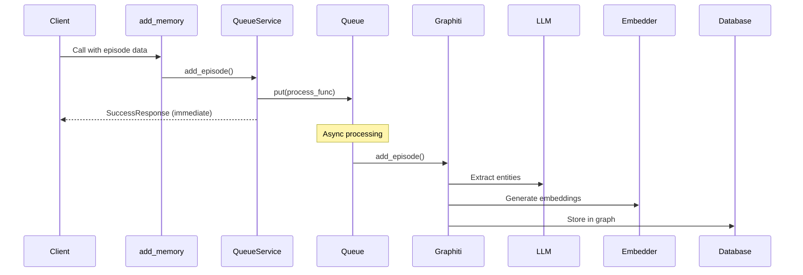
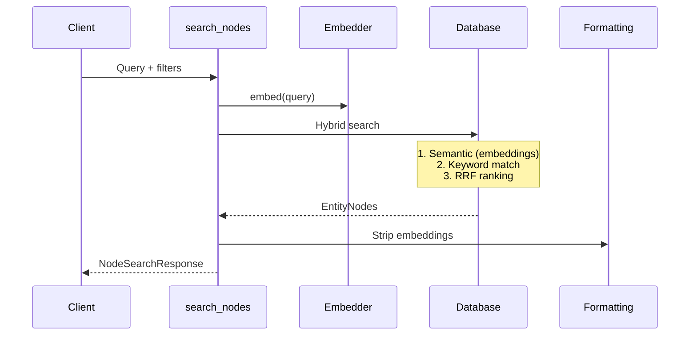

# Repository Architecture Documentation

## Overview

**Graphiti-FastMCP** is a production-ready MCP (Model Context Protocol) server that provides AI agents with persistent memory capabilities through a knowledge graph. The system enables AI assistants like Claude to remember information across conversations by storing episodes, entities, and relationships in a graph database, making them searchable via semantic and keyword queries.

### What It Does

- **Memory Persistence**: AI agents can add episodes (conversations, documents, structured data) to long-term memory
- **Intelligent Search**: Hybrid search combines semantic similarity (embeddings) with keyword matching for better retrieval
- **Knowledge Graph**: Automatically extracts entities (people, organizations, preferences, etc.) and relationships from unstructured text
- **Multi-Provider Support**: Works with OpenAI, Anthropic, Azure OpenAI, Gemini, or Groq for LLMs; multiple embedder and database options
- **Production Ready**: Async queue-based processing, health checks, Docker support, comprehensive error handling

### Key Technologies

| Technology | Purpose | Version/Provider |
|------------|---------|------------------|
| **FastMCP** | MCP protocol implementation | Latest |
| **Graphiti Core** | Knowledge graph engine | 0.3.x |
| **Neo4j / FalkorDB** | Graph database backend | Neo4j 5.x / FalkorDB latest |
| **OpenAI / Anthropic / Others** | LLM for entity extraction | GPT-4.1, Claude Sonnet 4.5, etc. |
| **Pydantic** | Configuration & validation | v2 |
| **Python** | Primary language | 3.11+ |

### Architecture Highlights

- **Layered Design**: Clean separation between MCP interface, business logic, integration, and data layers
- **Factory Pattern**: Runtime provider selection for LLMs, embedders, and databases
- **Queue-Based Processing**: Sequential episode processing per group with parallel processing across groups
- **Lazy Initialization**: Fast startup with on-demand client creation
- **Type Safety**: Pydantic models throughout with TypedDict responses

---

## Quick Start

### How to Navigate This Documentation

This architecture documentation set consists of four main documents, each covering a specific aspect of the system:

| Document | What It Covers | When to Read |
|----------|----------------|--------------|
| **[Component Inventory](docs/01_component_inventory.md)** | Complete catalog of classes, functions, modules | Finding specific code, understanding structure |
| **[Architecture Diagrams](diagrams/02_architecture_diagrams.md)** | Visual system design with Mermaid diagrams | Understanding system flow, design patterns |
| **[Data Flows](docs/03_data_flows.md)** | Step-by-step operation flows | Tracing requests, debugging, understanding async processing |
| **[API Reference](docs/04_api_reference.md)** | Complete API documentation | Using the MCP tools, configuring providers |

### Recommended Reading Order

**For New Developers:**
1. This README (overview and key concepts)
2. Architecture Diagrams (visual understanding)
3. Data Flows (how operations work)
4. Component Inventory (detailed code reference)

**For Integration/Usage:**
1. API Reference (MCP tools and configuration)
2. Architecture Diagrams (understanding the flow)
3. This README (configuration quick reference)

**For Debugging:**
1. Data Flows (trace the specific operation)
2. Component Inventory (find the implementation)
3. Architecture Diagrams (understand context)

### How to Find Specific Information

- **"How do I add memory?"** → [API Reference: add_memory](docs/04_api_reference.md#add_memory)
- **"How does search work?"** → [Data Flows: Search Operations](docs/03_data_flows.md#1-query-flow-search-operations)
- **"What LLM providers are supported?"** → [API Reference: LLMClientFactory](docs/04_api_reference.md#llmclientfactory)
- **"How is the queue implemented?"** → [Component Inventory: QueueService](docs/01_component_inventory.md#queueservice)
- **"What's the configuration precedence?"** → [Data Flows: Configuration Precedence](docs/03_data_flows.md#configuration-precedence)
- **"Where's the main entry point?"** → [Component Inventory: Entry Points](docs/01_component_inventory.md#entry-points)

---

## Architecture Summary

### System Architecture

Graphiti-FastMCP follows a **four-layer architecture** with clear separation of concerns:

```
┌─────────────────────────────────────────────────────┐
│           MCP INTERFACE LAYER                       │
│  FastMCP Server + 10 MCP Tools + /health endpoint   │
└─────────────────────────────────────────────────────┘
                        ↓
┌─────────────────────────────────────────────────────┐
│           SERVICE LAYER                             │
│  GraphitiService + QueueService + Graphiti Client   │
└─────────────────────────────────────────────────────┘
                        ↓
┌─────────────────────────────────────────────────────┐
│           INTEGRATION LAYER                         │
│  LLMClientFactory + EmbedderFactory + DBFactory     │
└─────────────────────────────────────────────────────┘
                        ↓
┌─────────────────────────────────────────────────────┐
│           DATA LAYER                                │
│  Neo4j / FalkorDB Graph Database                    │
└─────────────────────────────────────────────────────┘
```

**Configuration flows through all layers:**
- YAML config file → Environment variables → CLI arguments (highest priority)
- Supports ${VAR:default} syntax for flexible deployment

**Key Architectural Decisions:**

1. **Async-First**: Full async/await throughout for high concurrency and responsiveness
2. **Queue-Based Processing**: Episodes queued per group_id, processed sequentially to avoid race conditions
3. **Multi-Provider Abstraction**: Factory pattern enables runtime switching between LLM/embedder/DB providers
4. **Lazy Initialization**: Graphiti client created on first use, not at startup (faster startup, better error isolation)
5. **Stateless Tools**: MCP tools are stateless functions accessing global singleton services
6. **Embedding Exclusion**: Embeddings stripped from responses to reduce payload size and prevent vector leakage

See [Architecture Diagrams](diagrams/02_architecture_diagrams.md) for visual representations.

### Technology Stack

#### Core Dependencies

| Library | Purpose | Configuration |
|---------|---------|---------------|
| `graphiti-core` | Knowledge graph operations | Version tracked in Docker |
| `fastmcp` | MCP server framework | Decorators for tool exposure |
| `pydantic` | Config validation | BaseSettings for GraphitiConfig |
| `pyyaml` | Config file parsing | YAML with env var expansion |
| `neo4j` | Neo4j driver (optional) | bolt://localhost:7687 |
| `falkordb` | FalkorDB driver (optional) | redis://localhost:6379 |

#### Provider Libraries

**LLM Providers (5 supported):**
- `openai` - GPT-4.1, GPT-5, O1, O3 models
- `anthropic` - Claude Sonnet 4.5
- Azure OpenAI - Enterprise deployments
- `google-generativeai` - Gemini 2.0 Flash
- `groq` - LLaMA 3.3 70B

**Embedder Providers (4 supported):**
- OpenAI - text-embedding-3-small/large
- Azure OpenAI - Enterprise embeddings
- Google Gemini - text-embedding-004
- Voyage AI - voyage-3 (retrieval optimized)

**Database Providers (2 supported):**
- Neo4j - Production-grade graph database
- FalkorDB - Redis-based graph database

### Design Patterns

| Pattern | Implementation | Purpose |
|---------|----------------|---------|
| **Factory** | LLMClientFactory, EmbedderFactory, DatabaseDriverFactory | Runtime provider selection |
| **Service** | GraphitiService, QueueService | Encapsulate business logic and state |
| **Singleton** | Global service instances | Single source of truth for app state |
| **Decorator** | @mcp.tool() | Clean MCP tool exposure |
| **Queue** | asyncio.Queue per group_id | Sequential processing, avoid race conditions |
| **Lazy Initialization** | GraphitiService.get_client() | Defer expensive operations |
| **Configuration as Code** | GraphitiConfig with YAML/env/CLI | Flexible, layered configuration |
| **Formatting** | format_node_result, format_fact_result | Cross-cutting concerns |

---

## Component Overview

### Core Components

#### GraphitiService
**Location:** `src/graphiti_mcp_server.py:162-321`

Main service managing Graphiti client lifecycle. Handles:
- Factory-based client creation (LLM, embedder, database)
- Custom entity type registration
- Database connection validation
- Semaphore-based rate limiting

**Key Methods:**
- `initialize()` - Create and configure Graphiti client
- `get_client()` - Lazy initialization pattern, returns cached client

**Configuration:** Driven by GraphitiConfig instance

#### QueueService
**Location:** `src/services/queue_service.py:12-153`

Manages sequential episode processing queues by group_id. Ensures:
- Episodes for same group processed sequentially (no race conditions)
- Episodes from different groups processed in parallel
- Background worker tasks per group
- Graceful error handling (failures don't stop queue)

**Key Methods:**
- `add_episode()` - Queue episode for processing, returns immediately
- `get_queue_size()` - Monitor queue depth
- `is_worker_running()` - Check worker status

**Architecture:** One asyncio.Queue per group_id, long-lived worker tasks

#### Graphiti Client
**External Library:** graphiti-core

The core knowledge graph engine that:
- Extracts entities and relationships from text using LLMs
- Generates embeddings for semantic search
- Stores/retrieves data from graph database
- Performs hybrid search (semantic + keyword)
- Manages temporal metadata (creation, expiration)

**Initialized by:** GraphitiService with provider-specific clients

### MCP Tools

Graphiti-FastMCP exposes **10 MCP tools** through the FastMCP framework:

| Tool | Purpose | Returns | Async |
|------|---------|---------|-------|
| **add_memory** | Add episode to graph (queued) | SuccessResponse | Yes |
| **search_nodes** | Search entities (hybrid search) | NodeSearchResponse | Yes |
| **search_memory_facts** | Search relationships | FactSearchResponse | Yes |
| **get_episodes** | Retrieve episodes | EpisodeSearchResponse | Yes |
| **get_entity_edge** | Get specific relationship | dict or ErrorResponse | Yes |
| **delete_entity_edge** | Delete relationship | SuccessResponse | Yes |
| **delete_episode** | Delete episode | SuccessResponse | Yes |
| **clear_graph** | Clear all data for group(s) | SuccessResponse | Yes |
| **get_status** | Server/DB health check | StatusResponse | Yes |

**HTTP Endpoint:**
- `GET /health` - Health check for Docker/load balancers

See [API Reference](docs/04_api_reference.md) for detailed documentation.

### Services

#### Factory Classes

**LLMClientFactory** (`src/services/factories.py:100-251`)
- Creates LLM clients based on config.llm.provider
- Validates API keys before creation
- Supports reasoning models (GPT-5, O1, O3) with special handling
- Azure AD authentication for Azure OpenAI

**EmbedderFactory** (`src/services/factories.py:253-361`)
- Creates embedder clients based on config.embedder.provider
- Handles dimension configuration
- Azure AD support for Azure embedders

**DatabaseDriverFactory** (`src/services/factories.py:363-440`)
- Creates database configuration dictionaries
- Neo4j: Returns {uri, user, password}
- FalkorDB: Returns {driver, host, port, username, password, database}

### Configuration

#### GraphitiConfig
**Location:** `src/config/schema.py:230-293`

Pydantic BaseSettings class with multi-source loading:

```python
class GraphitiConfig(BaseSettings):
    server: ServerConfig          # Transport, host, port
    llm: LLMConfig               # LLM provider and settings
    embedder: EmbedderConfig     # Embedder provider and settings
    database: DatabaseConfig     # Database provider
    graphiti: GraphitiAppConfig  # App-specific (group_id, entity types)
    destroy_graph: bool          # Clear on startup flag
```

**Configuration Sources (Priority):**
1. CLI arguments (highest)
2. Environment variables
3. YAML configuration file
4. .env file
5. Default values (lowest)

**Environment Variable Expansion:**
- YAML supports `${VAR}` and `${VAR:default}` syntax
- Automatic boolean conversion ('true' → True, 'false' → False)

See [Data Flows: Configuration](docs/03_data_flows.md#5-configuration-and-initialization-flow) for details.

---

## Data Flows

### Key Flow Patterns

#### 1. Memory Addition Flow (Asynchronous)



**Key Characteristics:**
- Returns immediately after queuing (non-blocking)
- Sequential processing per group_id
- LLM calls happen during async processing
- Multiple groups process in parallel

**Files:**
- Tool: `src/graphiti_mcp_server.py:324-407`
- Queue: `src/services/queue_service.py:101-152`

#### 2. Search Flow (Hybrid Search)



**Key Characteristics:**
- Combines semantic similarity and keyword matching
- Reciprocal Rank Fusion (RRF) for result merging
- Embeddings excluded from response
- Filterable by entity_types and group_ids

**Files:** `src/graphiti_mcp_server.py:410-487`

#### 3. Configuration Loading Flow

Configuration resolution follows a clear precedence chain:

```
CLI Args → Environment → YAML → .env → Defaults
(highest priority)              (lowest priority)
```

**Process:**
1. Parse CLI arguments
2. Load YAML config (with ${VAR} expansion)
3. Merge environment variables
4. Apply CLI overrides
5. Validate with Pydantic

**Files:** `src/config/schema.py:230-293`

See [Data Flows](docs/03_data_flows.md) for complete flow diagrams.

### Request Lifecycle

1. **MCP Client** calls tool (via stdio/HTTP/SSE transport)
2. **FastMCP Server** routes to decorated @mcp.tool() function
3. **Tool Function** validates parameters, accesses global services
4. **Service Layer** (GraphitiService/QueueService) performs operation
5. **Integration Layer** (Factories) creates provider-specific clients
6. **Graphiti Client** interacts with LLM/embedder/database
7. **Response** formatted and returned to client

### Async Processing

**Episode Processing:**
- `add_memory` returns immediately with queue position
- Background worker processes episodes sequentially per group
- Worker uses `asyncio.Queue.get()` (blocking)
- Errors logged but don't stop worker
- Worker terminates when queue empty

**Concurrency Control:**
- Semaphore limits concurrent operations (default: 10)
- Prevents LLM rate limit violations
- Configurable via SEMAPHORE_LIMIT env var

**State Management:**
- Global singleton services (graphiti_service, queue_service)
- Per-group queues and worker flags
- Lazy client initialization (cached after first use)
- Database as source of truth for persistent state

---

## Key Insights

### Strengths

1. **Production Ready**
   - Health checks for Docker/K8s
   - Comprehensive error handling with helpful messages
   - Structured logging throughout
   - Async queue prevents client timeouts

2. **Flexible Architecture**
   - Multi-provider support (5 LLM, 4 embedder, 2 DB providers)
   - Runtime provider switching via config
   - Multi-transport (stdio, HTTP, SSE)
   - Configurable entity types

3. **Performance Optimized**
   - Hybrid search (semantic + keyword)
   - Embedding exclusion reduces payload size
   - Parallel group processing
   - Database indexing on startup
   - Semaphore-based rate limiting

4. **Developer Experience**
   - Type-safe with Pydantic and TypedDict
   - Clear layered architecture
   - Comprehensive documentation
   - Helpful error messages with solutions

5. **Scalability Features**
   - Queue-based processing avoids race conditions
   - Per-group parallelism
   - Lazy initialization
   - Configurable concurrency limits

### Design Decisions

#### Why Queue-Based Processing?

**Problem:** Knowledge graph updates can't be parallelized for same group without race conditions.

**Solution:** Per-group sequential queues with cross-group parallelism.

**Tradeoff:** Slight delay for large episode backlogs vs. data consistency.

**Alternative Considered:** Locking mechanism (rejected - too complex, deadlock risk).

#### Why Factory Pattern?

**Problem:** Need to support multiple LLM/embedder/database providers with runtime selection.

**Solution:** Factory classes abstract provider instantiation based on configuration.

**Benefit:** Easy to add new providers, switch at runtime, no code changes.

**Files:** `src/services/factories.py`

#### Why Lazy Initialization?

**Problem:** Database might not be ready at server startup.

**Solution:** Initialize Graphiti client on first request that needs it.

**Benefit:** Faster startup, server can run without DB for status checks, better error isolation.

**Implementation:** `GraphitiService.get_client()` checks `self.client is None`

#### Why Exclude Embeddings from Responses?

**Problem:** Embedding vectors are large (768-1536 dimensions) and sensitive.

**Solution:** Strip embeddings in formatting utilities.

**Benefit:** Smaller payloads, prevent vector space leakage, better performance.

**Files:** `src/utils/formatting.py`

#### Configuration Precedence

**Order:** CLI > Env > YAML > .env > Defaults

**Rationale:**
- CLI args for ad-hoc overrides (development, testing)
- Env vars for deployment-specific settings (Docker, K8s)
- YAML for base configuration (version controlled)
- .env for local secrets (not committed)
- Defaults for sensible fallbacks

**Implementation:** Pydantic settings_customise_sources

### Extension Points

The architecture provides clear extension points:

#### 1. Adding New Providers

**LLM Provider:**
1. Add provider config class in `src/config/schema.py`
2. Add case to `LLMClientFactory.create()` match statement
3. Update configuration YAML schema
4. Document in API reference

**Example locations:**
- Config: Lines 87-134 in schema.py
- Factory: Lines 104-250 in factories.py

#### 2. Adding Custom Entity Types

**Via YAML:**
```yaml
graphiti:
  entity_types:
    - name: Product
      description: Software products or services
    - name: Customer
      description: Customer or client organizations
```

**Runtime:** Entity types converted to Pydantic models during initialization.

**Files:** `src/graphiti_mcp_server.py:195-211`

#### 3. Adding New MCP Tools

**Pattern:**
```python
@mcp.tool()
async def my_new_tool(param1: str, param2: int) -> SuccessResponse | ErrorResponse:
    """Tool description for MCP clients."""
    try:
        client = await graphiti_service.get_client()
        # Perform operation
        return SuccessResponse(message="Success")
    except Exception as e:
        logger.error(f"Error in my_new_tool: {e}")
        return ErrorResponse(error=str(e))
```

**Location:** Add to `src/graphiti_mcp_server.py`

#### 4. Custom Transport Layers

FastMCP supports pluggable transports. Current implementations:
- STDIO: Lines 917-918
- SSE: Lines 919-924
- HTTP: Lines 925-947

**Extension:** Implement custom transport by extending FastMCP's transport interface.

#### 5. Database Providers

**Pattern:**
1. Add provider config to `DatabaseConfig`
2. Add driver creation to `DatabaseDriverFactory`
3. Graphiti Core must support the driver interface

**Currently Supported:** Neo4j (native), FalkorDB (redis-based)

---

## Documentation Index

### Detailed Documents

| Document | Description | Key Topics | Lines |
|----------|-------------|------------|-------|
| [Component Inventory](docs/01_component_inventory.md) | Complete catalog of all modules, classes, and functions | Public API, internal implementation, entry points, statistics | 472 |
| [Architecture Diagrams](diagrams/02_architecture_diagrams.md) | Visual system architecture with Mermaid diagrams | Layered view, component relationships, data flows, patterns | 938 |
| [Data Flows](docs/03_data_flows.md) | Step-by-step analysis of all data flows | Search, session, memory addition, MCP communication, configuration | 996 |
| [API Reference](docs/04_api_reference.md) | Complete API documentation with examples | MCP tools, services, factories, configuration, entity types | 2426 |

### Quick Reference

#### MCP Tools at a Glance

| Tool | Primary Use Case | Response Time | Mutating |
|------|------------------|---------------|----------|
| add_memory | Store conversation/document | Immediate (queued) | Yes |
| search_nodes | Find entities by query | Fast (~100-500ms) | No |
| search_memory_facts | Find relationships | Fast (~100-500ms) | No |
| get_episodes | Retrieve raw episodes | Fast | No |
| get_entity_edge | Get specific relationship | Very fast | No |
| delete_entity_edge | Remove relationship | Fast | Yes |
| delete_episode | Remove episode | Fast | Yes |
| clear_graph | Reset group data | Fast | Yes |
| get_status | Health check | Very fast | No |

#### Configuration Quick Reference

**Minimal Configuration (config.yaml):**
```yaml
llm:
  provider: openai
  model: gpt-4.1
  providers:
    openai:
      api_key: ${OPENAI_API_KEY}

embedder:
  provider: openai
  model: text-embedding-3-small
  providers:
    openai:
      api_key: ${OPENAI_API_KEY}

database:
  provider: falkordb
  providers:
    falkordb:
      uri: redis://localhost:6379
```

**Common Environment Variables:**
```bash
# Secrets (required)
OPENAI_API_KEY=sk-...
ANTHROPIC_API_KEY=sk-ant-...

# Server
SERVER__TRANSPORT=http
SERVER__PORT=8000

# Performance
SEMAPHORE_LIMIT=10

# Database
DATABASE__PROVIDER=falkordb
DATABASE__PROVIDERS__FALKORDB__URI=redis://localhost:6379
```

**CLI Override Examples:**
```bash
# Switch to Anthropic
python src/graphiti_mcp_server.py --llm-provider anthropic --model claude-sonnet-4-5

# STDIO for Claude Desktop
python src/graphiti_mcp_server.py --transport stdio

# HTTP with custom port
python src/graphiti_mcp_server.py --transport http --port 8080
```

#### Common Operations

**Add Memory:**
```python
await add_memory(
    name="User Preference Update",
    episode_body="User prefers dark mode and large fonts",
    group_id="user_123",
    source="text"
)
```

**Search Entities:**
```python
result = await search_nodes(
    query="user interface preferences",
    entity_types=["Preference"],
    max_nodes=10
)
```

**Search Relationships:**
```python
facts = await search_memory_facts(
    query="what does the user prefer",
    group_ids=["user_123"],
    max_facts=20
)
```

**Check Status:**
```python
status = await get_status()
# Returns: {"status": "ok", "message": "..."}
```

---

## Getting Started with Development

### Prerequisites

**Required:**
- Python 3.11+
- Graph database (Neo4j OR FalkorDB)
- LLM API key (OpenAI, Anthropic, etc.)

**Optional:**
- Docker & Docker Compose (for database)
- Azure CLI (for Azure AD authentication)

**Installation:**
```bash
# Clone repository
git clone <repository-url>
cd graphiti-fastmcp

# Install dependencies
pip install -r requirements.txt

# Set up configuration
cp config/config.yaml.example config/config.yaml
cp .env.example .env

# Edit .env with your API keys
nano .env
```

**Start Database:**
```bash
# FalkorDB (recommended for development)
docker compose up -d

# OR Neo4j
docker compose -f docker/docker-compose-neo4j.yml up -d
```

**Run Server:**
```bash
# STDIO mode (for Claude Desktop)
python src/graphiti_mcp_server.py --transport stdio

# HTTP mode (for production)
python src/graphiti_mcp_server.py --transport http --port 8000

# Check health
curl http://localhost:8000/health
```

### Project Structure

```
graphiti-fastmcp/
├── src/
│   ├── graphiti_mcp_server.py    # Main server (968 lines)
│   ├── config/
│   │   └── schema.py              # Configuration classes (293 lines)
│   ├── models/
│   │   ├── entity_types.py        # Entity type definitions (226 lines)
│   │   └── response_types.py      # Response type definitions (44 lines)
│   ├── services/
│   │   ├── factories.py           # LLM/Embedder/DB factories (440 lines)
│   │   └── queue_service.py       # Queue management (153 lines)
│   └── utils/
│       ├── formatting.py          # Response formatting (51 lines)
│       └── utils.py               # Azure auth utilities (28 lines)
├── config/
│   └── config.yaml                # Default configuration
├── examples/                      # Usage examples
├── scripts/                       # Utility scripts
├── tests/                         # Test suite
├── docker/                        # Docker configurations
├── docs/                          # Additional documentation
└── ra_output/                     # Architecture documentation
    └── architecture_20251129_224200/
        ├── README.md              # This file
        ├── docs/
        │   ├── 01_component_inventory.md
        │   ├── 03_data_flows.md
        │   └── 04_api_reference.md
        └── diagrams/
            └── 02_architecture_diagrams.md
```

**Key Directories:**
- `src/` - All source code (clean package structure)
- `config/` - Configuration files (YAML)
- `examples/` - Working examples of MCP usage
- `scripts/` - Database utilities (health check, import/export)
- `ra_output/` - Generated architecture documentation

### Key Files

**Must Read:**
1. `src/graphiti_mcp_server.py` - Main server implementation (968 lines)
   - Entry point, MCP tools, services initialization

2. `src/config/schema.py` - Configuration system (293 lines)
   - All config classes, YAML loading, env var expansion

3. `src/services/factories.py` - Provider factories (440 lines)
   - LLM/embedder/database client creation

**Important for Understanding:**
4. `src/services/queue_service.py` - Queue processing (153 lines)
5. `src/models/entity_types.py` - Entity definitions (226 lines)

**Configuration:**
6. `config/config.yaml` - Default settings
7. `.env.example` - Environment template

**Testing/Development:**
8. `examples/` - Working examples
9. `scripts/` - Utility scripts

---

## Appendix

### Glossary

| Term | Definition |
|------|------------|
| **Episode** | A unit of information added to the graph (conversation, document, event) |
| **Entity** | A node in the graph representing a person, organization, preference, etc. |
| **Fact** | A relationship (edge) between two entities with temporal metadata |
| **Group ID** | Namespace for isolating different knowledge domains in the same database |
| **MCP** | Model Context Protocol - standard for AI agent tool integration |
| **Hybrid Search** | Combined semantic (embedding) and keyword search with RRF ranking |
| **RRF** | Reciprocal Rank Fusion - algorithm for merging search results |
| **Graphiti** | Core knowledge graph library (graphiti-core) |
| **FastMCP** | Python framework for building MCP servers |
| **Semaphore** | Concurrency control limiting parallel operations |
| **Queue Worker** | Background task processing episodes for a group_id |
| **Lazy Initialization** | Deferring object creation until first use |
| **Entity Type** | Classification for entities (Preference, Organization, etc.) |
| **Provider** | External service (OpenAI, Anthropic, Neo4j, etc.) |
| **Factory** | Design pattern for creating provider-specific objects |
| **Transport** | Communication protocol (stdio, HTTP, SSE) |
| **STDIO** | Standard input/output transport for Claude Desktop |

### Entity Types Reference

| Type | Priority | Usage | Examples |
|------|----------|-------|----------|
| Preference | Highest | Any user choice or opinion | "I prefer dark mode" |
| Requirement | High | Project needs, specifications | "App must support offline mode" |
| Organization | Medium | Companies, institutions | "Acme Corp", "Stanford University" |
| Event | Medium | Time-bound activities | "Q4 Planning Meeting" |
| Document | Medium | Information content | "Technical Specification" |
| Procedure | Medium | Instructions, directives | "First authenticate, then fetch" |
| Location | Low | Physical/virtual places | "Conference Room A" |
| Object | Lowest (last resort) | Physical items, tools | "MacBook Pro" |
| Topic | Lowest (last resort) | Subjects, domains | "Machine learning" |

**Classification Rules:**
- Check Preference first (low threshold)
- Object and Topic are last resort classifications
- Location checked after Preference, Organization, Document, Event

### Provider Comparison

#### LLM Providers

| Provider | Best For | Key Features | Rate Limits |
|----------|----------|--------------|-------------|
| OpenAI | General purpose, reasoning | GPT-4.1, GPT-5, O1, O3 models | Tier-based (3-10000 RPM) |
| Anthropic | Long context, analysis | Claude Sonnet 4.5 | API key based |
| Azure OpenAI | Enterprise, compliance | Managed deployments, Azure AD | Custom agreements |
| Gemini | Multimodal, cost-effective | Gemini 2.0 Flash | API key based |
| Groq | Speed, open models | LLaMA 3.3 70B | API key based |

#### Embedder Providers

| Provider | Dimensions | Best For | Notes |
|----------|-----------|----------|-------|
| OpenAI | 1536 | General purpose | Most widely supported |
| Azure OpenAI | 1536 | Enterprise | Azure AD support |
| Gemini | 768 | Lower cost | Good quality/cost ratio |
| Voyage | 1024 | Retrieval | Optimized for search |

#### Database Providers

| Provider | Type | Best For | Notes |
|----------|------|----------|-------|
| Neo4j | Native graph | Production, scale | Industry standard, rich features |
| FalkorDB | Redis-based | Development, simplicity | Fast, lightweight, Redis ecosystem |

### Performance Tuning

**Semaphore Limits by LLM Tier:**
```bash
# OpenAI Free Tier (3 RPM)
SEMAPHORE_LIMIT=1

# OpenAI Tier 1 (60 RPM)
SEMAPHORE_LIMIT=3

# OpenAI Tier 2 (500 RPM)
SEMAPHORE_LIMIT=10

# OpenAI Tier 3+ (5000+ RPM)
SEMAPHORE_LIMIT=30
```

**Search Performance:**
- `max_nodes`: 10 (default) to 50 (comprehensive)
- `max_facts`: 10 (default) to 100 (deep analysis)
- Entity type filtering improves speed

**Queue Monitoring:**
```python
size = queue_service.get_queue_size("group_id")
if size > 100:
    logger.warning("Queue backlog detected")
```

### Version Information

**Documentation Generated:** 2025-11-29

**Key Component Versions:**
- Python: 3.11+
- Graphiti Core: 0.3.x (check `/app/.graphiti-core-version` in Docker)
- FastMCP: Latest
- Pydantic: v2

**Checking Versions:**
```bash
# Graphiti Core
cat /app/.graphiti-core-version

# Python packages
pip list | grep -E "graphiti|fastmcp|pydantic"

# Docker image
docker inspect graphiti-fastmcp:latest
```

**Upgrade Notes:**
- Configuration schema is backward compatible
- Database schema managed by Graphiti Core migrations
- MCP protocol updates handled by FastMCP

---

## Summary

This README synthesizes four comprehensive architecture documents totaling **4,800+ lines** of detailed documentation:

- **Component Inventory**: 30 classes, 25+ functions, 9 modules
- **Architecture Diagrams**: 11 visual diagrams showing system design
- **Data Flows**: 7 major flow patterns with sequence diagrams
- **API Reference**: 10 MCP tools, 3 service classes, 9 entity types

**Key Takeaways:**

1. **Production-Ready Architecture**: Async processing, health checks, error handling, multi-transport support
2. **Flexible Provider System**: 5 LLM, 4 embedder, 2 database providers with runtime switching
3. **Queue-Based Processing**: Sequential per-group, parallel cross-group for consistency
4. **Type-Safe Design**: Pydantic models, TypedDict responses throughout
5. **Developer-Friendly**: Clear layers, comprehensive docs, helpful error messages

**Next Steps:**

- **For Developers**: Start with [Architecture Diagrams](diagrams/02_architecture_diagrams.md) for visual understanding
- **For Integrators**: Read [API Reference](docs/04_api_reference.md) for MCP tool usage
- **For Debugging**: Trace operations in [Data Flows](docs/03_data_flows.md)
- **For Code Navigation**: Use [Component Inventory](docs/01_component_inventory.md) as reference

**Related Documentation:**
- Examples: `examples/`
- Configuration: `config/config.yaml`
- Source Code: `src/`

**Questions or Issues?**
- Check error messages for helpful diagnostics
- Review data flows for operation understanding
- Consult API reference for usage patterns
- Examine component inventory for implementation details

---

**Document Version:** 1.0
**Generated:** 2025-11-29
**Coverage:** Complete system architecture as of commit 175836a
