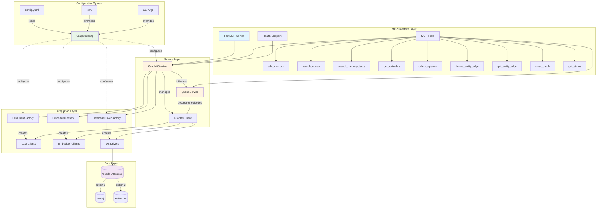
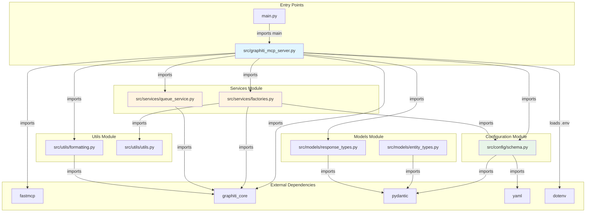
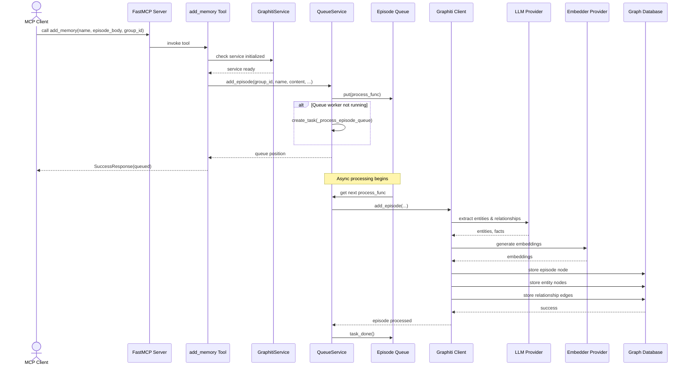
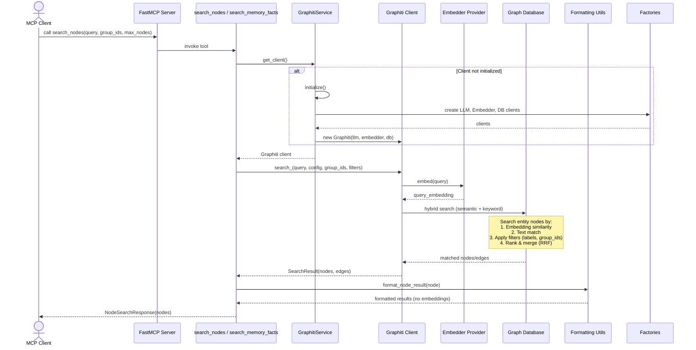
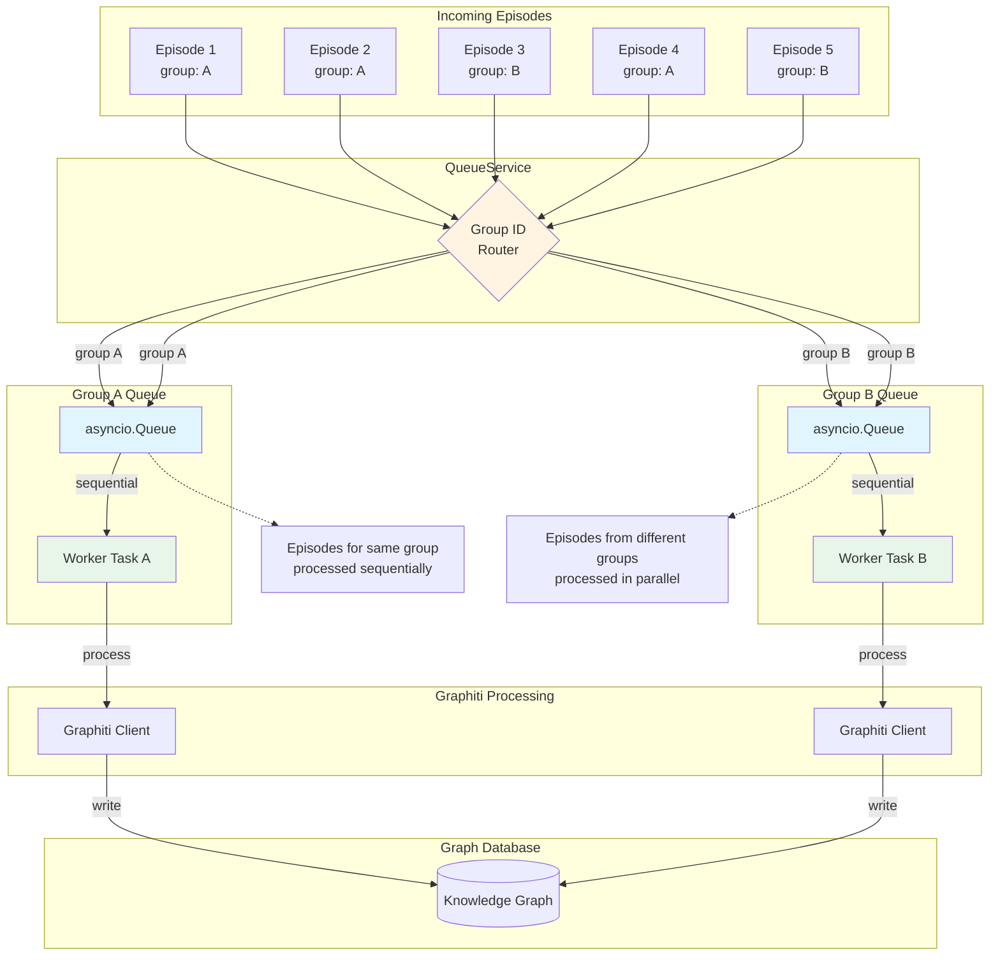
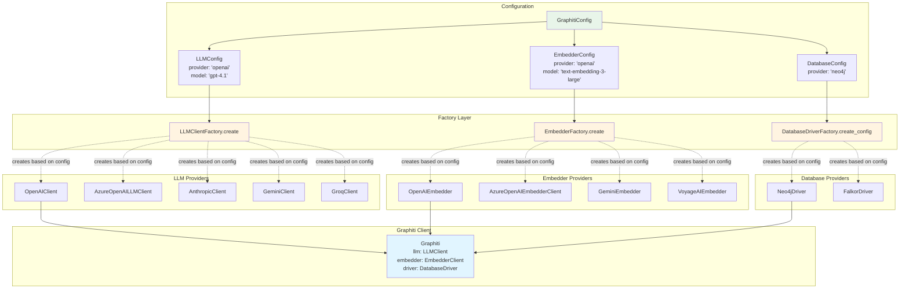
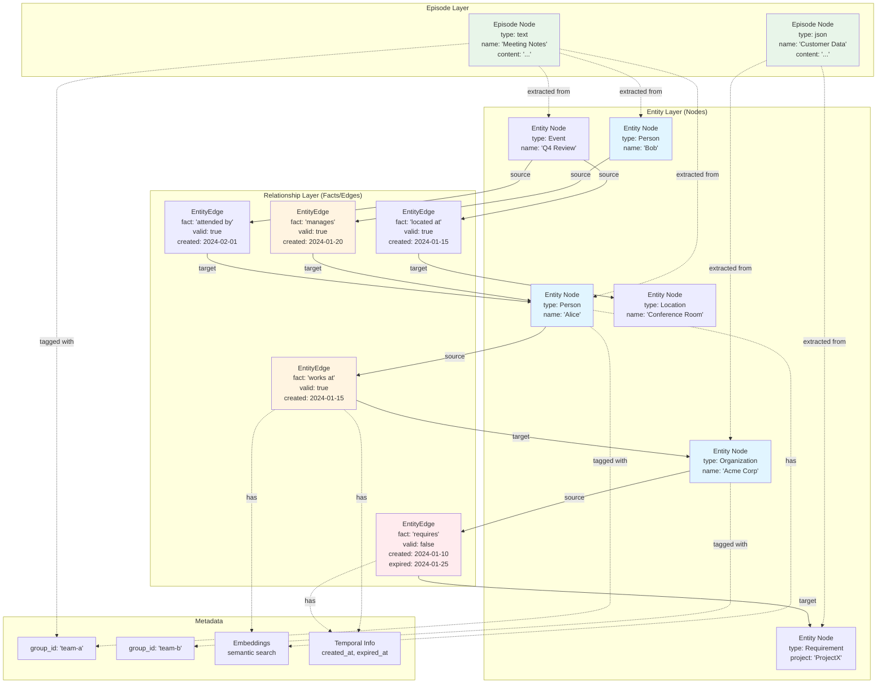

# Architecture Diagrams

## Overview

Graphiti-FastMCP is an MCP (Model Context Protocol) server that provides AI agents with persistent memory capabilities through a knowledge graph. The architecture follows a clean layered design with clear separation between presentation (MCP tools), business logic (services), and data persistence (graph database). The system uses factory patterns for multi-provider support (OpenAI, Azure, Anthropic, Gemini, Groq) and implements queue-based processing to ensure sequential episode processing per group.

## System Architecture (Layered View)

The system is organized into four distinct layers: the MCP Interface Layer (exposed tools), the Service Layer (business logic), the Integration Layer (external providers), and the Data Layer (graph database). Configuration flows from YAML/environment variables through all layers.



## Component Relationships

This diagram shows the key classes and their relationships, including composition, dependency, and inheritance patterns. The GraphitiService acts as the central orchestrator, composing the Graphiti client and coordinating with factories. The QueueService manages asynchronous episode processing with per-group queues.

```mermaid
flowchart TB
    subgraph "Core Services"
        GS[GraphitiService]
        QS[QueueService]
        Graphiti[Graphiti Client]
    end

    subgraph "Configuration"
        GC[GraphitiConfig]
        SC[ServerConfig]
        LC[LLMConfig]
        EC[EmbedderConfig]
        DC[DatabaseConfig]
        GAC[GraphitiAppConfig]
    end

    subgraph "Factories"
        LF[LLMClientFactory]
        EF[EmbedderFactory]
        DF[DatabaseDriverFactory]
    end

    subgraph "Models"
        RT[Response Types]
        ET[Entity Types]

        RT --> ErrorResp[ErrorResponse]
        RT --> SuccessResp[SuccessResponse]
        RT --> NodeResp[NodeSearchResponse]
        RT --> FactResp[FactSearchResponse]
        RT --> EpisodeResp[EpisodeSearchResponse]
        RT --> StatusResp[StatusResponse]

        ET --> Requirement
        ET --> Preference
        ET --> Procedure
        ET --> Location
        ET --> Event
        ET --> Object
        ET --> Topic
        ET --> Organization
        ET --> Document
    end

    subgraph "Utilities"
        Formatting[format_node_result<br/>format_fact_result]
        AzureUtil[create_azure_credential_token_provider]
    end

    GC -->|contains| SC
    GC -->|contains| LC
    GC -->|contains| EC
    GC -->|contains| DC
    GC -->|contains| GAC

    GS -->|uses| GC
    GS -->|manages| Graphiti
    GS -->|creates via| LF
    GS -->|creates via| EF
    GS -->|creates via| DF

    QS -->|processes with| Graphiti
    GS -->|initializes| QS

    LF -->|uses| LC
    EF -->|uses| EC
    DF -->|uses| DC

    GS -->|uses| ET
    GS -->|returns| RT

    SearchNodes[search_nodes] -->|uses| Formatting
    SearchFacts[search_memory_facts] -->|uses| Formatting

    LF -.->|optional| AzureUtil
    EF -.->|optional| AzureUtil

    style GS fill:#fff4e1
    style QS fill:#fff4e1
    style GC fill:#e8f5e9
    style Graphiti fill:#e1f5ff
```



## Class Hierarchies

This diagram shows the inheritance structure and key attributes/methods of the main classes. Configuration classes use Pydantic BaseModel/BaseSettings, while service classes use composition patterns.

```mermaid
classDiagram
    class BaseSettings {
        <<pydantic>>
    }

    class BaseModel {
        <<pydantic>>
    }

    class GraphitiConfig {
        +ServerConfig server
        +LLMConfig llm
        +EmbedderConfig embedder
        +DatabaseConfig database
        +GraphitiAppConfig graphiti
        +bool destroy_graph
        +settings_customise_sources()
        +apply_cli_overrides(args)
    }

    class ServerConfig {
        +str transport
        +str host
        +int port
    }

    class LLMConfig {
        +str provider
        +str model
        +float temperature
        +int max_tokens
        +LLMProvidersConfig providers
    }

    class EmbedderConfig {
        +str provider
        +str model
        +int dimensions
        +EmbedderProvidersConfig providers
    }

    class DatabaseConfig {
        +str provider
        +DatabaseProvidersConfig providers
    }

    class GraphitiAppConfig {
        +str group_id
        +str episode_id_prefix
        +str user_id
        +list~EntityTypeConfig~ entity_types
        +model_post_init()
    }

    class GraphitiService {
        +GraphitiConfig config
        +int semaphore_limit
        +Semaphore semaphore
        +Graphiti client
        +dict entity_types
        +initialize() async
        +get_client() async
    }

    class QueueService {
        -dict~str,Queue~ _episode_queues
        -dict~str,bool~ _queue_workers
        -Graphiti _graphiti_client
        +add_episode_task(group_id, process_func) async
        +_process_episode_queue(group_id) async
        +get_queue_size(group_id)
        +is_worker_running(group_id)
        +initialize(graphiti_client) async
        +add_episode(...) async
    }

    class LLMClientFactory {
        <<factory>>
        +create(config)$ LLMClient
    }

    class EmbedderFactory {
        <<factory>>
        +create(config)$ EmbedderClient
    }

    class DatabaseDriverFactory {
        <<factory>>
        +create_config(config)$ dict
    }

    class Requirement {
        +str project_name
        +str description
    }

    class Preference {
        <<prioritized>>
    }

    class Procedure {
        +str description
    }

    class Location {
        +str name
        +str description
    }

    class Event {
        +str name
        +str description
    }

    BaseSettings <|-- GraphitiConfig
    BaseModel <|-- ServerConfig
    BaseModel <|-- LLMConfig
    BaseModel <|-- EmbedderConfig
    BaseModel <|-- DatabaseConfig
    BaseModel <|-- GraphitiAppConfig

    BaseModel <|-- Requirement
    BaseModel <|-- Preference
    BaseModel <|-- Procedure
    BaseModel <|-- Location
    BaseModel <|-- Event

    GraphitiConfig *-- ServerConfig
    GraphitiConfig *-- LLMConfig
    GraphitiConfig *-- EmbedderConfig
    GraphitiConfig *-- DatabaseConfig
    GraphitiConfig *-- GraphitiAppConfig

    GraphitiService o-- GraphitiConfig
    GraphitiService --> LLMClientFactory
    GraphitiService --> EmbedderFactory
    GraphitiService --> DatabaseDriverFactory
```



## Module Dependencies

This diagram shows how modules import and depend on each other, illustrating the dependency flow from the entry point through configuration, services, and utilities.



## Data Flow - Adding Memory to Graph

This sequence diagram shows how information flows through the system when an MCP client adds a memory episode. It demonstrates the queue-based processing, factory creation of components, and interaction with the graph database.



## Data Flow - Searching the Graph

This sequence diagram illustrates how search queries flow through the system, showing hybrid search with both semantic (embedding-based) and keyword matching.



## Configuration Flow

This diagram shows how configuration is loaded, merged, and applied throughout the system, with priority ordering from CLI args down to defaults.

```mermaid
flowchart LR
    subgraph "Configuration Sources (Priority Order)"
        CLI[CLI Arguments]
        ENV[Environment Variables]
        YAML[config.yaml]
        Defaults[Default Values]
    end

    subgraph "Configuration Processing"
        YamlSource[YamlSettingsSource]
        EnvSource[Environment Settings]
        InitSource[Init Settings]

        YamlSource -->|expand ${VAR}| YamlExpanded[Expanded Config]
        YamlExpanded -->|convert booleans| YamlParsed[Parsed YAML]
    end

    subgraph "Configuration Schema"
        GraphitiConfig

        GraphitiConfig -->|contains| ServerConfig
        GraphitiConfig -->|contains| LLMConfig
        GraphitiConfig -->|contains| EmbedderConfig
        GraphitiConfig -->|contains| DatabaseConfig
        GraphitiConfig -->|contains| GraphitiAppConfig
    end

    subgraph "Provider Configurations"
        LLMProviders[LLMProvidersConfig]
        EmbedderProviders[EmbedderProvidersConfig]
        DBProviders[DatabaseProvidersConfig]

        LLMProviders --> OpenAI[OpenAIProviderConfig]
        LLMProviders --> AzureOAI[AzureOpenAIProviderConfig]
        LLMProviders --> Anthropic[AnthropicProviderConfig]
        LLMProviders --> Gemini[GeminiProviderConfig]
        LLMProviders --> Groq[GroqProviderConfig]

        EmbedderProviders --> EmbedOpenAI[OpenAIProviderConfig]
        EmbedderProviders --> EmbedAzure[AzureOpenAIProviderConfig]
        EmbedderProviders --> EmbedGemini[GeminiProviderConfig]
        EmbedderProviders --> Voyage[VoyageProviderConfig]

        DBProviders --> Neo4j[Neo4jProviderConfig]
        DBProviders --> FalkorDB[FalkorDBProviderConfig]
    end

    CLI -->|highest priority| InitSource
    ENV -->|medium priority| EnvSource
    YAML -->|low priority| YamlSource
    Defaults -->|fallback| GraphitiConfig

    InitSource --> GraphitiConfig
    EnvSource --> GraphitiConfig
    YamlParsed --> GraphitiConfig

    LLMConfig -->|contains| LLMProviders
    EmbedderConfig -->|contains| EmbedderProviders
    DatabaseConfig -->|contains| DBProviders

    GraphitiConfig -->|configures| GraphitiService[GraphitiService]
    GraphitiConfig -->|passed to| Factories[Factories]

    style CLI fill:#ffebee
    style ENV fill:#fff3e0
    style YAML fill:#e8f5e9
    style GraphitiConfig fill:#e1f5ff
```

## Queue-Based Processing Architecture

This diagram illustrates the queue-based episode processing system that ensures sequential processing per group_id to avoid race conditions.



## Factory Pattern for Multi-Provider Support

This diagram shows how the factory classes enable support for multiple LLM, embedder, and database providers through runtime configuration.



## MCP Tool Exposure Pattern

This diagram shows how the codebase exposes Graphiti functionality through the MCP protocol using FastMCP decorators.

```mermaid
flowchart TB
    subgraph "FastMCP Framework"
        FastMCP[FastMCP Instance<br/>name: 'Graphiti Agent Memory']
        Decorator[@mcp.tool decorator]
        CustomRoute[@mcp.custom_route decorator]
    end

    subgraph "Exposed MCP Tools"
        direction TB
        T1[add_memory]
        T2[search_nodes]
        T3[search_memory_facts]
        T4[get_episodes]
        T5[delete_episode]
        T6[delete_entity_edge]
        T7[get_entity_edge]
        T8[clear_graph]
        T9[get_status]

        T1 -.->|queues| QueueService
        T2 -.->|searches| GraphitiClient
        T3 -.->|searches| GraphitiClient
        T4 -.->|retrieves| GraphitiClient
        T5 -.->|deletes| GraphitiClient
        T6 -.->|deletes| GraphitiClient
        T7 -.->|gets| GraphitiClient
        T8 -.->|clears| GraphitiClient
        T9 -.->|checks| GraphitiService
    end

    subgraph "HTTP Endpoints"
        Health[GET /health<br/>health_check]
    end

    subgraph "Response Types"
        Success[SuccessResponse]
        Error[ErrorResponse]
        NodeSearch[NodeSearchResponse]
        FactSearch[FactSearchResponse]
        EpisodeSearch[EpisodeSearchResponse]
        Status[StatusResponse]
    end

    subgraph "MCP Client"
        MCPClient[Claude / Other AI Agent]
        ToolCall[Tool Call Request]
        ToolResult[Tool Response]
    end

    Decorator -->|decorates| T1
    Decorator -->|decorates| T2
    Decorator -->|decorates| T3
    Decorator -->|decorates| T4
    Decorator -->|decorates| T5
    Decorator -->|decorates| T6
    Decorator -->|decorates| T7
    Decorator -->|decorates| T8
    Decorator -->|decorates| T9

    CustomRoute -->|decorates| Health

    T1 -->|returns| Success
    T1 -->|returns| Error
    T2 -->|returns| NodeSearch
    T2 -->|returns| Error
    T3 -->|returns| FactSearch
    T3 -->|returns| Error
    T4 -->|returns| EpisodeSearch
    T5 -->|returns| Success
    T8 -->|returns| Success
    T9 -->|returns| Status

    MCPClient -->|sends| ToolCall
    ToolCall -->|invokes| FastMCP
    FastMCP -->|routes to| T1
    FastMCP -->|routes to| T2
    FastMCP -->|routes to| T3

    T1 -->|packages| ToolResult
    ToolResult -->|returns to| MCPClient

    style FastMCP fill:#e1f5ff
    style Decorator fill:#fff4e1
    style MCPClient fill:#f3e5f5
```

## Knowledge Graph Structure

This diagram illustrates how information is structured in the graph database, showing the relationships between episodes, entities (nodes), and facts (edges).



## Key Insights

### Architectural Patterns

1. **Layered Architecture**: Clean separation between MCP interface, business logic, integration, and data layers
2. **Factory Pattern**: Enables runtime selection of LLM, embedder, and database providers based on configuration
3. **Service Pattern**: GraphitiService and QueueService encapsulate complex business logic and lifecycle management
4. **Queue-based Processing**: Ensures sequential episode processing per group_id to avoid race conditions
5. **Decorator Pattern**: FastMCP's @mcp.tool() decorator cleanly exposes functionality as MCP tools
6. **Configuration as Code**: YAML + environment variables + CLI args with clear precedence ordering

### Design Decisions

1. **Multi-Provider Support**: Factory classes abstract provider-specific implementations, supporting 5 LLM providers, 4 embedder providers, and 2 database providers
2. **Async-First**: Full async/await throughout the stack for high concurrency
3. **Type Safety**: Pydantic models and TypedDict for configuration and responses ensure type safety
4. **Separation of Concerns**:
   - Configuration system is completely separate from business logic
   - Factories handle provider instantiation
   - Services manage application state and Graphiti client lifecycle
   - Utils provide cross-cutting concerns (formatting, Azure auth)
5. **Backward Compatibility**: main.py wrapper delegates to src/graphiti_mcp_server.py for compatibility with existing deployments
6. **Extensibility**: Entity types are configurable and can be customized via YAML configuration

### Data Flow Characteristics

1. **Asynchronous Episode Processing**: add_memory returns immediately; actual processing happens in background queues
2. **Hybrid Search**: Combines semantic (embedding-based) and keyword search with reciprocal rank fusion (RRF)
3. **Temporal Awareness**: Facts have creation/expiration timestamps, allowing temporal queries
4. **Group Isolation**: group_id provides multi-tenancy within a single graph database
5. **Embedding Exclusion**: Formatters strip embeddings from responses to reduce payload size

### Scalability Features

1. **Semaphore-based Rate Limiting**: SEMAPHORE_LIMIT controls concurrent operations to stay within LLM provider rate limits
2. **Per-Group Sequential Processing**: Queue workers per group_id enable parallel processing across groups while maintaining order within groups
3. **Provider Flexibility**: Easy to switch between providers based on cost, performance, or availability requirements
4. **Configurable Concurrency**: Semaphore limit can be tuned based on LLM provider tier

### Integration Points

1. **MCP Protocol**: FastMCP framework handles MCP transport (stdio, HTTP, SSE)
2. **Graphiti Core**: Deep integration with graphiti-core library for knowledge graph operations
3. **Multiple Transports**: Supports stdio (Claude Desktop), HTTP (production), and SSE (deprecated)
4. **Health Checks**: Custom /health endpoint for Docker and load balancers
5. **Structured Logging**: Consistent logging format across all components with timestamps
