# Data Flow Analysis

## Overview

Graphiti-FastMCP implements several distinct data flow patterns to support its knowledge graph memory operations. The system uses asynchronous processing with queue-based episode handling, hybrid search mechanisms, and a multi-layer architecture that cleanly separates client requests, business logic, and data persistence.

Key data flow characteristics:
- **Asynchronous Queue Processing**: Episodes are queued and processed sequentially per group_id to avoid race conditions
- **Hybrid Search**: Combines semantic (embedding-based) and keyword search using Reciprocal Rank Fusion (RRF)
- **Factory-based Provider Resolution**: LLM, embedder, and database clients are created on-demand based on configuration
- **Lazy Initialization**: The Graphiti client is initialized on first use, not at server startup
- **Multi-transport Support**: Supports STDIO, HTTP, and SSE transports for different deployment scenarios

## 1. Query Flow (Search Operations)

### Search Nodes Flow

When a client searches for entities (nodes) in the knowledge graph, the system performs a hybrid search combining semantic similarity (via embeddings) and keyword matching.

**Flow Description**: The search_nodes tool receives a query, initializes the Graphiti client if needed, generates an embedding for the query, performs a hybrid search in the graph database, and returns formatted results with embeddings stripped out to reduce payload size.

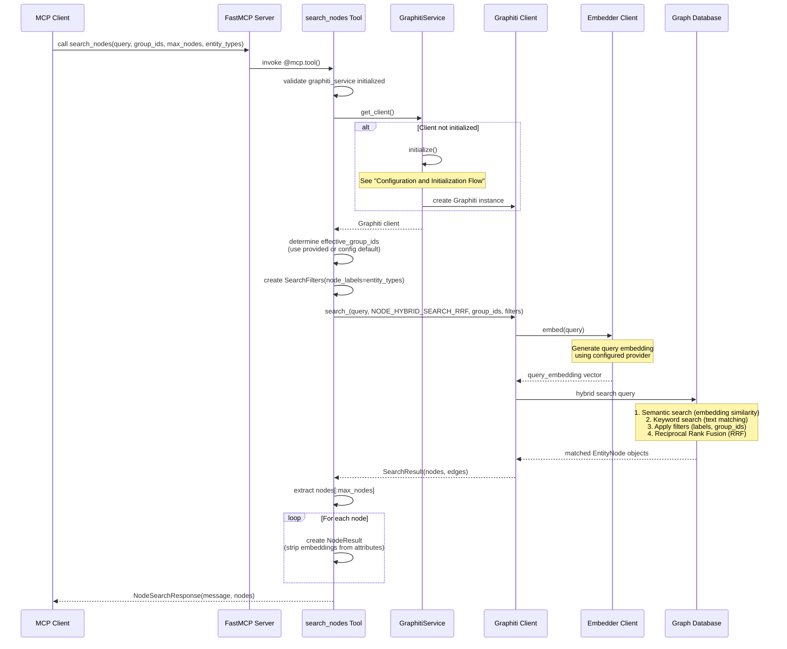
```mermaid
sequenceDiagram
    participant Client as MCP Client
    participant MCP as FastMCP Server
    participant Tool as search_nodes Tool
    participant GS as GraphitiService
    participant Graphiti as Graphiti Client
    participant Embedder as Embedder Client
    participant DB as Graph Database

    Client->>MCP: call search_nodes(query, group_ids, max_nodes, entity_types)
    MCP->>Tool: invoke @mcp.tool()

    Tool->>Tool: validate graphiti_service initialized

    Tool->>GS: get_client()
    alt Client not initialized
        GS->>GS: initialize()
        Note over GS: See "Configuration and Initialization Flow"
        GS->>Graphiti: create Graphiti instance
    end
    GS-->>Tool: Graphiti client

    Tool->>Tool: determine effective_group_ids<br/>(use provided or config default)
    Tool->>Tool: create SearchFilters(node_labels=entity_types)

    Tool->>Graphiti: search_(query, NODE_HYBRID_SEARCH_RRF, group_ids, filters)

    Graphiti->>Embedder: embed(query)
    Note over Embedder: Generate query embedding<br/>using configured provider
    Embedder-->>Graphiti: query_embedding vector

    Graphiti->>DB: hybrid search query
    Note over DB: 1. Semantic search (embedding similarity)<br/>2. Keyword search (text matching)<br/>3. Apply filters (labels, group_ids)<br/>4. Reciprocal Rank Fusion (RRF)
    DB-->>Graphiti: matched EntityNode objects

    Graphiti-->>Tool: SearchResult(nodes, edges)

    Tool->>Tool: extract nodes[:max_nodes]

    loop For each node
        Tool->>Tool: create NodeResult<br/>(strip embeddings from attributes)
    end

    Tool-->>Client: NodeSearchResponse(message, nodes)
```

**Key Files**:
- `src/graphiti_mcp_server.py:410-487` - search_nodes implementation
- `src/graphiti_mcp_server.py:162-321` - GraphitiService

**Key Operations**:
1. **Client Lazy Initialization** (line 430): `client = await graphiti_service.get_client()`
2. **Group ID Resolution** (lines 432-439): Falls back to config default if not provided
3. **Search Filter Creation** (lines 442-444): Create SearchFilters with entity_types
4. **Hybrid Search** (lines 449-454): Uses NODE_HYBRID_SEARCH_RRF config recipe
5. **Result Formatting** (lines 463-480): Strip embeddings and format as NodeResult

### Search Memory Facts Flow

Searching for facts (relationships/edges) between entities uses a similar hybrid search but targets EntityEdge objects instead of nodes.

**Flow Description**: The search_memory_facts tool performs a search centered around relationships between entities, optionally focusing on edges connected to a specific center node.

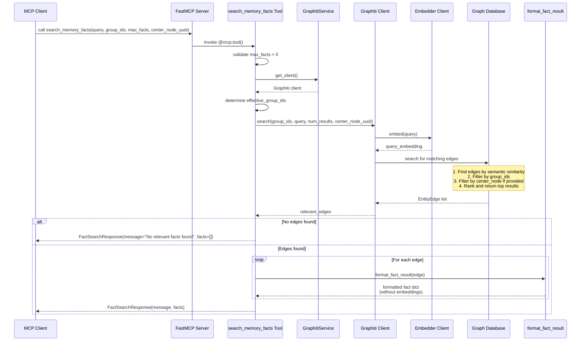
```mermaid
sequenceDiagram
    participant Client as MCP Client
    participant MCP as FastMCP Server
    participant Tool as search_memory_facts Tool
    participant GS as GraphitiService
    participant Graphiti as Graphiti Client
    participant Embedder as Embedder Client
    participant DB as Graph Database
    participant Format as format_fact_result

    Client->>MCP: call search_memory_facts(query, group_ids, max_facts, center_node_uuid)
    MCP->>Tool: invoke @mcp.tool()

    Tool->>Tool: validate max_facts > 0
    Tool->>GS: get_client()
    GS-->>Tool: Graphiti client

    Tool->>Tool: determine effective_group_ids

    Tool->>Graphiti: search(group_ids, query, num_results, center_node_uuid)

    Graphiti->>Embedder: embed(query)
    Embedder-->>Graphiti: query_embedding

    Graphiti->>DB: search for matching edges
    Note over DB: 1. Find edges by semantic similarity<br/>2. Filter by group_ids<br/>3. Filter by center_node if provided<br/>4. Rank and return top results
    DB-->>Graphiti: EntityEdge list

    Graphiti-->>Tool: relevant_edges

    alt No edges found
        Tool-->>Client: FactSearchResponse(message="No relevant facts found", facts=[])
    else Edges found
        loop For each edge
            Tool->>Format: format_fact_result(edge)
            Format-->>Tool: formatted fact dict<br/>(without embeddings)
        end
        Tool-->>Client: FactSearchResponse(message, facts)
    end
```

**Key Files**:
- `src/graphiti_mcp_server.py:490-541` - search_memory_facts implementation
- `src/utils/formatting.py:32-51` - format_fact_result

**Key Operations**:
1. **Parameter Validation** (lines 511-512): Ensure max_facts is positive
2. **Search Invocation** (lines 525-530): Call client.search() with center_node_uuid support
3. **Fact Formatting** (line 535): Strip embeddings using format_fact_result utility

## 2. Interactive Client Session Flow

### Session Initialization

The MCP server can be accessed through multiple transports (STDIO, HTTP, SSE), with the session initialized through a common path.

**Flow Description**: Server startup loads configuration from multiple sources (YAML, environment, CLI), creates service instances, initializes the Graphiti client, and starts the appropriate transport listener.

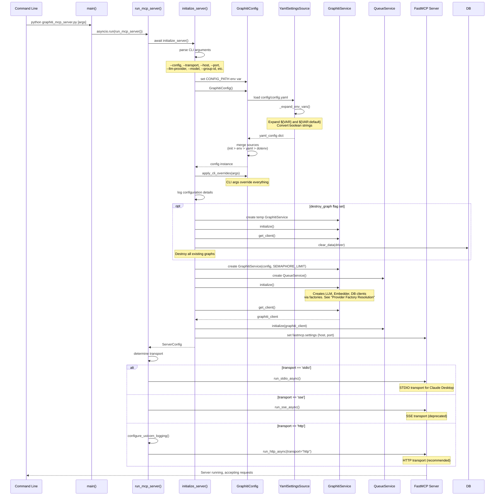
```mermaid
sequenceDiagram
    participant CLI as Command Line
    participant Main as main()
    participant Runner as run_mcp_server()
    participant Init as initialize_server()
    participant Config as GraphitiConfig
    participant YamlSource as YamlSettingsSource
    participant GS as GraphitiService
    participant QS as QueueService
    participant MCP as FastMCP Server

    CLI->>Main: python graphiti_mcp_server.py [args]
    Main->>Runner: asyncio.run(run_mcp_server())

    Runner->>Init: await initialize_server()

    Init->>Init: parse CLI arguments
    Note over Init: --config, --transport, --host, --port,<br/>--llm-provider, --model, --group-id, etc.

    Init->>Config: set CONFIG_PATH env var
    Init->>Config: GraphitiConfig()

    Config->>YamlSource: load config/config.yaml
    YamlSource->>YamlSource: _expand_env_vars()
    Note over YamlSource: Expand ${VAR} and ${VAR:default}<br/>Convert boolean strings
    YamlSource-->>Config: yaml_config dict

    Config->>Config: merge sources<br/>(init > env > yaml > dotenv)
    Config-->>Init: config instance

    Init->>Config: apply_cli_overrides(args)
    Note over Config: CLI args override everything

    Init->>Init: log configuration details

    opt destroy_graph flag set
        Init->>GS: create temp GraphitiService
        Init->>GS: initialize()
        Init->>GS: get_client()
        Init->>DB: clear_data(driver)
        Note over Init: Destroy all existing graphs
    end

    Init->>GS: create GraphitiService(config, SEMAPHORE_LIMIT)
    Init->>QS: create QueueService()

    Init->>GS: initialize()
    Note over GS: Creates LLM, Embedder, DB clients<br/>via factories. See "Provider Factory Resolution"

    Init->>GS: get_client()
    GS-->>Init: graphiti_client

    Init->>QS: initialize(graphiti_client)

    Init->>MCP: set fastmcp.settings (host, port)
    Init-->>Runner: ServerConfig

    Runner->>Runner: determine transport

    alt transport == 'stdio'
        Runner->>MCP: run_stdio_async()
        Note over MCP: STDIO transport for Claude Desktop
    else transport == 'sse'
        Runner->>MCP: run_sse_async()
        Note over MCP: SSE transport (deprecated)
    else transport == 'http'
        Runner->>Runner: configure_uvicorn_logging()
        Runner->>MCP: run_http_async(transport="http")
        Note over MCP: HTTP transport (recommended)
    end

    MCP-->>CLI: Server running, accepting requests
```

**Key Files**:
- `src/graphiti_mcp_server.py:954-964` - main() entry point
- `src/graphiti_mcp_server.py:910-952` - run_mcp_server()
- `src/graphiti_mcp_server.py:764-908` - initialize_server()
- `src/config/schema.py:230-293` - GraphitiConfig
- `src/config/schema.py:16-74` - YamlSettingsSource

**Key Operations**:
1. **Argument Parsing** (lines 768-840): Parse CLI arguments with defaults
2. **Config Loading** (line 847): Load GraphitiConfig from multiple sources
3. **Priority Resolution** (line 261 in schema.py): init > env > yaml > dotenv
4. **CLI Override** (line 850): Apply CLI args over loaded config
5. **Service Initialization** (lines 889-898): Create and initialize services
6. **Transport Selection** (lines 917-947): Start appropriate transport listener

### Session Lifecycle

Once the server is running, clients can connect and make tool calls through the MCP protocol.

**Flow Description**: Client connects via chosen transport, discovers available tools, makes tool calls, and receives responses. The connection remains open for the session duration.

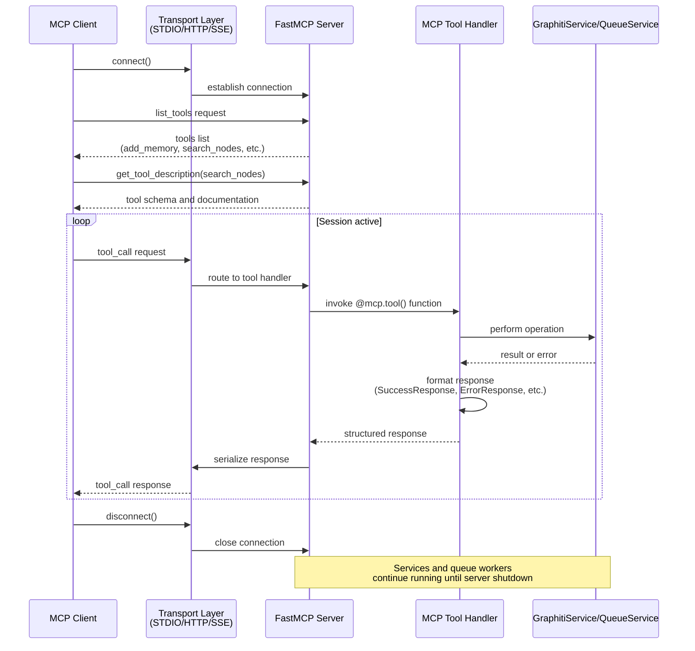
```mermaid
sequenceDiagram
    participant Client as MCP Client
    participant Transport as Transport Layer<br/>(STDIO/HTTP/SSE)
    participant MCP as FastMCP Server
    participant Tool as MCP Tool Handler
    participant Service as GraphitiService/QueueService

    Client->>Transport: connect()
    Transport->>MCP: establish connection

    Client->>MCP: list_tools request
    MCP-->>Client: tools list<br/>(add_memory, search_nodes, etc.)

    Client->>MCP: get_tool_description(search_nodes)
    MCP-->>Client: tool schema and documentation

    loop Session active
        Client->>Transport: tool_call request
        Transport->>MCP: route to tool handler
        MCP->>Tool: invoke @mcp.tool() function

        Tool->>Service: perform operation
        Service-->>Tool: result or error

        Tool->>Tool: format response<br/>(SuccessResponse, ErrorResponse, etc.)
        Tool-->>MCP: structured response
        MCP->>Transport: serialize response
        Transport-->>Client: tool_call response
    end

    Client->>Transport: disconnect()
    Transport->>MCP: close connection

    Note over MCP,Service: Services and queue workers<br/>continue running until server shutdown
```

**Key Operations**:
1. **Connection Establishment**: Transport-specific handshake
2. **Tool Discovery**: Client queries available tools and schemas
3. **Request Routing**: FastMCP routes requests to decorated tool functions
4. **Response Formatting**: Tools return TypedDict responses
5. **Session Persistence**: Services maintain state across requests

## 3. Memory Addition Flow (Episode Processing)

### Add Memory Request

The add_memory tool queues episodes for asynchronous processing, enabling the client to continue without waiting for the complete graph update.

**Flow Description**: Client calls add_memory, which validates parameters, determines the group_id, creates an episode processing function, and submits it to the queue service. The response is immediate, while actual processing happens asynchronously.

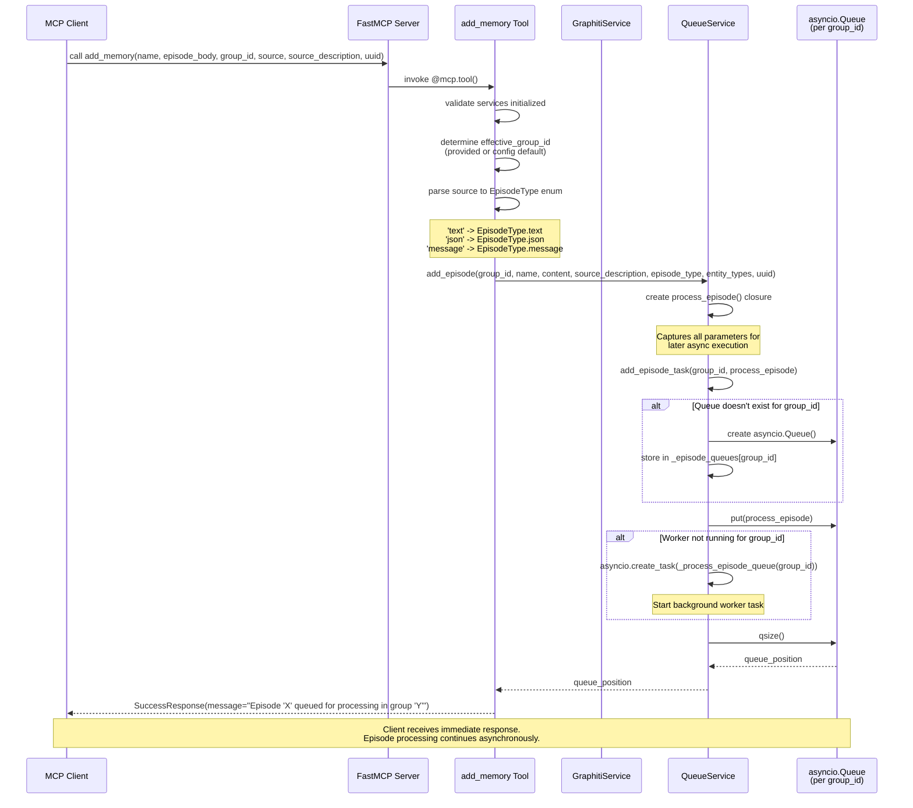
```mermaid
sequenceDiagram
    participant Client as MCP Client
    participant MCP as FastMCP Server
    participant Tool as add_memory Tool
    participant GS as GraphitiService
    participant QS as QueueService
    participant Queue as asyncio.Queue<br/>(per group_id)

    Client->>MCP: call add_memory(name, episode_body, group_id, source, source_description, uuid)
    MCP->>Tool: invoke @mcp.tool()

    Tool->>Tool: validate services initialized

    Tool->>Tool: determine effective_group_id<br/>(provided or config default)

    Tool->>Tool: parse source to EpisodeType enum
    Note over Tool: 'text' -> EpisodeType.text<br/>'json' -> EpisodeType.json<br/>'message' -> EpisodeType.message

    Tool->>QS: add_episode(group_id, name, content, source_description, episode_type, entity_types, uuid)

    QS->>QS: create process_episode() closure
    Note over QS: Captures all parameters for<br/>later async execution

    QS->>QS: add_episode_task(group_id, process_episode)

    alt Queue doesn't exist for group_id
        QS->>Queue: create asyncio.Queue()
        QS->>QS: store in _episode_queues[group_id]
    end

    QS->>Queue: put(process_episode)

    alt Worker not running for group_id
        QS->>QS: asyncio.create_task(_process_episode_queue(group_id))
        Note over QS: Start background worker task
    end

    QS->>Queue: qsize()
    Queue-->>QS: queue_position
    QS-->>Tool: queue_position

    Tool-->>Client: SuccessResponse(message="Episode 'X' queued for processing in group 'Y'")

    Note over Client,Queue: Client receives immediate response.<br/>Episode processing continues asynchronously.
```

**Key Files**:
- `src/graphiti_mcp_server.py:324-407` - add_memory tool
- `src/services/queue_service.py:101-152` - QueueService.add_episode
- `src/services/queue_service.py:24-47` - QueueService.add_episode_task

**Key Operations**:
1. **Group ID Resolution** (line 377): Use provided or fall back to config default
2. **Episode Type Parsing** (lines 380-387): Convert string source to EpisodeType enum
3. **Queue Submission** (lines 390-398): Submit to QueueService.add_episode
4. **Closure Creation** (line 128 in queue_service.py): Create async process_episode() function
5. **Queue Management** (lines 37-45 in queue_service.py): Create queue and worker if needed
6. **Immediate Response** (lines 400-402): Return success before processing completes

### Queue Processing

The queue worker processes episodes sequentially for each group_id, ensuring no race conditions when updating the graph.

**Flow Description**: The queue worker continuously pulls episode processing functions from the queue, executes them against the Graphiti client (which involves LLM calls for entity extraction and embedding generation), and stores the results in the graph database.

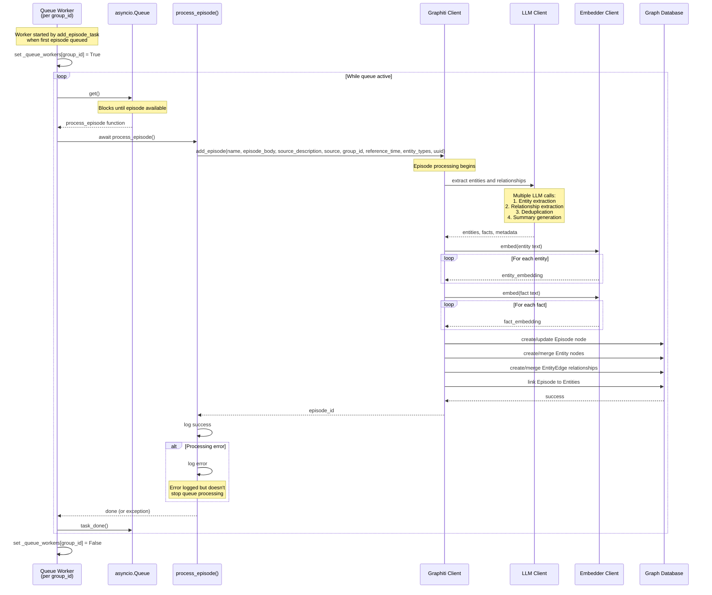
```mermaid
sequenceDiagram
    participant Worker as Queue Worker<br/>(per group_id)
    participant Queue as asyncio.Queue
    participant Process as process_episode()
    participant Graphiti as Graphiti Client
    participant LLM as LLM Client
    participant Embedder as Embedder Client
    participant DB as Graph Database

    Note over Worker: Worker started by add_episode_task<br/>when first episode queued

    Worker->>Worker: set _queue_workers[group_id] = True

    loop While queue active
        Worker->>Queue: get()
        Note over Queue: Blocks until episode available
        Queue-->>Worker: process_episode function

        Worker->>Process: await process_episode()

        Process->>Graphiti: add_episode(name, episode_body, source_description, source, group_id, reference_time, entity_types, uuid)

        Note over Graphiti: Episode processing begins

        Graphiti->>LLM: extract entities and relationships
        Note over LLM: Multiple LLM calls:<br/>1. Entity extraction<br/>2. Relationship extraction<br/>3. Deduplication<br/>4. Summary generation
        LLM-->>Graphiti: entities, facts, metadata

        Graphiti->>Embedder: embed(entity text)
        loop For each entity
            Embedder-->>Graphiti: entity_embedding
        end

        Graphiti->>Embedder: embed(fact text)
        loop For each fact
            Embedder-->>Graphiti: fact_embedding
        end

        Graphiti->>DB: create/update Episode node
        Graphiti->>DB: create/merge Entity nodes
        Graphiti->>DB: create/merge EntityEdge relationships
        Graphiti->>DB: link Episode to Entities

        DB-->>Graphiti: success
        Graphiti-->>Process: episode_id

        Process->>Process: log success

        alt Processing error
            Process->>Process: log error
            Note over Process: Error logged but doesn't<br/>stop queue processing
        end

        Process-->>Worker: done (or exception)
        Worker->>Queue: task_done()
    end

    Worker->>Worker: set _queue_workers[group_id] = False
```

**Key Files**:
- `src/services/queue_service.py:49-80` - _process_episode_queue
- `src/services/queue_service.py:128-149` - process_episode closure

**Key Operations**:
1. **Worker Lifecycle** (lines 55-80 in queue_service.py): Long-lived task processing queue
2. **Blocking Get** (line 62): Waits for next episode in queue
3. **Episode Processing** (line 66): Execute the process_episode closure
4. **Graphiti Add Episode** (lines 134-143): Call graphiti_client.add_episode
5. **Error Handling** (lines 67-70): Log errors but continue processing
6. **Task Completion** (line 73): Mark queue item as done
7. **Worker Cleanup** (line 79): Set worker flag to False when done

**Note on Semaphore**: The GraphitiService is initialized with a semaphore (SEMAPHORE_LIMIT, default 10) that controls concurrent operations within Graphiti. This limits parallel LLM calls to stay within provider rate limits. See lines 76, 165-168, 231 in graphiti_mcp_server.py.

## 4. MCP Server Communication Flow

### SSE Transport Flow

Server-Sent Events (SSE) transport is deprecated but still supported for backward compatibility.

**Flow Description**: Client establishes SSE connection, server sends tool responses as server-sent events.

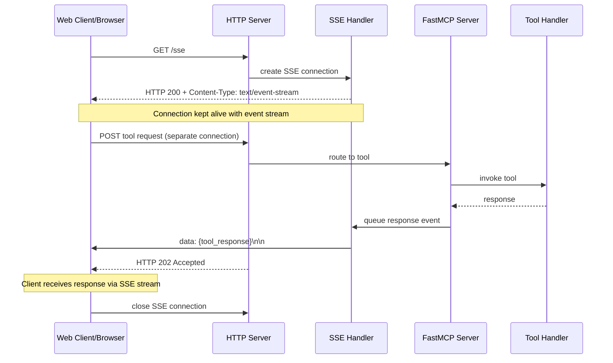
```mermaid
sequenceDiagram
    participant Client as Web Client/Browser
    participant HTTP as HTTP Server
    participant SSE as SSE Handler
    participant MCP as FastMCP Server
    participant Tool as Tool Handler

    Client->>HTTP: GET /sse
    HTTP->>SSE: create SSE connection
    SSE-->>Client: HTTP 200 + Content-Type: text/event-stream

    Note over Client,SSE: Connection kept alive with event stream

    Client->>HTTP: POST tool request (separate connection)
    HTTP->>MCP: route to tool
    MCP->>Tool: invoke tool
    Tool-->>MCP: response
    MCP->>SSE: queue response event
    SSE->>Client: data: {tool_response}\n\n
    HTTP-->>Client: HTTP 202 Accepted

    Note over Client: Client receives response via SSE stream

    Client->>HTTP: close SSE connection
```

**Key Files**:
- `src/graphiti_mcp_server.py:919-924` - SSE transport startup

### STDIO Transport Flow

Standard I/O transport is used by Claude Desktop and other local MCP clients.

**Flow Description**: Server reads JSON-RPC requests from stdin, processes them, and writes responses to stdout. Used primarily by Claude Desktop app.

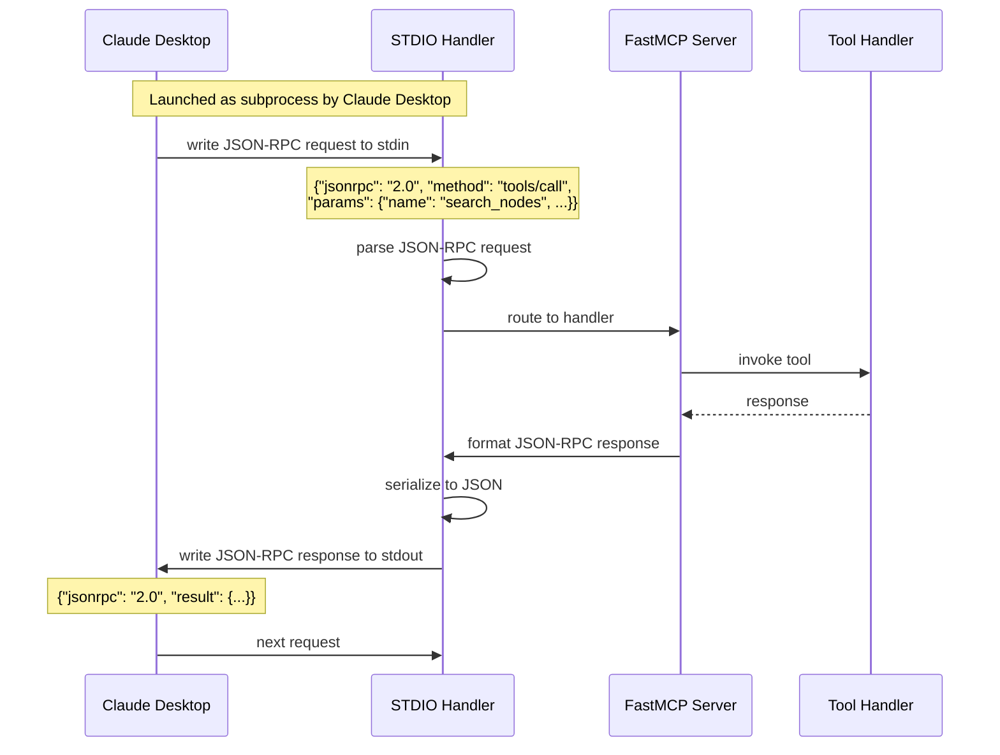
```mermaid
sequenceDiagram
    participant Client as Claude Desktop
    participant STDIO as STDIO Handler
    participant MCP as FastMCP Server
    participant Tool as Tool Handler

    Note over Client,STDIO: Launched as subprocess by Claude Desktop

    Client->>STDIO: write JSON-RPC request to stdin
    Note over STDIO: {"jsonrpc": "2.0", "method": "tools/call",<br/>"params": {"name": "search_nodes", ...}}

    STDIO->>STDIO: parse JSON-RPC request
    STDIO->>MCP: route to handler
    MCP->>Tool: invoke tool
    Tool-->>MCP: response
    MCP->>STDIO: format JSON-RPC response

    STDIO->>STDIO: serialize to JSON
    STDIO->>Client: write JSON-RPC response to stdout
    Note over Client: {"jsonrpc": "2.0", "result": {...}}

    Client->>STDIO: next request
```

**Key Files**:
- `src/graphiti_mcp_server.py:917-918` - STDIO transport startup

**Key Operations**:
1. **Process Launch**: Claude Desktop spawns server as subprocess
2. **JSON-RPC Protocol**: Requests and responses follow JSON-RPC 2.0 spec
3. **Stdin/Stdout Streaming**: Continuous bidirectional communication
4. **Process Lifecycle**: Server lives until Claude Desktop closes

### HTTP Transport Flow

HTTP transport (streamable) is the recommended production transport.

**Flow Description**: Server listens on HTTP endpoint, clients POST requests to /mcp/ endpoint, server responds with streaming JSON.

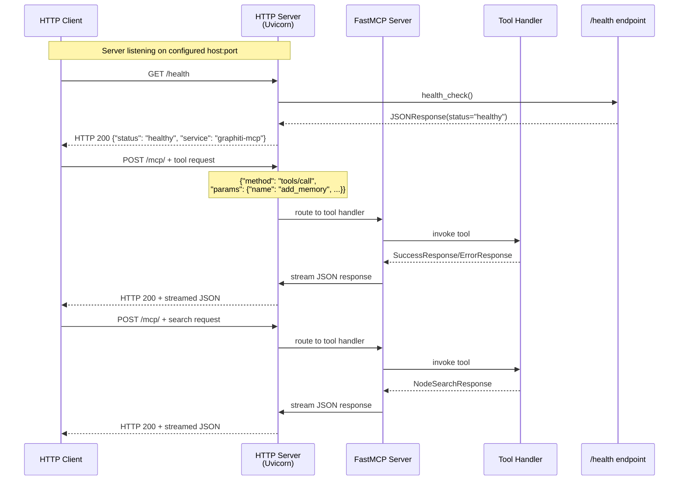
```mermaid
sequenceDiagram
    participant Client as HTTP Client
    participant HTTP as HTTP Server<br/>(Uvicorn)
    participant MCP as FastMCP Server
    participant Tool as Tool Handler
    participant Health as /health endpoint

    Note over Client,HTTP: Server listening on configured host:port

    Client->>HTTP: GET /health
    HTTP->>Health: health_check()
    Health-->>HTTP: JSONResponse(status="healthy")
    HTTP-->>Client: HTTP 200 {"status": "healthy", "service": "graphiti-mcp"}

    Client->>HTTP: POST /mcp/ + tool request
    Note over HTTP: {"method": "tools/call",<br/>"params": {"name": "add_memory", ...}}

    HTTP->>MCP: route to tool handler
    MCP->>Tool: invoke tool
    Tool-->>MCP: SuccessResponse/ErrorResponse
    MCP->>HTTP: stream JSON response
    HTTP-->>Client: HTTP 200 + streamed JSON

    Client->>HTTP: POST /mcp/ + search request
    HTTP->>MCP: route to tool handler
    MCP->>Tool: invoke tool
    Tool-->>MCP: NodeSearchResponse
    MCP->>HTTP: stream JSON response
    HTTP-->>Client: HTTP 200 + streamed JSON
```

**Key Files**:
- `src/graphiti_mcp_server.py:925-947` - HTTP transport startup
- `src/graphiti_mcp_server.py:759-762` - health_check endpoint

**Key Operations**:
1. **Uvicorn Server** (line 947): Run with transport="http"
2. **Health Endpoint** (lines 759-762): GET /health for monitoring
3. **MCP Endpoint**: POST /mcp/ for tool calls
4. **Logging Configuration** (lines 99-109, 945): Configure uvicorn logging format
5. **Production Ready**: Supports Docker, load balancers, health checks

## 5. Configuration and Initialization Flow

### Server Startup

Configuration is loaded from multiple sources with defined precedence, then services are initialized.

**Flow Description**: On startup, the server loads configuration from YAML, expands environment variables, merges with CLI args, creates service instances, and initializes the Graphiti client.

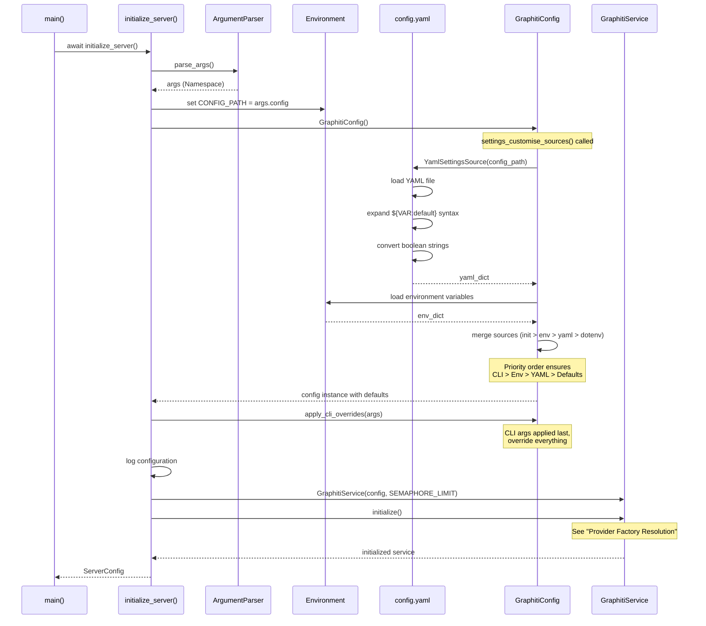
```mermaid
sequenceDiagram
    participant Main as main()
    participant Init as initialize_server()
    participant ArgParse as ArgumentParser
    participant Env as Environment
    participant YAML as config.yaml
    participant Config as GraphitiConfig
    participant GS as GraphitiService

    Main->>Init: await initialize_server()

    Init->>ArgParse: parse_args()
    ArgParse-->>Init: args (Namespace)

    Init->>Env: set CONFIG_PATH = args.config

    Init->>Config: GraphitiConfig()

    Note over Config: settings_customise_sources() called

    Config->>YAML: YamlSettingsSource(config_path)
    YAML->>YAML: load YAML file
    YAML->>YAML: expand ${VAR:default} syntax
    YAML->>YAML: convert boolean strings
    YAML-->>Config: yaml_dict

    Config->>Env: load environment variables
    Env-->>Config: env_dict

    Config->>Config: merge sources (init > env > yaml > dotenv)
    Note over Config: Priority order ensures<br/>CLI > Env > YAML > Defaults

    Config-->>Init: config instance with defaults

    Init->>Config: apply_cli_overrides(args)
    Note over Config: CLI args applied last,<br/>override everything

    Init->>Init: log configuration

    Init->>GS: GraphitiService(config, SEMAPHORE_LIMIT)
    Init->>GS: initialize()

    Note over GS: See "Provider Factory Resolution"

    GS-->>Init: initialized service

    Init-->>Main: ServerConfig
```

**Key Files**:
- `src/graphiti_mcp_server.py:764-908` - initialize_server
- `src/config/schema.py:230-293` - GraphitiConfig
- `src/config/schema.py:16-74` - YamlSettingsSource

**Key Operations**:
1. **Argument Parsing** (lines 768-840): Define all CLI arguments
2. **Config Path Setup** (lines 843-844): Set CONFIG_PATH environment variable
3. **Config Loading** (line 847): Trigger Pydantic settings loading
4. **Source Merging** (lines 249-262 in schema.py): Merge init > env > yaml > dotenv
5. **CLI Override** (lines 264-292 in schema.py): Apply CLI args as highest priority
6. **Service Creation** (lines 889-898): Create GraphitiService and QueueService

### Provider Factory Resolution

LLM, Embedder, and Database providers are resolved at runtime based on configuration using factory classes.

**Flow Description**: During GraphitiService initialization, factories create appropriate client instances based on the configured provider type, using provider-specific configuration and credentials.

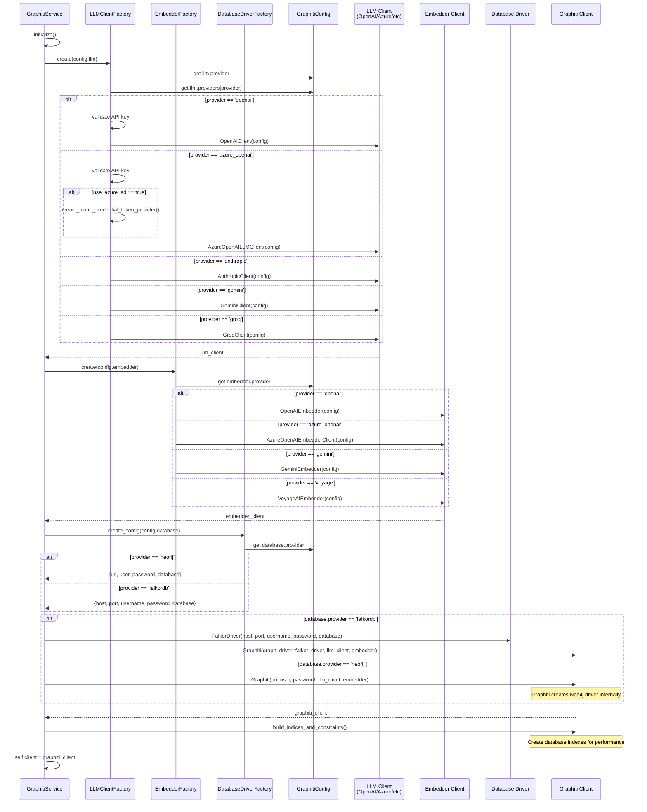
```mermaid
sequenceDiagram
    participant GS as GraphitiService
    participant LLMFac as LLMClientFactory
    participant EmbedFac as EmbedderFactory
    participant DBFac as DatabaseDriverFactory
    participant Config as GraphitiConfig
    participant LLMClient as LLM Client<br/>(OpenAI/Azure/etc)
    participant EmbedClient as Embedder Client
    participant DBDriver as Database Driver
    participant Graphiti as Graphiti Client

    GS->>GS: initialize()

    GS->>LLMFac: create(config.llm)
    LLMFac->>Config: get llm.provider
    LLMFac->>Config: get llm.providers[provider]

    alt provider == 'openai'
        LLMFac->>LLMFac: validate API key
        LLMFac->>LLMClient: OpenAIClient(config)
    else provider == 'azure_openai'
        LLMFac->>LLMFac: validate API key
        alt use_azure_ad == true
            LLMFac->>LLMFac: create_azure_credential_token_provider()
        end
        LLMFac->>LLMClient: AzureOpenAILLMClient(config)
    else provider == 'anthropic'
        LLMFac->>LLMClient: AnthropicClient(config)
    else provider == 'gemini'
        LLMFac->>LLMClient: GeminiClient(config)
    else provider == 'groq'
        LLMFac->>LLMClient: GroqClient(config)
    end

    LLMClient-->>GS: llm_client

    GS->>EmbedFac: create(config.embedder)
    EmbedFac->>Config: get embedder.provider

    alt provider == 'openai'
        EmbedFac->>EmbedClient: OpenAIEmbedder(config)
    else provider == 'azure_openai'
        EmbedFac->>EmbedClient: AzureOpenAIEmbedderClient(config)
    else provider == 'gemini'
        EmbedFac->>EmbedClient: GeminiEmbedder(config)
    else provider == 'voyage'
        EmbedFac->>EmbedClient: VoyageAIEmbedder(config)
    end

    EmbedClient-->>GS: embedder_client

    GS->>DBFac: create_config(config.database)
    DBFac->>Config: get database.provider

    alt provider == 'neo4j'
        DBFac-->>GS: {uri, user, password, database}
    else provider == 'falkordb'
        DBFac-->>GS: {host, port, username, password, database}
    end

    alt database.provider == 'falkordb'
        GS->>DBDriver: FalkorDriver(host, port, username, password, database)
        GS->>Graphiti: Graphiti(graph_driver=falkor_driver, llm_client, embedder)
    else database.provider == 'neo4j'
        GS->>Graphiti: Graphiti(uri, user, password, llm_client, embedder)
        Note over Graphiti: Graphiti creates Neo4j driver internally
    end

    Graphiti-->>GS: graphiti_client

    GS->>Graphiti: build_indices_and_constraints()
    Note over Graphiti: Create database indexes for performance

    GS->>GS: self.client = graphiti_client
```

**Key Files**:
- `src/graphiti_mcp_server.py:172-312` - GraphitiService.initialize
- `src/services/factories.py:100-251` - LLMClientFactory
- `src/services/factories.py:253-361` - EmbedderFactory
- `src/services/factories.py:363-440` - DatabaseDriverFactory

**Key Operations**:
1. **LLM Client Creation** (lines 176-189): Call LLMClientFactory.create with error handling
2. **Embedder Creation** (lines 186-189): Call EmbedderFactory.create with error handling
3. **Database Config** (line 192): Get database configuration dict
4. **Custom Entity Types** (lines 195-211): Build dynamic Pydantic models from config
5. **Provider Matching** (lines 112-251 in factories.py): Match statement for provider selection
6. **API Key Validation** (lines 76-98 in factories.py): Validate required credentials
7. **Graphiti Instantiation** (lines 214-242): Create Graphiti with appropriate driver
8. **Index Building** (line 284): Build database indices and constraints

## 6. Entity Management Flows

### Get Entity/Edge Flow

Retrieving a specific entity edge by UUID is a direct database query operation.

**Flow Description**: Client provides a UUID, server queries the database driver for the EntityEdge, and returns formatted results.

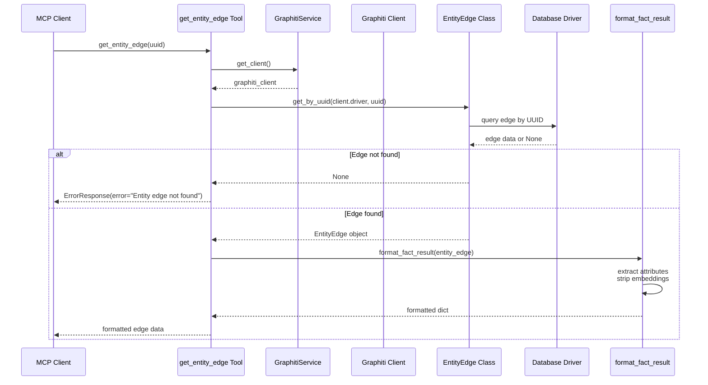
```mermaid
sequenceDiagram
    participant Client as MCP Client
    participant Tool as get_entity_edge Tool
    participant GS as GraphitiService
    participant Graphiti as Graphiti Client
    participant EntityEdge as EntityEdge Class
    participant DB as Database Driver
    participant Format as format_fact_result

    Client->>Tool: get_entity_edge(uuid)

    Tool->>GS: get_client()
    GS-->>Tool: graphiti_client

    Tool->>EntityEdge: get_by_uuid(client.driver, uuid)
    EntityEdge->>DB: query edge by UUID
    DB-->>EntityEdge: edge data or None

    alt Edge not found
        EntityEdge-->>Tool: None
        Tool-->>Client: ErrorResponse(error="Entity edge not found")
    else Edge found
        EntityEdge-->>Tool: EntityEdge object
        Tool->>Format: format_fact_result(entity_edge)
        Format->>Format: extract attributes<br/>strip embeddings
        Format-->>Tool: formatted dict
        Tool-->>Client: formatted edge data
    end
```

**Key Files**:
- `src/graphiti_mcp_server.py:596-620` - get_entity_edge tool

**Key Operations**:
1. **UUID Lookup** (line 608): EntityEdge.get_by_uuid(driver, uuid)
2. **Null Check** (lines 610-611): Handle edge not found
3. **Result Formatting** (line 618): format_fact_result to strip embeddings

### Delete Operations Flow

Deletion operations remove nodes or edges from the graph permanently.

**Flow Description**: Delete operations first fetch the entity to verify existence, then call the delete method on the object, which removes it from the database.

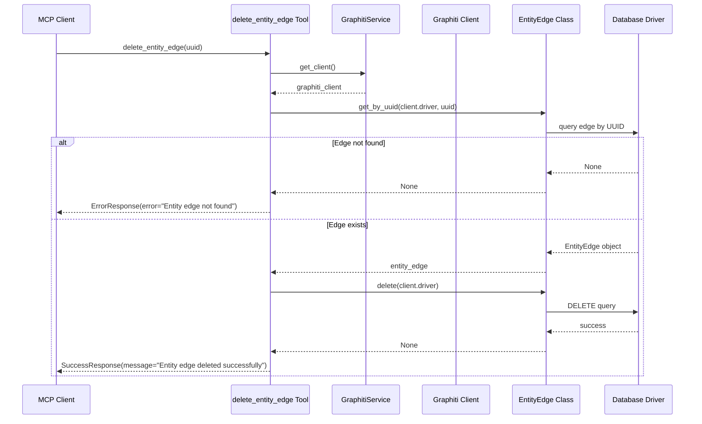
```mermaid
sequenceDiagram
    participant Client as MCP Client
    participant Tool as delete_entity_edge Tool
    participant GS as GraphitiService
    participant Graphiti as Graphiti Client
    participant EntityEdge as EntityEdge Class
    participant DB as Database Driver

    Client->>Tool: delete_entity_edge(uuid)

    Tool->>GS: get_client()
    GS-->>Tool: graphiti_client

    Tool->>EntityEdge: get_by_uuid(client.driver, uuid)
    EntityEdge->>DB: query edge by UUID

    alt Edge not found
        DB-->>EntityEdge: None
        EntityEdge-->>Tool: None
        Tool-->>Client: ErrorResponse(error="Entity edge not found")
    else Edge exists
        DB-->>EntityEdge: EntityEdge object
        EntityEdge-->>Tool: entity_edge

        Tool->>EntityEdge: delete(client.driver)
        EntityEdge->>DB: DELETE query
        DB-->>EntityEdge: success
        EntityEdge-->>Tool: None

        Tool-->>Client: SuccessResponse(message="Entity edge deleted successfully")
    end
```

**Key Files**:
- `src/graphiti_mcp_server.py:544-567` - delete_entity_edge tool
- `src/graphiti_mcp_server.py:570-593` - delete_episode tool

**Key Operations**:
1. **Fetch Entity** (line 559): EntityEdge.get_by_uuid to verify existence
2. **Existence Check** (lines 561-562): Return error if not found
3. **Delete Operation** (line 564): Call delete method on entity object

**Similar Flow for Episodes**: delete_episode follows the same pattern using EpisodicNode.get_by_uuid and delete.

## 7. Error Handling Flows

### Error Propagation

Errors are caught at multiple levels and propagated with context to the client.

**Flow Description**: Errors can occur at any layer (database, LLM, embedder, application logic). Each layer catches, logs, and wraps errors before returning ErrorResponse to the client.

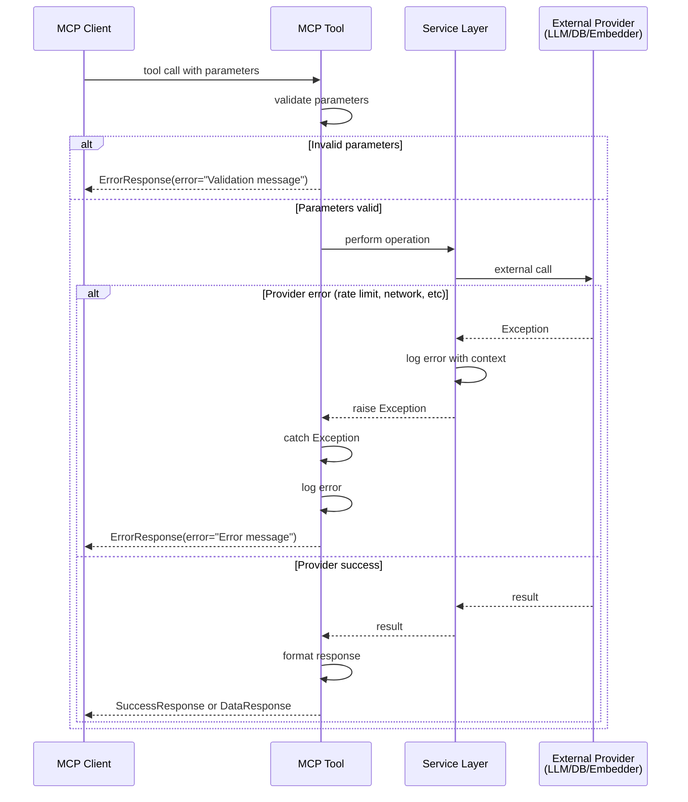
```mermaid
sequenceDiagram
    participant Client as MCP Client
    participant Tool as MCP Tool
    participant Service as Service Layer
    participant Provider as External Provider<br/>(LLM/DB/Embedder)

    Client->>Tool: tool call with parameters

    Tool->>Tool: validate parameters

    alt Invalid parameters
        Tool-->>Client: ErrorResponse(error="Validation message")
    else Parameters valid
        Tool->>Service: perform operation

        Service->>Provider: external call

        alt Provider error (rate limit, network, etc)
            Provider-->>Service: Exception
            Service->>Service: log error with context
            Service-->>Tool: raise Exception
            Tool->>Tool: catch Exception
            Tool->>Tool: log error
            Tool-->>Client: ErrorResponse(error="Error message")
        else Provider success
            Provider-->>Service: result
            Service-->>Tool: result
            Tool->>Tool: format response
            Tool-->>Client: SuccessResponse or DataResponse
        end
    end
```

**Key Error Handling Patterns**:

1. **Database Connection Errors** (lines 243-281 in graphiti_mcp_server.py):
   - Catch connection errors during initialization
   - Provide helpful messages with startup instructions
   - Distinguish between Neo4j and FalkorDB

2. **LLM/Embedder Creation Errors** (lines 180-189 in graphiti_mcp_server.py):
   - Log warnings if clients can't be created
   - Allow server to start with limited functionality
   - Log which features are unavailable

3. **Tool Execution Errors** (all tool functions):
   - Try-except block wraps all operations
   - Log full error with context
   - Return ErrorResponse with sanitized message

4. **Queue Processing Errors** (lines 67-70 in queue_service.py):
   - Catch errors during episode processing
   - Log error but continue processing queue
   - Don't stop worker on individual failures

**Example from search_nodes (lines 483-486)**:
```python
except Exception as e:
    error_msg = str(e)
    logger.error(f'Error searching nodes: {error_msg}')
    return ErrorResponse(error=f'Error searching nodes: {error_msg}')
```

**Key Files**:
- `src/graphiti_mcp_server.py:243-281` - Database connection error handling
- `src/services/queue_service.py:67-70` - Queue processing error handling
- All tool functions have try-except blocks with ErrorResponse returns

## Key Insights

### Data Flow Patterns

1. **Request-Response Pattern**: All MCP tools follow a consistent request-response pattern with typed responses (SuccessResponse, ErrorResponse, or specific search responses).

2. **Asynchronous Queue Pattern**: Episode processing uses per-group_id queues with sequential processing to avoid race conditions while allowing parallel processing across different groups.

3. **Lazy Initialization Pattern**: The Graphiti client is not initialized until the first request that needs it, reducing startup time and allowing the server to start even with database issues.

4. **Factory Pattern**: LLM, Embedder, and Database clients are created on-demand by factories based on configuration, enabling runtime provider selection.

5. **Hybrid Search Pattern**: Search operations combine semantic (embedding-based) and keyword search using Reciprocal Rank Fusion (RRF) for better results.

6. **Streaming Response Pattern**: HTTP transport supports streaming responses for large result sets.

### Async Processing

1. **Episode Queue Workers**: Each group_id has its own asyncio.Queue with a dedicated worker task that processes episodes sequentially (lines 49-80 in queue_service.py).

2. **Immediate Response**: add_memory returns immediately after queuing, not after processing completes. This prevents client timeouts on large episodes.

3. **Background Processing**: Queue workers run as background tasks (asyncio.create_task) and continue until the queue is empty.

4. **Semaphore Rate Limiting**: GraphitiService uses an asyncio.Semaphore to limit concurrent operations and stay within LLM provider rate limits (SEMAPHORE_LIMIT, default 10).

5. **Async/Await Throughout**: All I/O operations use async/await for efficient concurrent processing.

### State Management

1. **Global Service Singletons**: graphiti_service and queue_service are global singletons initialized at startup (lines 154-159 in graphiti_mcp_server.py).

2. **Per-Group Queues**: QueueService maintains separate queues and worker flags per group_id in dictionaries (lines 18-22 in queue_service.py).

3. **Lazy Client Initialization**: GraphitiService.client is None until first use, then cached for subsequent requests (line 169, lines 314-320).

4. **Stateless Tools**: Individual tool functions are stateless, accessing global services for state.

5. **Configuration Immutability**: Configuration is loaded once at startup and not modified during runtime.

6. **Database as Source of Truth**: All persistent state is stored in the graph database, not in application memory.

### Configuration Precedence

Configuration values are resolved in this priority order (highest to lowest):
1. **CLI Arguments** (lines 264-292 in schema.py): Explicit command-line args
2. **Environment Variables** (line 262): OS environment variables
3. **YAML Configuration** (lines 16-74 in schema.py): config/config.yaml file
4. **Dotenv File** (lines 42-46 in graphiti_mcp_server.py): .env file
5. **Default Values** (throughout schema.py): Hardcoded defaults

Environment variables in YAML support ${VAR:default} syntax for flexible configuration (lines 23-58 in schema.py).

### Performance Considerations

1. **Embedding Stripping**: Embeddings are removed from search results to reduce response payload size (lines 466-468 in search_nodes, format_fact_result utility).

2. **Max Results Limits**: Search operations have configurable max_nodes and max_facts parameters to prevent overwhelming responses.

3. **Database Indexing**: Indices and constraints are built on startup for search performance (line 284 in graphiti_mcp_server.py).

4. **Parallel Provider Calls**: Multiple embeddings can be generated in parallel (controlled by semaphore).

5. **Queue Batching**: Episodes are processed one at a time per group, but multiple groups process in parallel.

### Transport-Specific Behavior

1. **STDIO**: Used by Claude Desktop, synchronous JSON-RPC over stdin/stdout, subprocess lifecycle.

2. **HTTP**: Recommended for production, supports health checks (/health), works with load balancers and Docker.

3. **SSE**: Deprecated, uses server-sent events for responses, separate request/response connections.

All transports expose the same tools and functionality, only the wire protocol differs.

### Security and Reliability

1. **API Key Validation**: All providers validate API keys before creating clients (lines 76-98 in factories.py).

2. **Error Isolation**: Errors in episode processing don't stop the queue worker or affect other groups.

3. **Graceful Degradation**: Server can start without LLM or Embedder clients, with reduced functionality.

4. **Connection Retry**: Database connection errors are caught and reported with helpful diagnostic messages.

5. **Input Validation**: Parameters are validated before processing (e.g., max_facts > 0 check).

6. **Embedding Exclusion**: Embeddings are never returned to clients to prevent vector space leakage.

