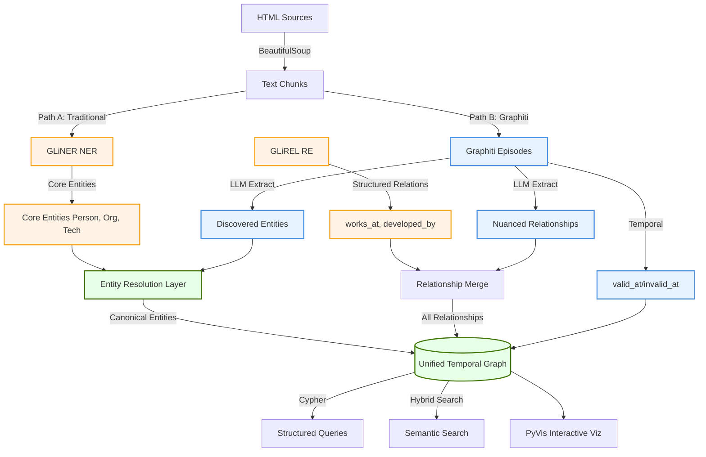

# Graphiti vs Traditional Knowledge Graph Construction

*Comparative analysis: LLM-based temporal graphs (Graphiti) vs traditional NER/RE pipelines (GLiNER/GLiREL)*

**Date**: November 30, 2025, 10:00 PM PST
**Context**: Analyzing how Graphiti can enhance existing knowledge graph construction workflows
**Reference**: Traditional pipeline at [reference/knowledge_graph_construction.md](../reference/knowledge_graph_construction.md)

---

## Executive Summary

This analysis compares two approaches to knowledge graph construction:

1. **Traditional Pipeline** (your current implementation):
   - Web scraping → Text chunking → GLiNER (NER) → GLiREL (RE) → NetworkX → PyVis
   - Deterministic extraction with domain-specific models
   - Explicit TextRank for entity ranking
   - Manual semantic overlay

2. **Graphiti Approach**:
   - Episodes (text/JSON) → LLM-based extraction → Temporal graph → Hybrid search
   - Autonomous entity/relationship extraction
   - Built-in temporal tracking
   - Automatic semantic layer

**Key Insight**: These approaches are **complementary, not competitive**. A hybrid architecture leveraging both provides:
- ✅ LLM flexibility (Graphiti) for complex, evolving relationships
- ✅ Domain precision (GLiNER/GLiREL) for high-accuracy entity extraction
- ✅ Temporal awareness (Graphiti) for tracking knowledge evolution
- ✅ Cost efficiency (traditional models) for bulk processing

---

## Part 1: Architectural Comparison

### **Traditional Pipeline Architecture** (Your Current Implementation)

```mermaid
graph TD
    %% Data Sources
    HTML[HTML Sources] -->|BeautifulSoup| Chunks[Text Chunks 1024 tokens]

    %% Embedding Layer
    Chunks -->|bge-small-en-v1.5| Embeddings[Chunk Embeddings]
    Embeddings --> LanceDB[(LanceDB Vector Store)]

    %% NLP Pipeline
    Chunks -->|spaCy Pipeline| NLP[NLP Processing]
    NLP --> GLiNER[GLiNER NER]
    NLP --> GLiREL[GLiREL RE]

    %% Entity Extraction
    GLiNER -->|Person, Org, Tech, Pub| Entities[Extracted Entities]
    GLiREL -->|works_at, developed_by| Relations[Extracted Relations]

    %% Graph Construction
    Entities --> LexicalGraph[Lexical Graph NetworkX]
    Relations --> LexicalGraph
    LexicalGraph -->|TextRank| RankedEntities[Ranked Entities]

    %% Semantic Layer
    RankedEntities -->|Word2Vec| EntityEmbeddings[Entity Embeddings]
    EntityEmbeddings --> SemanticGraph[Semantic Graph]
    LanceDB -.->|Chunk References| SemanticGraph

    %% Visualization
    SemanticGraph --> PyVis[PyVis Visualization]

    %% Styling
    classDef dataSource fill:#f4f4f4,stroke:#666,stroke-width:2px
    classDef nlp fill:#fff3e6,stroke:#f5a623,stroke-width:2px
    classDef graph fill:#e6f3ff,stroke:#4a90e2,stroke-width:2px
    classDef storage fill:#f0e6ff,stroke:#9013fe,stroke-width:2px

    class HTML dataSource
    class GLiNER,GLiREL,NLP nlp
    class LexicalGraph,SemanticGraph graph
    class LanceDB,PyVis storage
```

**Key Characteristics**:
- **Deterministic**: GLiNER/GLiREL provide consistent, reproducible results
- **Domain-Tuned**: Models trained on specific entity/relationship types
- **Explicit Control**: Manual TextRank ranking, explicit semantic overlay
- **Static**: No built-in temporal tracking
- **Cost-Effective**: Open-source models, no LLM API calls

---

### **Graphiti Architecture**

```mermaid
graph TD
    %% Data Input
    Episodes[Episodes text/JSON] -->|LLM Extraction| Processing[Entity & Relation Extraction]

    %% Entity Processing
    Processing -->|Claude/GPT| Entities[Entities w/ Attributes]
    Processing -->|Claude/GPT| Relations[Relationships w/ Types]

    %% Graph Layer
    Entities --> TempGraph[(Temporal Graph FalkorDB/Neo4j)]
    Relations --> TempGraph

    %% Temporal Tracking
    TempGraph -->|valid_at| ValidTime[Valid Time Tracking]
    TempGraph -->|invalid_at| InvalidTime[Invalidation Tracking]

    %% Embeddings
    Entities -->|Embedding Model| NodeEmbeddings[Node Embeddings]
    Episodes -->|Embedding Model| EpisodeEmbeddings[Episode Embeddings]

    %% Search
    NodeEmbeddings --> HybridSearch[Hybrid Search Vector + BM25]
    EpisodeEmbeddings --> HybridSearch
    TempGraph -->|Center Node Reranking| HybridSearch

    %% Query
    HybridSearch --> Results[Search Results w/ Temporal Context]

    %% Styling
    classDef input fill:#f4f4f4,stroke:#666,stroke-width:2px
    classDef llm fill:#fff3e6,stroke:#f5a623,stroke-width:2px
    classDef graph fill:#e6f3ff,stroke:#4a90e2,stroke-width:2px
    classDef temporal fill:#e6ffe6,stroke:#417505,stroke-width:2px

    class Episodes input
    class Processing llm
    class TempGraph graph
    class ValidTime,InvalidTime temporal
```

**Key Characteristics**:
- **Autonomous**: LLM automatically extracts entities and relationships
- **Flexible**: No predefined schemas (though custom types supported)
- **Temporal**: Built-in valid_at/invalid_at tracking
- **Dynamic**: Self-correcting via temporal invalidation
- **LLM-Powered**: Higher cost but more nuanced understanding

---

## Part 2: Feature Comparison Matrix

| Dimension | Traditional Pipeline (GLiNER/GLiREL) | Graphiti | Hybrid Approach |
|-----------|-------------------------------------|----------|-----------------|
| **Entity Extraction** | Domain-specific models (GLiNER) | LLM-based (GPT/Claude) | GLiNER for known types, LLM for discovery |
| **Relationship Extraction** | Predefined relations (GLiREL) | LLM-inferred relationships | GLiREL for structured, LLM for nuanced |
| **Temporal Tracking** | Manual (requires custom code) | Built-in (valid_at/invalid_at) | Graphiti handles temporal layer |
| **Cost** | Low (open-source models) | Medium-High (LLM API calls) | Optimize: bulk with GLiNER, critical with LLM |
| **Accuracy** | High for domain-tuned entities | High for complex relationships | Best of both: precision + nuance |
| **Schema Flexibility** | Fixed (requires retraining) | Dynamic (LLM adapts) | GLiNER for core, LLM for edge cases |
| **Scalability** | High (local inference) | Medium (API rate limits) | Batch traditional, stream Graphiti |
| **Entity Resolution** | Manual (custom logic) | Automatic (LLM identifies same entities) | Graphiti provides base, refine with GLiNER |
| **Semantic Overlay** | Manual (Word2Vec + custom logic) | Automatic (LLM understands context) | Graphiti handles abstraction |
| **Graph Query** | Cypher (manual queries) | Hybrid search (vector + BM25) | Leverage both: Cypher for structure, hybrid for semantic |
| **Visualization** | PyVis (static HTML) | External tools needed | Combine: Graphiti data, PyVis rendering |

---

## Part 3: Where Graphiti Excels

### **1. Autonomous Entity & Relationship Extraction**

**Traditional Pipeline Challenge**:
```python
# You must define entity types upfront
ner_labels = ["person", "organization", "publication", "technology"]

# And relationship types
relation_types = ["works_at", "developed_by", "authored_by"]

# GLiNER only extracts what you tell it to look for
```

**Graphiti Advantage**:
```python
# Graphiti discovers entities and relationships autonomously
await graphiti.add_episode(
    name="Research: Agent Memory Architectures",
    episode_body="""
    The GAM (General Agentic Memory) system introduced JIT retrieval
    to address information loss in pre-computed indices like Graphiti.
    This paradigm shift enables zero information loss for high-value
    research tasks, though at the cost of increased latency.
    """,
    source=EpisodeType.text
)

# LLM automatically extracts:
# - Entities: "GAM", "JIT retrieval", "Graphiti", "pre-computed indices"
# - Relationships: "GAM INTRODUCED JIT_retrieval", "GAM ADDRESSES information_loss"
# - Nuanced relationships: "pre-computed_indices CAUSE information_loss"
```

**Benefit**: Discovers unexpected entities and relationships without manual schema definition.

---

### **2. Temporal Tracking**

**Traditional Pipeline Challenge**:
```python
# Your pipeline creates static graphs
# To track changes over time, you must:
# 1. Manually version entities
# 2. Create custom temporal edge properties
# 3. Write logic to invalidate outdated facts

# No built-in mechanism for "this was true from X to Y"
```

**Graphiti Advantage**:
```python
# Graphiti tracks temporal validity automatically
fact = {
    "source_entity": "Graphiti",
    "target_entity": "customer service bots",
    "relationship": "IDEAL_FOR",
    "valid_at": "2024-11-27T10:00:00Z",
    "invalid_at": None  # Still valid
}

# Later, if you add:
# "Graphiti is NOT ideal for legal discovery (requires GAM's JIT search)"
# Graphiti automatically:
# 1. Sets invalid_at on the previous fact
# 2. Creates new fact with updated relationship
# 3. Preserves history for temporal queries
```

**Benefit**: Track knowledge evolution without manual versioning logic.

---

### **3. Semantic Overlay Simplification**

**Traditional Pipeline Challenge**:
```python
# Your abstract_overlay function requires:
# 1. Manual entity ranking (TextRank)
# 2. Explicit entity embedding (Word2Vec)
# 3. Custom logic to connect entities to source chunks
# 4. Manual thesaurus/ontology integration

def abstract_overlay(lex_graph, sem_graph):
    # Run TextRank for ranking
    run_textrank(lex_graph)

    # Generate entity embeddings
    model = Word2Vec(...)

    # Manual chunk linking
    for entity in entities:
        link_to_source_chunk(entity, chunks)

    # Custom semantic layer creation
    create_semantic_relationships(...)
```

**Graphiti Advantage**:
```python
# Graphiti handles semantic layer automatically:
# 1. LLM understands semantic relationships during extraction
# 2. Embeddings created automatically for nodes and episodes
# 3. Hybrid search (vector + BM25) built-in
# 4. Center node reranking provides graph-aware semantic search

results = await graphiti.search(
    "What architectures are ideal for customer service bots?",
    center_node_uuid=graphiti_node_uuid  # Graph-aware reranking!
)
```

**Benefit**: Semantic layer emerges from LLM understanding, not manual construction.

---

### **4. Entity Resolution**

**Traditional Pipeline Challenge**:
```python
# Entity resolution requires custom logic:
# "John Smith" vs "J. Smith" vs "John A. Smith"
# "OpenAI" vs "Open AI" vs "OpenAI Inc."

# You must write:
# 1. String similarity matching
# 2. Alias detection
# 3. Disambiguation heuristics
```

**Graphiti Advantage**:
```python
# LLM performs entity resolution during extraction
# "John Smith spoke at the conference. Later, Smith discussed..."
# LLM recognizes "Smith" refers to "John Smith"

# No custom resolution logic needed - LLM understands context
```

**Benefit**: Reduces entity resolution code complexity.

---

## Part 4: Where Traditional Pipeline Excels

### **1. Cost Efficiency**

**Traditional Pipeline Advantage**:
```python
# GLiNER/GLiREL: Local inference, zero API costs
# Process 10,000 documents: ~$0 (compute only)

# Embeddings: bge-small-en-v1.5 (local)
# Process 10,000 chunks: ~$0
```

**Graphiti Cost**:
```python
# LLM extraction per episode:
# - Input: Episode content (~1K tokens)
# - Output: Entities + relationships (~500 tokens)
# - Cost: ~$0.01-0.03 per episode (Claude Sonnet)

# Process 10,000 documents: ~$100-300
```

**Traditional Win**: 100-1000x cheaper for bulk processing.

---

### **2. Deterministic, Reproducible Results**

**Traditional Pipeline Advantage**:
```python
# GLiNER always extracts same entities from same text
# No temperature, no randomness, no variation

# Critical for:
# - Regulatory compliance (audit trails)
# - Scientific reproducibility
# - A/B testing (need consistent baseline)
```

**Graphiti Challenge**:
```python
# LLM extraction varies with:
# - Temperature setting
# - Model version
# - Prompt engineering

# Same episode may extract slightly different entities across runs
```

**Traditional Win**: Deterministic extraction for compliance/research.

---

### **3. Domain-Specific Accuracy**

**Traditional Pipeline Advantage**:
```python
# GLiNER fine-tuned on domain-specific data
# Example: Biomedical entities (genes, proteins, diseases)

# Achieves 95%+ F1 on domain benchmarks
# Outperforms general-purpose LLMs on specialized entities
```

**Graphiti Challenge**:
```python
# LLMs are generalists
# May miss domain-specific nuances
# Example: Confuse "BRCA1" (gene) vs "BRCA1" (company name)
```

**Traditional Win**: Higher precision for specialized domains.

---

### **4. Control and Explainability**

**Traditional Pipeline Advantage**:
```python
# You control every step:
# - Chunk size (1024 tokens)
# - Entity types (person, org, tech, pub)
# - Relationship types (works_at, developed_by)
# - Ranking algorithm (TextRank with custom params)

# Explainable: "Entity extracted because GLiNER scored 0.95 confidence"
```

**Graphiti Challenge**:
```python
# LLM is a black box
# Why did it create relationship X?
# Why entity A vs entity B priority?

# Less explainable for debugging
```

**Traditional Win**: Full control and explainability.

---

## Part 5: Hybrid Integration Architecture

### **Recommended: Best of Both Worlds**



---

### **Hybrid Implementation Strategy**

#### **Phase 1: Core Entity Extraction (GLiNER)**

```python
# Use GLiNER for high-confidence, domain-specific entities
def extract_core_entities(text_chunks):
    """Extract well-defined entities using GLiNER."""
    core_entity_types = ["person", "organization", "technology", "publication"]

    entities = []
    for chunk in text_chunks:
        # GLiNER: Fast, deterministic, cheap
        ner_results = gliner_model.predict(chunk, core_entity_types)
        entities.extend(ner_results)

    return entities  # High precision, low cost
```

#### **Phase 2: Discovery & Nuance (Graphiti)**

```python
# Use Graphiti for discovery and complex relationships
async def enrich_with_graphiti(text_chunks, core_entities):
    """Use Graphiti to discover additional entities and nuanced relationships."""

    for chunk in text_chunks:
        # Add to Graphiti for LLM-based enrichment
        await graphiti.add_episode(
            name=f"Chunk: {chunk.id}",
            episode_body=chunk.text,
            source=EpisodeType.text,
            source_description="Web scraping chunk",
            group_id="research_corpus"
        )

    # Graphiti discovers:
    # 1. Entities GLiNER missed (abstract concepts, emergent terms)
    # 2. Complex relationships (EVOLVED_FROM, ADDRESSES, IMPROVES_UPON)
    # 3. Temporal relationships (INTRODUCED_IN_2024, SUPERSEDED_BY)

    return await graphiti.search_nodes(
        query="all extracted entities",
        group_ids=["research_corpus"]
    )
```

#### **Phase 3: Entity Resolution**

```python
async def resolve_entities(gliner_entities, graphiti_entities):
    """Merge entities from both sources, resolving duplicates."""

    canonical_entities = {}

    # 1. Start with high-confidence GLiNER entities
    for entity in gliner_entities:
        canonical_entities[entity.name.lower()] = {
            "name": entity.name,
            "type": entity.type,
            "source": "gliner",
            "confidence": entity.confidence
        }

    # 2. Add Graphiti discoveries (de-duplicate using LLM)
    for entity in graphiti_entities:
        # Use LLM to check if this is a duplicate
        is_duplicate = await check_duplicate(entity, canonical_entities)

        if not is_duplicate:
            canonical_entities[entity.name.lower()] = {
                "name": entity.name,
                "type": "discovered",  # Graphiti found it
                "source": "graphiti",
                "confidence": None  # LLM-based, no numeric confidence
            }

    return canonical_entities
```

#### **Phase 4: Unified Graph Construction**

```python
def build_unified_graph(canonical_entities, gliner_relations, graphiti_relations):
    """Combine all sources into unified temporal graph."""

    # Use FalkorDB/Neo4j for storage (Graphiti-compatible)
    graph = nx.MultiDiGraph()

    # Add entities
    for entity_id, entity_data in canonical_entities.items():
        graph.add_node(
            entity_id,
            name=entity_data["name"],
            type=entity_data["type"],
            source=entity_data["source"],
            created_at=datetime.now(timezone.utc)
        )

    # Add GLiREL relationships (structured)
    for rel in gliner_relations:
        graph.add_edge(
            rel.source,
            rel.target,
            type=rel.relation_type,
            source="glrel",
            confidence=rel.confidence,
            valid_at=datetime.now(timezone.utc)
        )

    # Add Graphiti relationships (nuanced)
    for rel in graphiti_relations:
        graph.add_edge(
            rel.source_entity,
            rel.target_entity,
            type=rel.relationship_type,
            source="graphiti",
            fact=rel.fact_text,  # Natural language relationship
            valid_at=rel.valid_at,
            invalid_at=rel.invalid_at  # Temporal tracking!
        )

    return graph
```

---

## Part 6: Integration with Your ra_orchestrators/

### **Current Implementation**

Your `ra_orchestrators/` directory contains Claude Agent SDK-based orchestrators for architecture research. Here's how to integrate Graphiti:

#### **Enhanced Architecture Orchestrator**

```python
# ra_orchestrators/architecture_orchestrator.py

from graphiti_core import Graphiti
from graphiti_core.nodes import EpisodeType
import asyncio

class HybridArchitectureOrchestrator:
    """
    Orchestrates architecture research using both traditional NER/RE
    and Graphiti temporal knowledge graphs.
    """

    def __init__(self, graphiti_client, gliner_model, glirel_model):
        self.graphiti = graphiti_client
        self.gliner = gliner_model
        self.glirel = glirel_model
        self.group_id = "architecture_research"

    async def analyze_architecture_document(self, doc_url, doc_content):
        """
        Dual-path analysis:
        1. Traditional: GLiNER/GLiREL for structured extraction
        2. Graphiti: LLM for discovery and temporal tracking
        """

        # Path 1: Traditional high-precision extraction
        chunks = self.chunk_text(doc_content)
        gliner_entities = self.extract_entities_gliner(chunks)
        glirel_relations = self.extract_relations_glirel(chunks, gliner_entities)

        # Path 2: Graphiti discovery and enrichment
        graphiti_episode_id = await self.graphiti.add_episode(
            name=f"Architecture Doc: {doc_url}",
            episode_body=doc_content,
            source=EpisodeType.text,
            source_description=f"Architecture document from {doc_url}",
            reference_time=datetime.now(timezone.utc),
            group_id=self.group_id
        )

        # Wait for Graphiti extraction (15-20 seconds)
        await asyncio.sleep(20)

        # Query Graphiti for discovered entities
        graphiti_entities = await self.graphiti.search_nodes(
            query="architecture patterns systems components",
            group_ids=[self.group_id],
            max_nodes=50
        )

        # Query Graphiti for relationships
        graphiti_relations = await self.graphiti.search_memory_facts(
            query="architecture relationships dependencies",
            group_ids=[self.group_id],
            max_facts=100
        )

        # Merge results
        unified_knowledge = self.merge_knowledge(
            gliner_entities,
            glirel_relations,
            graphiti_entities,
            graphiti_relations
        )

        # Store in unified graph (FalkorDB/Neo4j)
        await self.store_unified_graph(unified_knowledge)

        return unified_knowledge

    def merge_knowledge(self, gliner_ents, glirel_rels, graphiti_ents, graphiti_rels):
        """
        Merge traditional and Graphiti extractions.

        Strategy:
        - Trust GLiNER for core entity types (Person, Org, Tech)
        - Trust Graphiti for abstract concepts and nuanced relationships
        - Use Graphiti's temporal tracking for all relationships
        """

        merged = {
            "entities": {},
            "relationships": []
        }

        # Add GLiNER entities (high confidence baseline)
        for entity in gliner_ents:
            merged["entities"][entity.name] = {
                "name": entity.name,
                "type": entity.type,
                "source": "gliner",
                "confidence": entity.confidence
            }

        # Add Graphiti entities (discoveries)
        for entity in graphiti_ents:
            if entity.name not in merged["entities"]:
                merged["entities"][entity.name] = {
                    "name": entity.name,
                    "type": "concept",  # Graphiti often finds abstract concepts
                    "source": "graphiti",
                    "summary": entity.summary
                }

        # Add GLiREL relationships (structured)
        for rel in glirel_rels:
            merged["relationships"].append({
                "source": rel.source,
                "target": rel.target,
                "type": rel.relation_type,
                "extraction_source": "glirel",
                "confidence": rel.confidence,
                "valid_at": datetime.now(timezone.utc),
                "invalid_at": None
            })

        # Add Graphiti relationships (nuanced + temporal)
        for rel in graphiti_rels:
            merged["relationships"].append({
                "source": rel.source_entity,
                "target": rel.target_entity,
                "type": rel.relationship_type,
                "extraction_source": "graphiti",
                "fact": rel.fact_text,  # Natural language explanation
                "valid_at": rel.valid_at,  # Temporal tracking
                "invalid_at": rel.invalid_at
            })

        return merged
```

---

### **Research Capture Workflow**

#### **Store Research Sessions in Graphiti**

```python
# After each research session with ra_orchestrators/
async def capture_research_session(orchestrator, session_summary):
    """
    Store research session findings in Graphiti for future reference.
    """

    # Create episode with session findings
    await orchestrator.graphiti.add_episode(
        name=f"Research Session: {session_summary.topic}",
        episode_body=json.dumps({
            "topic": session_summary.topic,
            "architectures_analyzed": session_summary.architectures,
            "key_findings": session_summary.findings,
            "trade_offs_identified": session_summary.trade_offs,
            "recommendations": session_summary.recommendations,
            "session_date": session_summary.date.isoformat()
        }),
        source=EpisodeType.json,
        source_description="Architecture research session summary",
        reference_time=session_summary.date,
        group_id="architecture_research"
    )

    # Future sessions can query:
    # "What did we learn about microservices vs monoliths?"
    # Graphiti will retrieve relevant prior session findings!
```

---

## Part 7: Recommendations

### **When to Use Each Approach**

| Scenario | Recommended Approach | Rationale |
|----------|---------------------|-----------|
| **Bulk document processing** | Traditional (GLiNER/GLiREL) | Cost-effective, deterministic |
| **Real-time research capture** | Graphiti | Temporal tracking, discovery |
| **Domain-specific extraction** | Traditional (fine-tuned GLiNER) | Higher precision for specialized entities |
| **Complex relationship discovery** | Graphiti | LLM understands nuanced relationships |
| **Compliance/audit requirements** | Traditional | Deterministic, reproducible |
| **Knowledge evolution tracking** | Graphiti | Built-in temporal invalidation |
| **Multi-session learning** | Graphiti | Accumulate insights across sessions |
| **Cost-sensitive batch jobs** | Traditional | 100x cheaper than LLM extraction |

---

### **Hybrid Integration Roadmap**

#### **Phase 1: Add Graphiti to Existing Pipeline**

1. **Install Graphiti alongside current stack**:
   ```bash
   uv add graphiti-core
   ```

2. **Configure Graphiti to use existing FalkorDB**:
   ```python
   from graphiti_core import Graphiti
   from graphiti_core.driver.falkordb_driver import FalkorDriver

   # Use same FalkorDB instance
   driver = FalkorDriver(
       host='localhost',
       port=6379,
       username='',  # If FalkorDB Cloud
       password=''
   )

   graphiti = Graphiti(graph_driver=driver)
   await graphiti.build_indices_and_constraints()
   ```

3. **Parallel extraction**: Run GLiNER and Graphiti side-by-side
   ```python
   # Traditional path
   gliner_results = extract_with_gliner(chunks)

   # Graphiti path (concurrent)
   graphiti_task = asyncio.create_task(
       graphiti.add_episode(chunk_text, ...)
   )

   # Merge results
   await merge_results(gliner_results, await graphiti_task)
   ```

#### **Phase 2: Capture ra_orchestrators Sessions**

1. **Instrument orchestrators** to store findings:
   ```python
   # After architecture analysis
   await graphiti.add_episode(
       name="Architecture Analysis: Microservices",
       episode_body=analysis_results,
       group_id="architecture_research"
   )
   ```

2. **Query prior sessions** before new research:
   ```python
   # Check what we already know
   prior_findings = await graphiti.search_memory_facts(
       query="microservices scaling patterns",
       group_ids=["architecture_research"]
   )
   ```

#### **Phase 3: Full Hybrid Architecture**

1. **Entity resolution layer**: Merge GLiNER and Graphiti entities
2. **Temporal overlay**: Apply Graphiti's temporal tracking to all relationships
3. **Unified query interface**: Combine Cypher (structure) and hybrid search (semantics)

---

## Conclusion

Graphiti and traditional knowledge graph construction (GLiNER/GLiREL) are **complementary approaches**:

### **Graphiti Strengths**:
- ✅ Autonomous entity/relationship discovery
- ✅ Built-in temporal tracking (valid_at/invalid_at)
- ✅ Semantic overlay (LLM understands context)
- ✅ Multi-session learning (accumulate insights)
- ✅ Simplified entity resolution (LLM handles)

### **Traditional Pipeline Strengths**:
- ✅ Cost-effective (100x cheaper for bulk)
- ✅ Deterministic, reproducible results
- ✅ Domain-specific accuracy (fine-tuned models)
- ✅ Full control and explainability
- ✅ No API dependencies (local inference)

### **Recommended Hybrid Strategy**:

```
Traditional (GLiNER/GLiREL)    Graphiti (LLM-based)
           ↓                            ↓
    Core Entities              Discovered Entities
    Structured Relations       Nuanced Relationships
           ↓                            ↓
         ┌──────────────────────────────┐
         │   Entity Resolution Layer    │
         └──────────────────────────────┘
                      ↓
         ┌──────────────────────────────┐
         │  Unified Temporal Graph      │
         │  (FalkorDB/Neo4j)            │
         └──────────────────────────────┘
                      ↓
    ┌─────────────────────────────────────┐
    │  Dual Query Interface:              │
    │  • Cypher (structured queries)      │
    │  • Hybrid Search (semantic queries) │
    └─────────────────────────────────────┘
```

This hybrid approach provides:
- **Cost efficiency** (traditional for bulk)
- **Discovery power** (Graphiti for research)
- **Temporal awareness** (Graphiti tracking)
- **Domain precision** (GLiNER/GLiREL accuracy)

Your `ra_orchestrators/` can leverage both: use traditional pipeline for document processing, Graphiti for session capture and multi-session learning.

---

## Resources

**Your Implementation**:
- [reference/knowledge_graph_construction.md](../reference/knowledge_graph_construction.md)
- [ra_orchestrators/](../ra_orchestrators/)
- [ra_agents/](../ra_agents/)
- [architecture/](../architecture/)

**Graphiti Documentation**:
- [Graphiti Overview](https://docs.getzep.com/graphiti/getting-started/overview)
- [Custom Entity Types](https://docs.getzep.com/graphiti/advanced/custom-entity-edge-types)
- [Quick Start](https://docs.getzep.com/graphiti/getting-started/quick-start)

**This Research**:
- [blog/CLAUDE_MULTI_AGENT_RESEARCH_CAPABILITIES_20251130.md](CLAUDE_MULTI_AGENT_RESEARCH_CAPABILITIES_20251130.md)
- [blog/KNOWLEDGE_GRAPH_INVENTORY_20251130.md](KNOWLEDGE_GRAPH_INVENTORY_20251130.md)

---

**Date**: November 30, 2025, 10:00 PM PST
**Analysis Duration**: ~45 minutes
**Sources**: Zep/Graphiti docs (Qdrant MCP), your KG construction pipeline
**Approach**: Comparative analysis with hybrid integration strategy

---

*This analysis demonstrates how Graphiti's temporal knowledge graphs can complement traditional NER/RE pipelines, providing a path to integrate both approaches for research capture and knowledge graph construction.*
